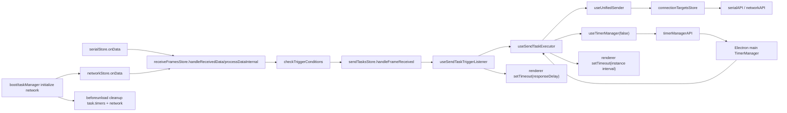
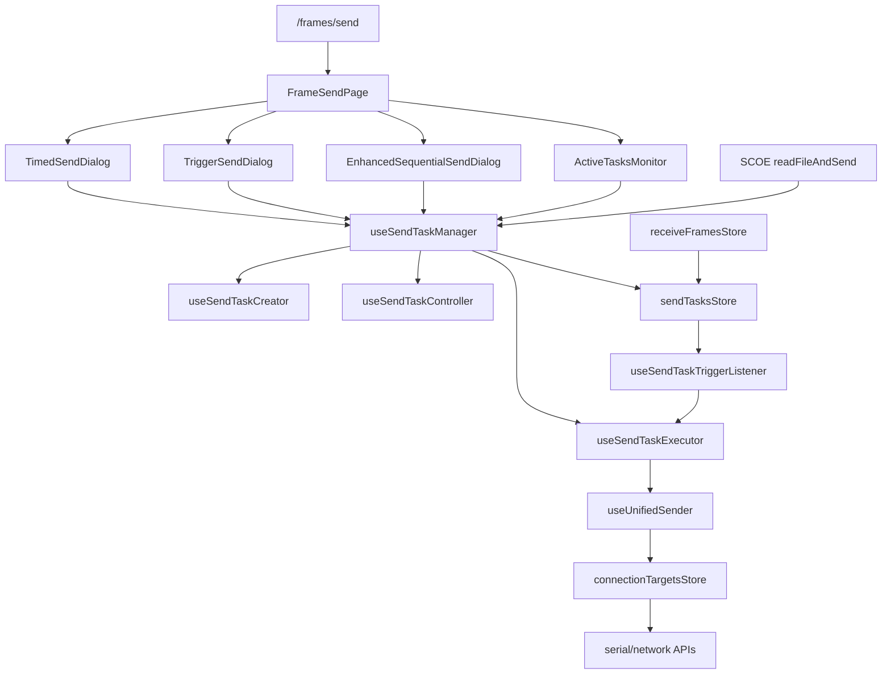
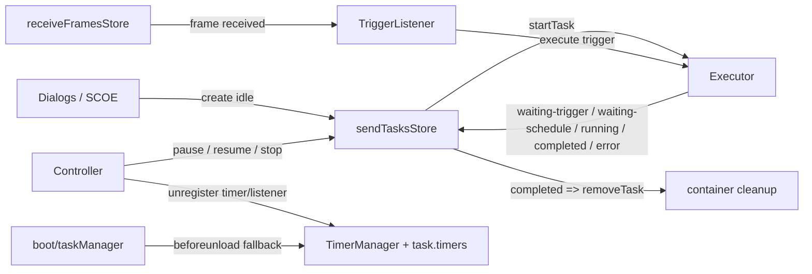

# 任务系统 module overview

> 范围：只做现状探索，不给改造方案，不改代码。
> 目标：沉淀一份后续可复用的任务系统现状文档。

## 结论前置

1. **架构文档已经把任务系统定义成独立能力域，但代码现状还不是一个独立域，而是 `发送工作台 UI + sendTasksStore + useSendTask* + receiveFramesStore + timerManager + boot 清理` 拼出来的混合体。**
   证据：`easysdd/architecture/domain-task-system-ownership.md:93-112`, `easysdd/architecture/domain-task-system-ownership.md:132-216`, `refactor/docs/01-scan/02-task-system-current-state.md:61-68`, `src/pages/FrameSendPage.vue:264-400`, `src/boot/taskManager.ts:17-48`

2. **当前“正式入口”不是单一入口。创建入口主要有两族：发送页对话框入口和 SCOE 命令入口；运行期推进入口还有 receive 侧触发入口；控制入口则在任务监控对话框。**
   证据：`src/router/routes.ts:21-24`, `src/pages/FrameSendPage.vue:264-400`, `src/components/frames/FrameSend/TimedSend/TimedSendDialog.vue:222-290`, `src/components/frames/FrameSend/TriggerSend/TriggerSendDialog.vue:289-377`, `src/components/frames/FrameSend/EnhancedSequentialSend/EnhancedSequentialSendDialog.vue:631-763`, `src/composables/scoe/commands/readFileAndSend.ts:118-157`, `src/stores/frames/receiveFramesStore.ts:1127-1139`, `src/stores/frames/sendTasksStore.ts:554-562`, `src/components/frames/FrameSend/ActiveTasksMonitor.vue:20-23`, `src/components/frames/FrameSend/ActiveTasksMonitor.vue:82-103`

3. **生命周期状态没有单点归口。任务主状态主要持有在 `sendTasksStore.tasks/taskMap/statusIndexes`，触发监听状态持有在 `useSendTaskTriggerListener.activeTriggerListeners`，定时状态同时分散在 `task.timers`、主进程 `TimerManager` 和渲染层原生 `setTimeout`。**
   证据：`src/stores/frames/sendTasksStore.ts:145-175`, `src/stores/frames/sendTasksStore.ts:177-215`, `src/stores/frames/sendTasksStore.ts:360-456`, `src/composables/frames/sendFrame/useSendTaskTriggerListener.ts:28-31`, `src/stores/frames/sendTasksStore.ts:109-121`, `src/composables/frames/sendFrame/useSendTaskExecutor.ts:140-159`, `src/composables/common/useTimerManager.ts:20-52`, `src-electron/main/ipc/timerManagerHandlers.ts:194-220`, `src/composables/frames/sendFrame/useSendTaskExecutor.ts:252-259`, `src/composables/frames/sendFrame/useSendTaskTriggerListener.ts:231-233`

4. **生命周期推进也是分段推进：Creator 建 `idle`，Executor 推 `running / waiting-* / completed / error`，Controller 推 `pause / resume / stop`，TriggerListener 负责条件命中后的执行桥接，Store 在 `completed` 时直接删任务，boot 负责页面退出时兜底清理。**
   证据：`src/composables/frames/sendFrame/useSendTaskCreator.ts:28-52`, `src/composables/frames/sendFrame/useSendTaskExecutor.ts:451-485`, `src/composables/frames/sendFrame/useSendTaskExecutor.ts:490-526`, `src/composables/frames/sendFrame/useSendTaskExecutor.ts:661-717`, `src/composables/frames/sendFrame/useSendTaskExecutor.ts:733-783`, `src/composables/frames/sendFrame/useSendTaskExecutor.ts:899-964`, `src/composables/frames/sendFrame/useSendTaskController.ts:23-117`, `src/composables/frames/sendFrame/useSendTaskTriggerListener.ts:223-305`, `src/stores/frames/sendTasksStore.ts:401-426`, `src/boot/taskManager.ts:17-48`

5. **最阻碍后续加功能的不是某一个脏函数，而是几组跨层耦合：任务触发语义依赖接收映射；结束语义和清理语义混在一起；定时器所有权双轨并存；页面/对话框仍直接拥有任务创建与后台继续运行决策。**
   证据：`src/composables/frames/sendFrame/useSendTaskTriggerListener.ts:164-183`, `src/stores/frames/receiveFramesStore.ts:1127-1139`, `src/composables/frames/sendFrame/useSendTaskController.ts:26-57`, `src/stores/frames/sendTasksStore.ts:424-426`, `src/composables/frames/sendFrame/useSendTaskExecutor.ts:638-647`, `src/composables/common/useTimerManager.ts:226-250`, `src/boot/taskManager.ts:25-44`, `src/components/frames/FrameSend/TimedSend/TimedSendDialog.vue:192-220`, `src/components/frames/FrameSend/EnhancedSequentialSend/EnhancedSequentialSendDialog.vue:766-793`

6. **有些问题只是“脏”，有些地方已经在“架构打架”。**
   证据：
   “脏”例子：`pause/resume` 只有状态切换没有对称执行恢复，`ActiveTasksMonitor` 的筛选值和真实 `TaskType` 不一致，`waiting-schedule` 在 UI 上可停但控制器并未纳入可停状态。见 `src/composables/frames/sendFrame/useSendTaskController.ts:77-110`, `src/components/frames/FrameSend/ActiveTasksMonitor.vue:205-212`, `src/stores/frames/sendTasksStore.ts:15-18`, `src/composables/frames/sendFrame/useSendTaskController.ts:33-39`, `src/components/frames/FrameSend/ActiveTasksMonitor.vue:365-369`
   “架构打架”例子：架构文档要求任务系统独立归口，但现状仍让接收链、页面工作台和 boot 清理共同定义任务事实。见 `easysdd/architecture/domain-task-system-ownership.md:93-119`, `src/stores/frames/receiveFramesStore.ts:1127-1139`, `src/pages/FrameSendPage.vue:264-400`, `src/boot/taskManager.ts:17-48`

## 1. 架构口径与代码现状

架构文档已经明确三件事：

- 任务系统不是页面工作台、不是接收主链、也不是发送主链，而应是独立能力域中的任务归口层。证据：`easysdd/architecture/domain-task-system-ownership.md:84-112`
- 生命周期推进、时间推进、等待触发、停止、完成、清理，都应由任务系统归口推进。证据：`easysdd/architecture/domain-task-system-ownership.md:192-223`
- 接收主链只能把“显式触发候选输入”交给任务系统，发送主链只能消费“显式发送请求”。证据：`easysdd/architecture/topology-receive-send-mainlines.md:173-181`, `easysdd/architecture/topology-receive-send-mainlines.md:224-239`, `easysdd/architecture/topology-receive-send-mainlines.md:483-487`

但代码现状还没有达到这个口径：

- 发送页本身直接挂任务入口和任务监控入口。证据：`src/pages/FrameSendPage.vue:264-400`
- 任务配置对话框直接创建并启动任务，而不是只提交配置意图。证据：`src/components/frames/FrameSend/TimedSend/TimedSendDialog.vue:243-280`, `src/components/frames/FrameSend/TriggerSend/TriggerSendDialog.vue:296-368`, `src/components/frames/FrameSend/EnhancedSequentialSend/EnhancedSequentialSendDialog.vue:640-753`
- 接收链直接把触发候选推进给任务系统，且任务触发判断回读接收映射。证据：`src/stores/frames/receiveFramesStore.ts:1127-1139`, `src/stores/frames/sendTasksStore.ts:554-562`, `src/composables/frames/sendFrame/useSendTaskTriggerListener.ts:164-183`
- boot 在页面退出时仍兜底清理任务定时器和网络连接。证据：`src/boot/taskManager.ts:17-48`

结论：**文档的“任务归口层”已经定义了目标语言，但代码现状仍是多层共同持有任务生命周期。**

## 2. 任务系统现在的正式入口

### 2.1 UI 创建入口

当前路由正式暴露的任务工作台是 `/frames/send -> FrameSendPage`。证据：`src/router/routes.ts:21-24`

`FrameSendPage` 上有四个显式任务入口：

- 定时发送入口：打开 `TimedSendDialog`。证据：`src/pages/FrameSendPage.vue:153-162`, `src/pages/FrameSendPage.vue:316-323`, `src/pages/FrameSendPage.vue:376-382`
- 触发发送入口：打开 `TriggerSendDialog`。证据：`src/pages/FrameSendPage.vue:164-173`, `src/pages/FrameSendPage.vue:316-323`, `src/pages/FrameSendPage.vue:384-390`
- 多帧顺序/策略发送入口：打开 `EnhancedSequentialSendDialog`。证据：`src/pages/FrameSendPage.vue:175-183`, `src/pages/FrameSendPage.vue:269-273`, `src/pages/FrameSendPage.vue:392-397`
- 任务监控控制入口：打开 `ActiveTasksMonitor`。证据：`src/pages/FrameSendPage.vue:185-193`, `src/pages/FrameSendPage.vue:264-267`, `src/pages/FrameSendPage.vue:399-400`

### 2.2 程序化创建入口

除发送页 UI 外，当前还能从 SCOE 命令侧直接创建并启动标准任务：

- `executeReadFileAndSend` 直接调用 `useSendTaskManager()`，若已有同名任务先停掉，再 `createTimedTask + startTask`。证据：`src/composables/scoe/commands/readFileAndSend.ts:118-157`

这意味着当前“任务系统正式入口”已经不只属于发送页。

### 2.3 运行期输入入口

任务不是只靠 UI 启动后自行运行，条件触发任务还有一条运行期输入入口：

- 串口/网络数据先进入 `receiveFramesStore.processDataInternal`。证据：`src/stores/serialStore.ts:392-417`, `src/stores/netWorkStore.ts:200-219`, `src/stores/frames/receiveFramesStore.ts:1005-1025`
- 接收处理完成后调用 `checkTriggerConditions(...)`。证据：`src/stores/frames/receiveFramesStore.ts:1127-1139`
- `checkTriggerConditions(...)` 再调用 `sendTasksStore.handleFrameReceived(...)`。证据：`src/stores/frames/receiveFramesStore.ts:1186-1228`
- `sendTasksStore.handleFrameReceived(...)` 继续委派给 `useSendTaskTriggerListener.handleFrameReceived(...)`。证据：`src/stores/frames/sendTasksStore.ts:554-562`

所以当前条件触发任务的运行期正式输入口，不是 `useSendTaskManager`，而是 `receiveFramesStore -> sendTasksStore.handleFrameReceived`。

### 2.4 控制入口

任务监控对话框直接暴露 `start / pause / resume / stop`。证据：`src/components/frames/FrameSend/ActiveTasksMonitor.vue:20-23`, `src/components/frames/FrameSend/ActiveTasksMonitor.vue:82-103`, `src/components/frames/FrameSend/ActiveTasksMonitor.vue:333-378`

因此，当前入口可以归成 4 类：

| 入口类型 | 现在的正式入口 | 证据 |
| --- | --- | --- |
| UI 创建入口 | `FrameSendPage` 下三个任务对话框 | `src/pages/FrameSendPage.vue:264-400` |
| 程序化创建入口 | SCOE `READ_FILE_AND_SEND` | `src/composables/scoe/commands/readFileAndSend.ts:118-157` |
| 运行期输入入口 | `receiveFramesStore -> sendTasksStore.handleFrameReceived` | `src/stores/frames/receiveFramesStore.ts:1127-1139`, `src/stores/frames/sendTasksStore.ts:554-562` |
| 控制入口 | `ActiveTasksMonitor` | `src/components/frames/FrameSend/ActiveTasksMonitor.vue:82-103` |

## 3. 生命周期状态由谁持有、谁推进、谁清理

### 3.1 谁持有

| 状态/事实 | 当前持有者 | 证据 |
| --- | --- | --- |
| 任务对象与任务主状态 | `sendTasksStore.tasks / taskMap / statusIndexes` | `src/stores/frames/sendTasksStore.ts:145-175`, `src/stores/frames/sendTasksStore.ts:177-215` |
| 任务进度与配置的批量缓存 | `progressCache / configCache` | `src/stores/frames/sendTasksStore.ts:152-159`, `src/stores/frames/sendTasksStore.ts:265-357` |
| 触发监听注册态 | `useSendTaskTriggerListener.activeTriggerListeners` | `src/composables/frames/sendFrame/useSendTaskTriggerListener.ts:28-31`, `src/composables/frames/sendFrame/useSendTaskTriggerListener.ts:35-65` |
| 任务执行期实例缓存 | `useSendTaskExecutor.frameInstanceCaches` | `src/composables/frames/sendFrame/useSendTaskExecutor.ts:46-75` |
| 可登记的任务定时器 ID | `SendTask.timers` | `src/stores/frames/sendTasksStore.ts:109-121`, `src/composables/frames/sendFrame/useSendTaskExecutor.ts:140-159` |
| 真正运行的长生命周期定时器 | 主进程 `TimerManager` | `src/composables/common/useTimerManager.ts:29-55`, `src-electron/main/ipc/timerManagerHandlers.ts:194-220` |
| 局部延时 | 渲染层原生 `setTimeout` | `src/composables/frames/sendFrame/useSendTaskExecutor.ts:252-259`, `src/composables/frames/sendFrame/useSendTaskTriggerListener.ts:231-233`, `src/composables/frames/sendFrame/useUnifiedSender.ts:146-166` |

### 3.2 谁推进

| 推进动作 | 当前推进者 | 证据 |
| --- | --- | --- |
| 建任务（`idle`） | `useSendTaskCreator -> sendTasksStore.addTask` | `src/composables/frames/sendFrame/useSendTaskCreator.ts:28-52`, `src/composables/frames/sendFrame/useSendTaskCreator.ts:65-97`, `src/composables/frames/sendFrame/useSendTaskCreator.ts:108-142`, `src/composables/frames/sendFrame/useSendTaskCreator.ts:153-194` |
| 启动顺序/定时/触发任务 | `useSendTaskExecutor.startTask` | `src/composables/frames/sendFrame/useSendTaskExecutor.ts:451-485` |
| 推 `running / waiting-trigger / waiting-schedule / completed / error` | `useSendTaskExecutor` | `src/composables/frames/sendFrame/useSendTaskExecutor.ts:500-526`, `src/composables/frames/sendFrame/useSendTaskExecutor.ts:688-717`, `src/composables/frames/sendFrame/useSendTaskExecutor.ts:754-783`, `src/composables/frames/sendFrame/useSendTaskExecutor.ts:899-964` |
| 条件命中后的执行桥接 | `useSendTaskTriggerListener.executeTriggerTask` | `src/composables/frames/sendFrame/useSendTaskTriggerListener.ts:223-305` |
| `pause / resume / stop` | `useSendTaskController` | `src/composables/frames/sendFrame/useSendTaskController.ts:23-117` |
| 真正发送动作 | `useUnifiedSender` | `src/composables/frames/sendFrame/useUnifiedSender.ts:69-177` |

### 3.3 谁清理

| 清理对象 | 当前清理者 | 证据 |
| --- | --- | --- |
| 任务完成后的容器项 | `sendTasksStore.updateTaskStatus('completed') -> removeTask` | `src/stores/frames/sendTasksStore.ts:401-426`, `src/stores/frames/sendTasksStore.ts:459-477` |
| 定时器与监听器正常停止 | `useSendTaskController.stopTask / forceCleanupTask` | `src/composables/frames/sendFrame/useSendTaskController.ts:42-57`, `src/composables/frames/sendFrame/useSendTaskController.ts:188-227` |
| 执行期实例缓存 | `useSendTaskExecutor.clearFrameInstanceCache` 与触发执行结束后的清理 | `src/composables/frames/sendFrame/useSendTaskExecutor.ts:115-121`, `src/composables/frames/sendFrame/useSendTaskExecutor.ts:523-524`, `src/composables/frames/sendFrame/useSendTaskTriggerListener.ts:282-304` |
| 页面退出时的兜底清理 | `src/boot/taskManager.ts` 的 `beforeunload` | `src/boot/taskManager.ts:17-48` |

### 3.4 当前最关键的生命周期事实

- `completed` 不是纯“自然完成”，`stopTask` 也会把任务推到 `completed`。证据：`src/composables/frames/sendFrame/useSendTaskController.ts:55-57`
- 一旦进入 `completed`，任务会立刻从 store 删除。证据：`src/stores/frames/sendTasksStore.ts:424-426`
- 所以“谁结束了任务、为什么结束、结束后要不要保留事实”当前没有独立归口，而是被“状态更新 + 容器删除”揉在一起。

## 4. 页面/对话框、store、executor、trigger listener、boot 各自承担什么职责

### 4.1 页面 / 对话框

当前页面和对话框不是纯 UI 壳。

`FrameSendPage` 的职责：

- 暴露任务入口和任务监控入口。证据：`src/pages/FrameSendPage.vue:264-323`, `src/pages/FrameSendPage.vue:376-400`
- 同时仍保留单次立即发送能力，不强制所有发送先进入任务系统。证据：`src/pages/FrameSendPage.vue:109-151`, `src/pages/FrameSendPage.vue:341-350`

三类对话框的共同职责：

- 直接从发送实例/接收配置/连接目标 store 取数据组装任务入参。证据：`src/components/frames/FrameSend/TimedSend/TimedSendDialog.vue:20-30`, `src/components/frames/FrameSend/TriggerSend/TriggerSendDialog.vue:24-39`, `src/components/frames/FrameSend/EnhancedSequentialSend/EnhancedSequentialSendDialog.vue:115-139`
- 直接调用 `useSendTaskManager` 创建并启动任务。证据：`src/components/frames/FrameSend/TimedSend/TimedSendDialog.vue:259-280`, `src/components/frames/FrameSend/TriggerSend/TriggerSendDialog.vue:315-368`, `src/components/frames/FrameSend/EnhancedSequentialSend/EnhancedSequentialSendDialog.vue:643-753`
- 决定“关闭对话框时停止任务还是后台继续运行”。证据：`src/components/frames/FrameSend/TimedSend/TimedSendDialog.vue:192-220`, `src/components/frames/FrameSend/EnhancedSequentialSend/EnhancedSequentialSendDialog.vue:766-793`
- 还会把策略配置写回发送实例资产。证据：`src/components/frames/FrameSend/TimedSend/TimedSendDialog.vue:90-133`, `src/components/frames/FrameSend/TriggerSend/TriggerSendDialog.vue:150-228`

结论：**当前对话框同时承担了配置编辑器、入口适配器、局部状态展示器和后台继续运行决策器。**

### 4.2 store

`sendTasksStore` 的职责：

- 保存任务对象容器、状态索引、任务查找映射。证据：`src/stores/frames/sendTasksStore.ts:145-175`, `src/stores/frames/sendTasksStore.ts:177-215`
- 维护进度/配置缓存，并做批量同步。证据：`src/stores/frames/sendTasksStore.ts:265-357`
- 暴露任务 CRUD 和状态更新。证据：`src/stores/frames/sendTasksStore.ts:360-477`
- 作为触发监听器协调点。证据：`src/stores/frames/sendTasksStore.ts:530-576`

`receiveFramesStore` 的职责（与任务系统有关的部分）：

- 作为接收主链编排中心。证据：`src/stores/frames/receiveFramesStore.ts:1005-1139`
- 在接收处理后主动推进任务触发检查。证据：`src/stores/frames/receiveFramesStore.ts:1127-1139`, `src/stores/frames/receiveFramesStore.ts:1186-1228`

结论：**`sendTasksStore` 不是纯存储层，`receiveFramesStore` 也不是纯接收配置层。两者都已经进入运行编排。**

### 4.3 executor

`useSendTaskExecutor` 的职责：

- 统一启动不同任务类型。证据：`src/composables/frames/sendFrame/useSendTaskExecutor.ts:451-485`
- 持有执行期实例缓存和字段变化逻辑。证据：`src/composables/frames/sendFrame/useSendTaskExecutor.ts:46-101`
- 负责实例状态推进、任务进度更新、长生命周期定时器注册。证据：`src/composables/frames/sendFrame/useSendTaskExecutor.ts:304-390`, `src/composables/frames/sendFrame/useSendTaskExecutor.ts:540-656`, `src/composables/frames/sendFrame/useSendTaskExecutor.ts:792-964`
- 调 `useUnifiedSender` 落实真正发送。证据：`src/composables/frames/sendFrame/useSendTaskExecutor.ts:36-40`, `src/composables/frames/sendFrame/useSendTaskExecutor.ts:222-247`

结论：**executor 不是“发包函数”，而是当前最接近任务引擎的一层。**

### 4.4 trigger listener

`useSendTaskTriggerListener` 的职责：

- 持有活跃监听器。证据：`src/composables/frames/sendFrame/useSendTaskTriggerListener.ts:28-31`
- 处理条件匹配、字段值查找、条件执行。证据：`src/composables/frames/sendFrame/useSendTaskTriggerListener.ts:67-158`, `src/composables/frames/sendFrame/useSendTaskTriggerListener.ts:164-217`
- 条件命中后，直接桥接到 executor。证据：`src/composables/frames/sendFrame/useSendTaskTriggerListener.ts:223-305`

但它并不拥有独立字段语义层：

- `findDataItemByFieldId` 必须回读 `receiveFramesStore.mappings` 才能把 `fieldId` 解释成当前 `dataItem`。证据：`src/composables/frames/sendFrame/useSendTaskTriggerListener.ts:164-183`

结论：**trigger listener 在职责上像“任务输入适配器”，但语义上仍寄生在接收映射体系。**

### 4.5 boot / lifecycle

`taskManager` boot 的职责：

- 应用启动时初始化 `networkStore`，让网络输入变成常驻能力。证据：`quasar.config.ts:17-24`, `src/boot/taskManager.ts:5-15`
- 页面退出时遍历任务做兜底清理，并断开网络连接。证据：`src/boot/taskManager.ts:17-48`

`useAppLifecycle` 的职责：

- 页面挂载后加载帧模板、发送实例、接收配置、串口列表、连接目标、全局统计、SCOE，并开启数据显示定时采集。证据：`src/layouts/useAppLifecycle.ts:44-72`, `src/layouts/MainLayout.vue:37-47`
- 页面卸载时清理数据显示/统计/接收值。证据：`src/layouts/useAppLifecycle.ts:74-89`

结论：**boot 不负责定义任务语义，但它负责输入侧常驻化和退出兜底清理；layout lifecycle 则负责与任务系统相邻的资产/接收/显示初始化。**

## 5. 定时器、触发监听、receive 侧输入、发送执行之间怎么耦合

### 5.1 总览图

### 5.2 具体耦合关系

1. **receive 侧输入先统一收敛到 `receiveFramesStore`。**
   证据：`src/stores/serialStore.ts:392-417`, `src/stores/netWorkStore.ts:200-219`, `src/stores/frames/receiveFramesStore.ts:1005-1025`

2. **接收处理完成后，`receiveFramesStore` 主动触发任务触发检查。**
   证据：`src/stores/frames/receiveFramesStore.ts:1127-1139`

3. **触发监听不是独立事件总线消费，而是 `sendTasksStore.handleFrameReceived` 被显式调用后继续委派。**
   证据：`src/stores/frames/receiveFramesStore.ts:1186-1228`, `src/stores/frames/sendTasksStore.ts:554-562`

4. **触发条件判断依赖接收映射，发送执行依赖连接目标抽象。**
   证据：`src/composables/frames/sendFrame/useSendTaskTriggerListener.ts:164-183`, `src/composables/frames/sendFrame/useUnifiedSender.ts:101-136`, `src/stores/connectionTargetsStore.ts:166-197`

5. **长生命周期调度尽量走主进程 timerManager，但局部等待仍留在渲染层。**
   证据：`src/composables/frames/sendFrame/useSendTaskExecutor.ts:638-647`, `src/composables/frames/sendFrame/useSendTaskExecutor.ts:920-929`, `src/composables/frames/sendFrame/useSendTaskExecutor.ts:252-259`, `src/composables/frames/sendFrame/useSendTaskTriggerListener.ts:231-233`, `src/composables/frames/sendFrame/useUnifiedSender.ts:146-166`

6. **boot 又在退出时从渲染层兜底清 `task.timers`，说明 timer 所有权并未彻底统一。**
   证据：`src/boot/taskManager.ts:25-44`

## 6. 哪些耦合最阻碍后续加功能

### 6.1 最阻碍的 4 组耦合

1. **任务触发语义依赖接收映射。**
   为什么阻碍：任何想扩展“任务输入语义”的功能，都会先撞上 `fieldId -> mapping -> dataItemId` 这条路径。
   证据：`src/composables/frames/sendFrame/useSendTaskTriggerListener.ts:164-183`

2. **结束语义和清理语义混在一起。**
   为什么阻碍：手动停止、自然完成、异常结束都难以保留成稳定事实，因为 `completed` 会立刻删任务。
   证据：`src/composables/frames/sendFrame/useSendTaskController.ts:55-57`, `src/stores/frames/sendTasksStore.ts:424-426`

3. **timer 所有权双轨并存。**
   为什么阻碍：新增任何“调度/暂停/恢复/后台继续”功能，都要同时考虑主进程 timer、渲染层 local timeout、boot 退出清理。
   证据：`src/composables/frames/sendFrame/useSendTaskExecutor.ts:638-647`, `src/composables/common/useTimerManager.ts:226-250`, `src/boot/taskManager.ts:25-44`, `src/composables/frames/sendFrame/useSendTaskExecutor.ts:252-259`

4. **UI 对话框仍直接拥有任务创建和后台继续运行决策。**
   为什么阻碍：入口一多，后续任何创建前校验、统一审计、生命周期钩子都要回扫多个入口组件。
   证据：`src/components/frames/FrameSend/TimedSend/TimedSendDialog.vue:243-280`, `src/components/frames/FrameSend/TriggerSend/TriggerSendDialog.vue:315-368`, `src/components/frames/FrameSend/EnhancedSequentialSend/EnhancedSequentialSendDialog.vue:640-753`, `src/components/frames/FrameSend/TimedSend/TimedSendDialog.vue:192-220`

## 7. 哪些地方只是脏，哪些地方已经在架构上打架

### 7.1 只是脏

1. **`pause / resume` 只改状态，没有完整恢复执行逻辑。**
   证据：`src/composables/frames/sendFrame/useSendTaskController.ts:77-110`

2. **`ActiveTasksMonitor` 的类型筛选值和真实 `TaskType` 枚举不一致。**
   真实枚举只有 `sequential | timed | triggered`，但筛选器用了 `timed-single / timed-multiple / triggered-single / triggered-multiple`。
   证据：`src/stores/frames/sendTasksStore.ts:15-18`, `src/components/frames/FrameSend/ActiveTasksMonitor.vue:205-212`

3. **`waiting-schedule` 在监控 UI 上有“停止”按钮，但控制器的 stop 许可状态里不含 `waiting-schedule`。**
   这更像现状逻辑缺口，而不是架构口径本身。
   证据：`src/components/frames/FrameSend/ActiveTasksMonitor.vue:365-369`, `src/composables/frames/sendFrame/useSendTaskController.ts:33-39`

### 7.2 已经在架构上打架

1. **架构文档要求任务系统独立归口，但现状仍由页面/对话框直接拥有入口和后台继续运行决策。**
   证据：`easysdd/architecture/domain-task-system-ownership.md:93-119`, `src/pages/FrameSendPage.vue:264-400`, `src/components/frames/FrameSend/TimedSend/TimedSendDialog.vue:192-220`

2. **架构文档要求接收主链只输出显式触发候选输入，但现状是接收链直接推进触发检查，并且任务触发还回读接收映射。**
   证据：`easysdd/architecture/topology-receive-send-mainlines.md:177-181`, `src/stores/frames/receiveFramesStore.ts:1127-1139`, `src/composables/frames/sendFrame/useSendTaskTriggerListener.ts:164-183`

3. **架构文档要求时间推进和清理由任务系统解释，现状却是 executor、controller、boot 三方共同定义。**
   证据：`easysdd/architecture/domain-task-system-ownership.md:198-216`, `src/composables/frames/sendFrame/useSendTaskExecutor.ts:540-656`, `src/composables/frames/sendFrame/useSendTaskController.ts:42-57`, `src/boot/taskManager.ts:25-44`

4. **运行模型仍然强绑定发送实例资产模型。**
   `FrameInstanceInTask` 直接带完整 `SendFrameInstance`，而不是一个更窄的执行引用；这让任务天然继承发送实例编辑语义。
   证据：`src/stores/frames/sendTasksStore.ts:43-54`, `src/types/frames/sendInstances.ts:61-78`

## 8. 3-5 个后续可切的小重构切口

以下只是切口识别，不是方案。

1. **入口适配层切口**
   先把“发送页对话框入口 / SCOE 命令入口 / receive 触发入口”当成 3 类 adapter 识别出来。
   价值：后续新增入口时，不必再把统一前置校验散落在多个组件和命令里。
   证据：`src/components/frames/FrameSend/TimedSend/TimedSendDialog.vue:243-280`, `src/composables/scoe/commands/readFileAndSend.ts:118-157`, `src/stores/frames/receiveFramesStore.ts:1186-1228`

2. **生命周期容器与结束原因切口**
   先把“状态推进”和“完成后立即删任务”分开看。
   价值：这是后续保留结束原因、保留运行记录、补齐停止/完成语义的最小切面。
   证据：`src/composables/frames/sendFrame/useSendTaskController.ts:55-57`, `src/stores/frames/sendTasksStore.ts:424-426`

3. **触发条件解析切口**
   先把 `fieldId -> receiveFramesStore.mappings -> dataItem` 这段解析单独识别出来。
   价值：这是后续削弱任务系统对接收映射强依赖的最小切面。
   证据：`src/composables/frames/sendFrame/useSendTaskTriggerListener.ts:164-183`

4. **timer 所有权切口**
   先把“主进程调度 timer”和“渲染层局部 delay”分账。
   价值：后续无论做暂停/恢复还是后台继续运行，都会直接受益。
   证据：`src/composables/frames/sendFrame/useSendTaskExecutor.ts:638-647`, `src/composables/frames/sendFrame/useSendTaskExecutor.ts:252-259`, `src/boot/taskManager.ts:25-44`

5. **任务运行模型与发送资产模型切口**
   先把 `FrameInstanceInTask` 与 `SendFrameInstance` 的边界单独观察。
   价值：这是后续减少“任务系统被发送工作台语义挟持”的最小切面。
   证据：`src/stores/frames/sendTasksStore.ts:43-54`, `src/types/frames/sendInstances.ts:61-78`, `src/types/frames/taskConfig.ts:8-35`

## 9. 跨模块图

### 9.1 入口与职责图

### 9.2 生命周期责任图

## 10. 最终判断

当前任务系统已经具备“局部任务子系统”的雏形：

- 有统一的代码级入口 `useSendTaskManager`。证据：`src/composables/frames/sendFrame/useSendTaskManager.ts:15-22`, `src/composables/frames/sendFrame/useSendTaskManager.ts:180-222`
- 有相对明确的运行对象 `SendTask`。证据：`src/stores/frames/sendTasksStore.ts:106-122`
- 有 Creator / Executor / Controller / TriggerListener 的职责拆分。证据：`src/composables/frames/sendFrame/useSendTaskManager.ts:19-22`

但它离“独立任务系统”还有明显距离：

- UI 入口仍直接参与运行决策。
- receive 侧仍直接推进任务触发。
- timer 所有权仍然分裂。
- 结束语义与容器清理仍然缠在一起。

所以更准确的现状判断是：

**现在的任务系统不是一个稳定的独立域，而是一个以 `useSendTaskManager + sendTasksStore + useSendTaskExecutor` 为中轴、但仍被页面工作台、接收链和 boot 清理共同定义边界的混合运行块。**
