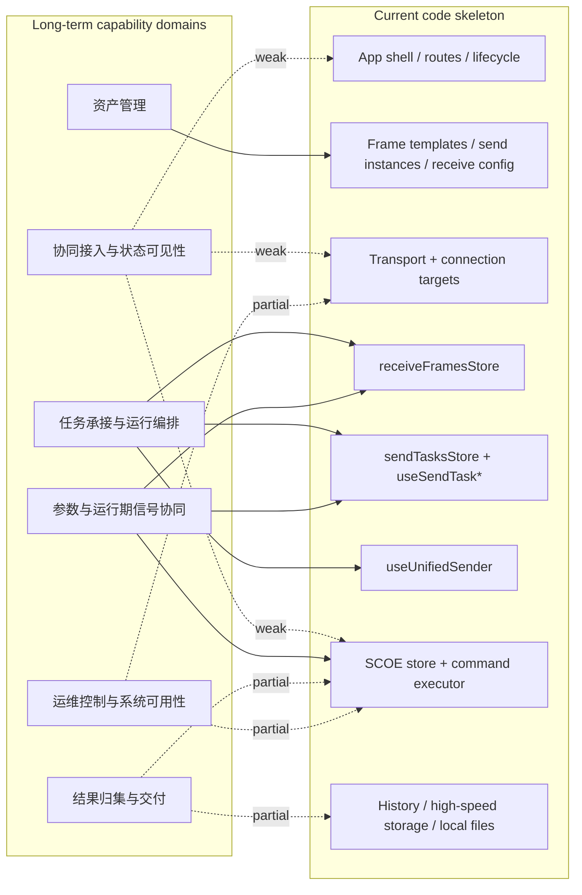

# 甲方能力域 vs 当前代码骨架 spike

## Scope

- 目标：做 evidence-based explore / spike，不进入 design、spec、实现建议。
- 资料范围：已阅读指定文档、现有 `easysdd/compound/2026-04-23-explore-task-system-module-overview.md`、当前仓库相关代码入口与骨架。
- 置信度规则：
  - `Evidence`：代码或文档中可直接指到的事实。
  - `Inference`：基于多处证据的归纳判断。
  - `Unknown`：当前仓库与文档都不足以确认的点。
- 特别约束：`08`、`09` 仅作为低置信度参考，不视为已批准结论。

## Ranked synthesis

1. `High confidence`：甲方长期能力更自然地分成 6 个能力域，而不是“任务接口列表 + 其他零散接口”。
2. `High confidence`：当前仓库已经有较强的本地运行骨架，但它主要是“帧收发工作台 + 发送任务编排 + SCOE + 本地存储/历史”，还不是完整的“中心协同接入型集成测试系统骨架”。
3. `High confidence`：当前 `send task` 体系是一个重要内部热点，但它更像“本地发送执行/编排骨架”，不能直接等同于未来全系统主骨架。
4. `High confidence`：当前仓库在“资产/配置”上已有明显落点，但落点是 `frame template / send instance / receive mapping / SCOE command config`，不是甲方文档里的完整“用例/脚本/菜单资产系统”。
5. `High confidence`：当前仓库存在本地结果留痕、历史分析、高速存储等能力，但“用例结果回传、任务汇总、JSON 报告、报告交付、北向响应/心跳”没有形成代码中的独立边界层。

## Evidence

### S1. 甲方长期能力应按 6 个能力域理解，而不是按接口标题重抄

`Evidence`

- 甲方拆解文档已经把原文重组为：设备/子系统基础信息、用例资产/脚本/菜单、任务主链、结果/文件/报告、参数协同、运维/升级/保活等主题块。`refactor/docs/甲方文档/集成测试系统与各二级子系统接口设计-原文主题拆解.md:14-40`
- 文档明确区分：
  - 基础信息关注“对象当前长什么样、是否正常、是否告警”，不是任务执行。`refactor/docs/甲方文档/集成测试系统与各二级子系统接口设计-原文主题拆解.md:84-115`
  - 用例/脚本/菜单是资产维护，不是任务执行。`refactor/docs/甲方文档/集成测试系统与各二级子系统接口设计-原文主题拆解.md:116-147`
  - 任务主链只处理接入、启动、控制。`refactor/docs/甲方文档/集成测试系统与各二级子系统接口设计-原文主题拆解.md:149-172`
  - 结果/文件/报告是任务主链之后的交付面。`refactor/docs/甲方文档/集成测试系统与各二级子系统接口设计-原文主题拆解.md:174-196`
  - 参数查询/配置/转发/反馈是单独一组协同行为。`refactor/docs/甲方文档/集成测试系统与各二级子系统接口设计-原文主题拆解.md:220-250`
  - 升级/心跳/重启是系统可用性与运维动作。`refactor/docs/甲方文档/集成测试系统与各二级子系统接口设计-原文主题拆解.md:252-272`

`Inference`

- 从长期看，至少应分开看：
  - 协同接入与状态可见性
  - 资产管理
  - 任务承接与运行编排
  - 参数与运行期信号协同
  - 结果归集与交付
  - 运维控制与系统可用性

`Unknown`

- 心跳最终更靠近“协同可见性”还是“运维控制”，当前文档内部仍有交叉语义，尚未完全拍板。

### S2. 当前仓库已有强本地运行骨架，但不是北向协同型总骨架

`Evidence`

- 路由层显示当前产品表面主要是连接、帧列表/编辑、发送、接收、设置、存储、历史、SCOE，没有北向协同接入模块。`src/router/routes.ts:3-45`
- 应用启动时初始化的是帧模板、发送实例、接收配置、串口、连接目标、统计、SCOE、本地数据采集，而不是中心侧协同入口。`src/layouts/useAppLifecycle.ts:45-68`
- 前端公共 API / preload API 暴露的仍是系统、串口、网络、文件、接收、存储、历史、定时器等桌面与本地能力，没有中心侧业务 API 层。`src/api/common/index.ts:6-34`, `src-electron/preload/api/index.ts:14-31`
- 网络 IPC 处理的是 TCP/UDP/TCP server 连接能力，本身是传输层，不是中心控制系统业务边界。`src-electron/main/ipc/networkHandlers.ts:31-80`, `src-electron/main/ipc/networkHandlers.ts:143-223`

`Inference`

- 当前代码更像“本地收发/测试工作台 + 若干运行骨架”，不是“外部中心协同对象进入后驱动内部骨架”的系统。

`Unknown`

- 仓库外是否还有独立的北向服务、协议网关或另一个对接仓库，当前 explore 无法确认。

### S3. 当前 task system 是重要内部热点，但不能直接视为全系统主骨架

`Evidence`

- 架构文档明确：任务系统不是接收主链，不是发送主链，不是页面工作台；它应是独立能力域，但报告生成、结果展示、历史沉淀和对外交付不应混入任务系统。`refactor/docs/03-architecture/06-任务系统归口方式.md:74-90`, `refactor/docs/03-architecture/06-任务系统归口方式.md:208-214`
- 运行主状态文档明确：中心任务上下文不等于现有发送任务；页面工作台状态、发送任务监控状态、接收显示态、历史态都不应充当运行骨架。`refactor/docs/03-architecture/04-运行主状态与状态边界.md:50-79`, `refactor/docs/03-architecture/04-运行主状态与状态边界.md:95-101`
- 当前代码里的任务体系确实围绕本地发送任务展开：
  - `sendTasksStore` 维护任务对象、状态索引、活跃任务、触发监听入口。`src/stores/frames/sendTasksStore.ts:145-185`, `src/stores/frames/sendTasksStore.ts:533-562`
  - 任务完成时直接从 store 中移除。`src/stores/frames/sendTasksStore.ts:401-426`
  - `useSendTaskExecutor` / `useSendTaskController` 管理创建后的启动、定时、触发、停止、暂停/继续等本地执行语义。`src/composables/frames/sendFrame/useSendTaskExecutor.ts:451-485`, `src/composables/frames/sendFrame/useSendTaskController.ts:26-57`, `src/composables/frames/sendFrame/useSendTaskController.ts:70-117`
  - 发送页工作台与任务 UI 是耦合共存的。`src/pages/FrameSendPage.vue:109-193`, `src/pages/FrameSendPage.vue:234-400`

`Inference`

- 当前 task system 很可能是后续多个功能都要借力的内部编排热点，但它现在主要承载的是“本地发送执行任务”，不是全系统唯一主骨架。

`Unknown`

- 未来是否保留一部分显式“非任务发送”入口，还是所有发送都要汇入统一任务语义，当前 explore 不做结论。

### S4. 当前资产/配置落点是 frame-centric，不是 case/script/menu-centric

`Evidence`

- 帧模板是显式的一层核心资产：加载、创建、更新、删除都通过 `frameTemplateStore` 管理。`src/stores/frames/frameTemplateStore.ts:13-40`, `src/stores/frames/frameTemplateStore.ts:42-89`
- 发送实例也是一层显式资产：实例 CRUD、触发/时间策略、统计缓存都集中在 `sendFrameInstancesStore`。`src/stores/frames/sendFrameInstancesStore.ts:27-64`, `src/stores/frames/sendFrameInstancesStore.ts:76-137`, `src/stores/frames/sendFrameInstancesStore.ts:199-249`, `src/stores/frames/sendFrameInstancesStore.ts:293-368`
- 页面层的资产面也是围绕帧列表和帧编辑组织。`src/pages/frames/FrameList.vue:15-29`, `src/pages/frames/FrameEditor.vue:89-141`
- 本地文件 API 提供的是目录、JSON、文本读写等基础文件能力，没有独立的“用例/脚本/菜单”资产域。`src/api/common/filesApi.ts:9-80`

`Inference`

- 当前仓库已经有“资产层雏形”，但这层更接近本地通信/测试工作台资产，不是甲方语义下的用例脚本系统。

`Unknown`

- 未来“用例/脚本/菜单”是否会建立为独立资产域，还是建立在现有 frame/instance/config 之上，目前没有代码证据。

### S5. 本地结果留痕存在，但北向结果交付边界尚未成形

`Evidence`

- 功能清单要求的主线明确包含：任务接入、启动/停止、状态查询、心跳、每用例结果上报、任务汇总、JSON 报告、报告交付。`后面对接所需功能清单.md:109-115`, `后面对接所需功能清单.md:144-209`, `后面对接所需功能清单.md:213-393`
- 当前代码里的结果相邻能力主要是：
  - 历史分析：读取历史数据与元数据，做本地分析。`src/stores/historyAnalysis.ts:21-40`, `src/stores/historyAnalysis.ts:157-229`
  - 高速存储：本地存储配置与统计。`src/stores/highSpeedStorageStore.ts:18-40`, `src/stores/highSpeedStorageStore.ts:80-107`, `src/stores/highSpeedStorageStore.ts:198-264`
  - SCOE 状态和测试记录：本地状态更新、发送/接收记录。`src/stores/scoeStore.ts:42-56`, `src/stores/scoeStore.ts:293-341`
- `08` 和 `09` 自己也都把“中心协同接入与对外交付边界”当作尚未真正展开的缺口。`refactor/docs/03-architecture/08-功能清单与目标架构对比（第二轮）.md:49-58`, `refactor/docs/03-architecture/09-中心协同接入与对外交付边界.md:71-117`

`Inference`

- 结果归集与本地记录并不是空白，但“北向回传/交付”在代码里还没有独立落点。

`Unknown`

- 报告交付最终是接口回传、文件上传、上传后通知，还是混合方式，当前无代码证据。

## Capability map

| 能力域 | 它在解决什么问题 | 当前仓库已有什么落点 | 目前缺什么或仍很模糊 |
| --- | --- | --- | --- |
| 协同接入与状态可见性 | 让外部中心“能把请求送进来，也能看见我是谁、我现在怎么样” | 仅有本地连接与传输能力、SCOE 局部状态、一些显示状态；没有独立北向边界层。`src/router/routes.ts:3-45`, `src/api/common/index.ts:6-34`, `src/stores/settingsStore.ts:8-22`, `src/stores/scoeStore.ts:293-341` | `subSysType/subSysId` 的稳定来源、状态查询投影视图、心跳归属、基础响应/错误模型都没有代码落点。 |
| 资产管理 | 管“系统里有哪些可执行资产，以及如何维护它们” | `frameTemplateStore`、`sendFrameInstancesStore`、接收配置、SCOE command/config、本地文件工具。`src/stores/frames/frameTemplateStore.ts:13-40`, `src/stores/frames/sendFrameInstancesStore.ts:27-64`, `src/stores/frames/receiveFramesStore.ts:343-369`, `src/stores/frames/scoeFrameInstancesStore.ts:78-101`, `src/api/common/filesApi.ts:9-80` | 没有独立的用例/脚本/菜单资产模型，也没有甲方语义下的资产生命周期边界。 |
| 任务承接与运行编排 | 把任务吃进来、建立上下文、推进用例执行、吸收启动/停止/等待/完成等语义 | 当前最接近的是本地发送任务体系、触发监听、统一发送编排，以及 receive -> trigger -> task 的链路。`src/stores/frames/sendTasksStore.ts:145-185`, `src/stores/frames/sendTasksStore.ts:533-562`, `src/composables/frames/sendFrame/useSendTaskExecutor.ts:451-964`, `src/stores/frames/receiveFramesStore.ts:1186-1227` | 真正的“中心任务上下文/用例上下文/结果归口状态”没有代码里的独立正式对象。 |
| 参数与运行期信号协同 | 处理参数进入、转发、接收信号触发、运行中协同输入 | receive 主链、mappings、触发条件监听、SCOE 参数解析和文件参数注入。`src/stores/frames/receiveFramesStore.ts:1005-1143`, `src/composables/frames/sendFrame/useSendTaskTriggerListener.ts:164-183`, `src/composables/scoe/commands/readFileAndSend.ts:41-157` | “参数协同”目前主要是本地帧/触发/SCOE 语义，没有独立的北向参数协同对象。 |
| 结果归集与交付 | 把运行中产生的结果沉淀成可读、可汇总、可交付的事实 | 本地历史分析、高速存储、SCOE 状态与记录、本地文件能力。`src/stores/historyAnalysis.ts:157-229`, `src/stores/highSpeedStorageStore.ts:198-264`, `src/stores/scoeStore.ts:293-341`, `src/api/common/filesApi.ts:9-80` | 用例级结果事实、任务级汇总、JSON 报告、交付回执、报告交付边界都没有独立代码骨架。 |
| 运维控制与系统可用性 | 处理升级、重启、保活、系统维护动作 | 当前可见的是本地连接状态、SCOE 自身状态更新、beforeunload 清理、本地设置/记录。`src/boot/taskManager.ts:17-48`, `src/stores/scoeStore.ts:293-341`, `src/stores/settingsStore.ts:8-22` | 升级、重启、外部保活协同都缺代码证据；心跳是否归这里还是归协同外显层仍待拍板。 |

说明：

- 实线：当前代码里已有较直接骨架。
- `weak / partial`：只有局部能力或本地实现痕迹，不等于完整能力域。

## Current code map

| 区域 | 入口 | 主要职责 | 主要依赖 |
| --- | --- | --- | --- |
| 应用壳层 | `src/router/routes.ts`, `src/layouts/useAppLifecycle.ts` | 组织页面、初始化本地帧/连接/SCOE/统计/记录能力 | `frameTemplateStore`, `sendFrameInstancesStore`, `receiveFramesStore`, `serialStore`, `connectionTargetsStore`, `scoeStore` |
| 传输与连接目标层 | `src/stores/netWorkStore.ts`, `src/stores/serialStore.ts`, `src/stores/connectionTargetsStore.ts`, `src-electron/main/ipc/networkHandlers.ts` | 管理 serial/network 连接、统一目标 ID、入站字节转发 | Electron IPC、`receiveFramesStore`、`connectionTargetsStore` |
| 接收主骨架 | `src/stores/frames/receiveFramesStore.ts` | 串行化接收入站、统一解析调用、缓存/分组/表达式/统计更新、触发下游监听、SCOE 特判入口 | `receiveAPI`, `globalStatsStore`, `frameExpressionManager`, `sendTasksStore`, SCOE 相关组件 |
| 发送/任务工作台骨架 | `src/pages/FrameSendPage.vue`, `src/composables/frames/sendFrame/useSendTaskManager.ts`, `src/composables/frames/sendFrame/useSendTaskExecutor.ts`, `src/composables/frames/sendFrame/useSendTaskController.ts`, `src/stores/frames/sendTasksStore.ts` | 创建本地发送任务、启动/停止/暂停/恢复、定时/触发调度、活跃任务监控 | `useUnifiedSender`, timer manager, `sendTasksStore`, `receiveFramesStore` |
| 统一发送层 | `src/composables/frames/sendFrame/useUnifiedSender.ts` | 将显式目标解析成 serial/network 落地发送，更新发送统计与全局通信统计 | `connectionTargetsStore`, `serialAPI`, `networkAPI`, `sendFrameInstancesStore`, `globalStatsStore`, `scoeStore` |
| 资产/配置层 | `src/stores/frames/frameTemplateStore.ts`, `src/stores/frames/sendFrameInstancesStore.ts`, `src/pages/frames/FrameList.vue`, `src/pages/frames/FrameEditor.vue`, `src/api/common/filesApi.ts` | 管理帧模板、发送实例、局部文件/JSON 资产 | `dataStorageAPI`, `filesAPI` |
| SCOE 领域层 | `src/stores/scoeStore.ts`, `src/composables/scoe/useScoeCommandExecutor.ts`, `src/composables/scoe/commands/readFileAndSend.ts` | 维护 SCOE 配置与状态、识别并执行 SCOE 指令、复用统一发送与本地 task system | `networkStore`, `useUnifiedSender`, `scoeFrameInstancesStore`, `useSendTaskManager`, `filesAPI`, `pathAPI` |
| 本地记录/历史/存储层 | `src/stores/historyAnalysis.ts`, `src/stores/highSpeedStorageStore.ts` | 管理历史读取分析、高速存储配置与统计 | `historyDataAPI`, `highSpeedStorageAPI` |

## Cross-cut hotspots

### H1. `receiveFramesStore`

`Evidence`

- 统一入站入口做了队列/锁控制。`src/stores/frames/receiveFramesStore.ts:805-891`
- 同时承担接收解析结果更新、表达式计算、统计、触发条件检查。`src/stores/frames/receiveFramesStore.ts:1005-1143`
- 还把更新后的数据项转成 `DataItem[]` 继续推给 `sendTasksStore`。`src/stores/frames/receiveFramesStore.ts:1186-1227`
- SCOE 还在这里通过 `scoe-tcp-server` 做前置短路。`src/stores/frames/receiveFramesStore.ts:1015-1021`

`Inference`

- 这是当前最典型的“多能力域共享热点”：参数信号、触发、显示、统计、SCOE、任务编排都在这里汇流。

`Why it is a rework amplifier`

- 一旦未来要把“接收事实”“任务推进输入”“SCOE 领域入口”“显示/历史订阅”分层，这里会是第一批高影响区。

### H2. `sendTasksStore` + `useSendTaskExecutor` / `useSendTaskController`

`Evidence`

- 任务对象、状态索引、活跃任务与触发监听归口都在这里。`src/stores/frames/sendTasksStore.ts:145-185`, `src/stores/frames/sendTasksStore.ts:533-562`
- 任务完成即移除，说明当前 store 主要服务本地活动任务而非任务全生命周期留痕。`src/stores/frames/sendTasksStore.ts:401-426`
- 执行器负责定时、顺序、条件触发、时间触发四类推进。`src/composables/frames/sendFrame/useSendTaskExecutor.ts:490-964`
- 控制器的暂停/继续仍主要是状态切换，说明控制语义还偏本地实现态。`src/composables/frames/sendFrame/useSendTaskController.ts:70-117`

`Inference`

- 这组模块是“内部执行编排热点”，很多后续能力都会从这里借力，但它目前还不等于正式中心任务系统。

### H3. `useUnifiedSender` + `connectionTargetsStore`

`Evidence`

- 所有发送最终都收敛到统一目标解析与 serial/network 落地。`src/composables/frames/sendFrame/useUnifiedSender.ts:69-177`
- 发送目标是逻辑 target ID，经 `connectionTargetsStore` 解析/验证后落到物理路径。`src/composables/frames/sendFrame/useUnifiedSender.ts:107-136`, `src/stores/connectionTargetsStore.ts:172-197`
- SCOE 已经在统一发送中有目标特判。`src/composables/frames/sendFrame/useUnifiedSender.ts:154-160`

`Inference`

- 它已经是“通用发送落地层”雏形，也是手工发送、任务发送、SCOE 发送共同依赖的交叉热点。

### H4. SCOE 领域接入点

`Evidence`

- SCOE 依赖接收入口、统一发送、独立配置和状态更新。`src/stores/scoeStore.ts:18-24`, `src/stores/scoeStore.ts:216-311`
- `readFileAndSend` 直接复用 `useSendTaskManager()` 创建和启动标准发送任务。`src/composables/scoe/commands/readFileAndSend.ts:118-157`
- 架构文档明确：SCOE 是二级领域模块，不是一级骨架能力。`refactor/docs/03-architecture/07-SCOE 的架构位置.md:87-97`, `refactor/docs/03-architecture/07-SCOE 的架构位置.md:143-153`

`Inference`

- SCOE 不是边缘点，而是验证“通用链路 vs 领域模块”边界是否真的成立的关键压力点。

## Validation of 08/09

### 哪些判断被当前代码支持

1. `08` 说“内部骨架与北向协同边界不是同一件事”，这点有代码支持。
   - 当前代码里确实能看到内部骨架碎片：接收链、发送链、本地 task system、SCOE、本地历史/存储。`src/stores/frames/receiveFramesStore.ts:852-1227`, `src/stores/frames/sendTasksStore.ts:145-185`, `src/composables/frames/sendFrame/useUnifiedSender.ts:55-177`, `src/stores/scoeStore.ts:18-24`, `src/stores/historyAnalysis.ts:157-229`
   - 但看不到独立的北向协同接入/交付层。`src/router/routes.ts:3-45`, `src/api/common/index.ts:6-34`, `src-electron/preload/api/index.ts:14-31`

2. `08` 说“很多功能项的真正缺口在北向边界而不是内部对象”，这点也有代码支持。
   - 当前任务、接收、发送、本地记录都已存在局部实现。
   - 但身份、状态查询、心跳、用例结果上报、报告交付都缺少独立代码边界。`后面对接所需功能清单.md:123-393`, `src/stores/settingsStore.ts:8-22`, `src/api/common/index.ts:6-34`

3. `09` 说“外部请求对象不应直接等于内部运行对象”，这点与现有代码现状并不冲突，反而被代码侧的缺位所侧面支持。
   - 当前代码里根本还没有这组外部对象，说明还没有证据能把外部协同对象直接压成内部对象。

### 哪些判断只是文档自洽，但缺代码证据

1. `09` 的“中心协同接入层 / 对外交付层”二分法，目前是文档层判断，不是代码现实。
   - 代码里没有独立模块、API、store 或目录体现这两个边界层。`src/router/routes.ts:3-45`, `src/api/common/index.ts:6-34`, `src-electron/preload/api/index.ts:14-31`

2. `08` 里“`03-07` 已经把稳定落点立住”的说法，只能算架构文档内部自洽。
   - 从代码看，很多“稳定落点”仍停留在术语层，并没有与当前实现一一对齐。
   - 尤其是 `子系统运行主体 / 中心任务上下文 / 用例执行上下文 / 结果归口状态` 这组对象，在代码里没有直接落点。对照 `refactor/docs/03-architecture/04-运行主状态与状态边界.md:58-93`

3. `09` 对“投影视图”的描述目前也是文档判断，不是代码事实。
   - 当前没有北向状态投影、心跳投影、用例结果投影、任务结果投影的独立实现。

### 哪些地方可能拍脑袋过早收敛了

1. 把当前内部骨架说成“已经足以承接后续 spec”的语气偏早。
   - 从代码看，内部热点很多仍是页面/本地工作台语义与运行语义混合。
   - 例如当前 `send task` 完成后直接移除、暂停/继续仍主要停留在本地状态切换。`src/stores/frames/sendTasksStore.ts:401-426`, `src/composables/frames/sendFrame/useSendTaskController.ts:70-117`

2. 把“结果归口状态”和“对外交付边界”的关系说得过于接近，也偏早。
   - 当前代码能证明本地记录/历史存在，但不能证明未来结果事实如何稳定形成，更不能证明交付动作如何与其脱钩。`src/stores/historyAnalysis.ts:157-229`, `src/stores/highSpeedStorageStore.ts:198-264`

3. 把“任务系统是独立能力域”直接投射成“当前代码里已经有可直接升级的任务系统骨架”，也需要保留谨慎。
   - 代码里现在最强的是“本地发送任务骨架”，不是已独立成形的中心任务系统。

## Unknowns / limits

1. 当前仓库之外是否存在独立北向服务、协议层或另一个联调仓库，无法确认。
2. `subSysType / subSysId / 最小设备信息` 的真实来源与持久化归属，代码里没有证据。
3. 用例结果字段、任务报告字段、报告交付方式仍未明确，文档也明确这些尚未确认。`后面对接所需功能清单.md:94-105`, `后面对接所需功能清单.md:423-459`
4. “用例/脚本/菜单”是否会成为独立资产系统，还是会建立在当前 frame-centric 资产之上，当前 explore 无法拍板。
5. 升级、重启、完整运维控制能力是否在别处实现，当前仓库没有直接证据。
6. 心跳最终算接入层保活语义、交付层主动外显，还是运维控制的一部分，当前只能标为边界待决。

## Next-step handoff

1. 外部协同对象、内部运行对象、交付对象三层，最小应该怎么切分，哪些绝不能混写？
2. 当前系统里最值得被确认为“稳定内部事实源”的对象，究竟有哪些；哪些仍只是工作台态、显示态或记录态？
3. 当前 frame/template/instance 资产层，未来应只作为底层技术资产，还是需要承接一部分 case/script/menu 语义？
4. 用例级结果、任务级结果、报告对象三层之间，最小应该如何区分，哪些只是运行事实，哪些才是交付对象？
5. 如果后续要继续收敛热点，优先该讨论 `receive -> task`、`task -> result`、还是 `northbound ingress/delivery` 这三条边界中的哪一条？

## Source note

- 已阅读根 `AGENTS.md`；未发现更深层 `AGENTS.md` 覆盖本次涉及目录。
- 已读取：
  - `refactor/docs/甲方文档/集成测试系统与各二级子系统接口设计-原文主题拆解.md`
  - `refactor/docs/03-architecture/04-运行主状态与状态边界.md`
  - `refactor/docs/03-architecture/05-接收主链与发送主链组织方式.md`
  - `refactor/docs/03-architecture/06-任务系统归口方式.md`
  - `refactor/docs/03-architecture/07-SCOE 的架构位置.md`
  - `refactor/docs/03-architecture/08-功能清单与目标架构对比（第二轮）.md`
  - `refactor/docs/03-architecture/09-中心协同接入与对外交付边界.md`
  - `easysdd/compound/2026-04-23-explore-task-system-module-overview.md`
  - `后面对接所需功能清单.md`
