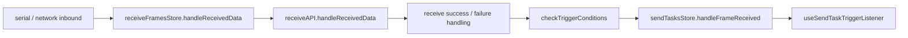

# Batch 1A first-cut cleanup plan

## 1. Context recap

Evidence:

- Post-step3 gating 已把 Batch 1A 定为第一批 cleanup 入口，覆盖 `receiveFramesStore` 与 `useSendTaskTriggerListener`，原因是接收事实、解析、统计、缓存、分组、表达式、触发和 SCOE 分流混在同一热点链路上。`easysdd/compound/2026-04-24-post-step3-review-and-execution-gating.md:190-203`
- Guardrail 明确当前下一步只能进入 `1A first-cut cleanup plan`，不得直接进入代码实现、feature design 或 spec 字段设计。`easysdd/compound/2026-04-24-cleanup-to-design-process-guardrail.md:42-67`
- Sequencing 已裁定第一刀只围绕 1A 直接链路：`receiveFramesStore` 当前接收输入事实、接收副作用边界、触发检查到 listener 的隐式事实链。`easysdd/compound/2026-04-24-batch-1abc-cleanup-sequencing-and-first-cut-scope.md:65-89`
- Code reality checkpoint 已核对真实调用链和保护面，结论是可以进入 `1A first-cut cleanup plan`，但前提只是“现有接收链路事实核对已完成”，不是目标架构已经清楚。`easysdd/compound/2026-04-24-code-reality-check-before-1a-cleanup-plan.md:165-190`

Inference:

- 当前文档承接顺序是：post-step3 gating 先给 cleanup-first gate，1ABC sequencing 再裁定第一刀顺序，code reality checkpoint 最后确认第一刀链路在代码中成立。
- 本文只把这些既有结论转成可执行前的 cleanup plan gate，不扩展为 feature design 或实现方案。

Plan decision:

- 本文是进入 implementation cleanup 前的最后一层边界计划：只回答第一刀切哪条事实链、保护哪些现状行为、哪些点停线、哪些验证面必须先列出、下一轮实现 cleanup 的最小边界。

## 2. Plan summary

Plan decision:

- 第一刀切：`serial/network -> receiveFramesStore.handleReceivedData -> receiveAPI.handleReceivedData -> checkTriggerConditions -> sendTasksStore.handleFrameReceived -> useSendTaskTriggerListener` 这条接收事实到触发 listener 的现状链。
- 第一刀不切：send-task lifecycle、common sender、SCOE 领域模型、result/report、Platform API 分层、任何 feature design。
- 现在可以进入 cleanup plan，因为 Gate 2 需要的第一刀链路、非目标、保护面、SCOE/result 停线点已经有文档和代码证据。`easysdd/compound/2026-04-24-cleanup-to-design-process-guardrail.md:114-137`, `easysdd/compound/2026-04-24-code-reality-check-before-1a-cleanup-plan.md:167-184`
- 现在不能进入实现，因为 Gate 3 还要求已有明确 cleanup plan、回归保护或可验证路径、小范围可回滚且不引入 feature behavior；本文正是在补这个 gate。`easysdd/compound/2026-04-24-cleanup-to-design-process-guardrail.md:138-154`

Deferred:

- trigger candidate 最终对象、中心任务上下文字段、生命周期枚举、发送 request/result、SCOE 接入对象、result/report 对象、Platform API 分层都不在本文拍板。

## 3. Confirmed first-cut scope

### 3.1 Evidence

- 串口 store 创建时持有 `receiveFramesStore`，串口连接成功后注册监听，数据回调按 `portPath` 过滤并调用 `receiveFramesStore.handleReceivedData('serial', portPath, ...)`。`src/stores/serialStore.ts:31-34`, `src/stores/serialStore.ts:177-193`, `src/stores/serialStore.ts:391-417`
- 网络数据监听把 `receivedData` 转成 `Uint8Array` 后调用 `receiveFramesStore.handleReceivedData('network', connectionId, ...)`，并更新连接活动时间；网络初始化会设置数据监听。`src/stores/netWorkStore.ts:200-218`, `src/stores/netWorkStore.ts:296-300`
- `handleReceivedData` 的入参只有 `source`、`sourceId`、`data`，并通过 `processingLock` 与 `pendingProcessQueue` 串行处理。`src/stores/frames/receiveFramesStore.ts:805-891`
- 通用接收解析调用点是 `receiveAPI.handleReceivedData(source, sourceId, data)`，Electron receive API 不可用时返回 `success: false`。`src/stores/frames/receiveFramesStore.ts:1023-1025`, `src/api/common/receiveApi.ts:21-48`
- 解析成功后，接收 store 更新 recent packet、`frameDataCache`、`groups` 当前值、表达式、星座图采集、`frameStats`，再用 `frameId`、`source + ':' + sourceId`、`updatedDataItems` 调用 `checkTriggerConditions`。`src/stores/frames/receiveFramesStore.ts:1050-1138`
- `checkTriggerConditions` 回读 `groups` 把更新项补成 `DataItem[]`，再调用 `sendTasksStore.handleFrameReceived(frameId, sourceId, dataItems)`。`src/stores/frames/receiveFramesStore.ts:1186-1227`
- `sendTasksStore.handleFrameReceived` 只转发到 trigger listener。`src/stores/frames/sendTasksStore.ts:553-562`
- trigger listener 匹配 `triggerFrameId` 与 `sourceId`，再读取本地任务状态，要求任务仍是 `waiting-trigger` 后才评估条件并触发执行。`src/composables/frames/sendFrame/useSendTaskTriggerListener.ts:70-92`

### 3.2 Inference

- 当前代码支持的最强第一刀判断是：接收输入事实到触发 listener 的隐式事实链确实存在。
- 当前代码没有稳定的正式 trigger candidate 对象，只能证明现状链路里存在 `frameId + sourceId + updatedDataItems/DataItem[]` 这类等价运行输入证据。`easysdd/compound/2026-04-24-code-reality-check-before-1a-cleanup-plan.md:54-63`
- 本轮核对范围是用户限定的 1A 直接链路，不是全仓入口证明；全仓额外回读点只能作为观察点，不进入第一刀实现范围。

### 3.3 Plan decision

- 第一刀 cleanup plan 覆盖真实链路：

  `serial/network -> receiveFramesStore.handleReceivedData -> receiveAPI.handleReceivedData -> checkTriggerConditions -> sendTasksStore.handleFrameReceived -> useSendTaskTriggerListener`

- 第一刀排序：
  1. 先保护入站可达性和处理顺序。
  2. 再保护解析成功 / 失败与现有副作用可观察性。
  3. 再标清触发转发链里的混合事实点。
  4. 进入 listener 后只标注 1B 边界，不设计 lifecycle。

Deferred:

- 不决定 `DataItem[]`、`groups`、`mappings`、`allReceiveFrameData` 是否会在未来继续作为任务输入载体；本文只把它们标为当前混合事实点。

## 4. Protected current behavior

Plan decision:

第一刀实现前必须保护以下现有行为。保护的意思是下一轮 cleanup 不得无证据破坏这些可观察行为；它不表示这些行为会被升格为目标架构。

### 4.1 串口 / 网络入站可达性

Evidence:

- 串口数据监听先保留端口消息，再调用统一接收入口。`src/stores/serialStore.ts:391-417`
- 网络数据监听调用统一接收入口后更新 `lastActivity`。`src/stores/netWorkStore.ts:207-218`

Protected behavior:

- 串口入站仍按端口过滤。
- 网络入站仍按连接 ID 进入接收链。
- `source/sourceId/data` 三元组的现有语义保持可用。
- `source + ':' + sourceId` 的触发来源匹配口径保持可观察。

### 4.2 processing lock / pending queue 顺序

Evidence:

- 正在处理时新请求进入 `pendingProcessQueue`，首包处理后 FIFO `shift()` 并逐个 `await processDataInternal`，最后释放锁。`src/stores/frames/receiveFramesStore.ts:857-891`

Protected behavior:

- 同一接收入口内仍是串行处理。
- 快速连续入站不应乱序更新当前值、统计、表达式或触发判断。
- 单包异常后不能让后续包永久卡在锁里。

### 4.3 解析成功 / 失败路径

Evidence:

- Electron receive API 不可用时 `receiveAPI.handleReceivedData` 返回失败结果。`src/api/common/receiveApi.ts:21-48`
- 解析失败会增加 unmatched，解析错误会增加 parse error，可能记录 recent packet 并 warning。`src/stores/frames/receiveFramesStore.ts:1027-1045`
- 解析成功会增加 matched，可能记录 recent packet。`src/stores/frames/receiveFramesStore.ts:1050-1056`

Protected behavior:

- API 不可用、未匹配、解析错误、匹配成功四类现状分支保持可观察。
- 失败分支不能从“返回失败结果”漂移成接收链崩溃。
- 成功 / 失败统计口径和 recent packet 记录不被无意改变。

### 4.4 recent packets / stats / frameDataCache / groups 当前值 / 表达式 / 星座图 / frameStats

Evidence:

- `frameDataCache` 与 `allReceiveFrameData` 是当前值缓存。`src/stores/frames/receiveFramesStore.ts:337-341`
- 成功解析后按 `updatedDataItems.fieldId` 更新 `frameDataCache`。`src/stores/frames/receiveFramesStore.ts:1058-1073`
- 成功解析后回填 `groups` 中 dataItem 的 `value/displayValue`，表达式字段跳过。`src/stores/frames/receiveFramesStore.ts:1075-1089`
- 成功解析后同步计算接收帧表达式。`src/stores/frames/receiveFramesStore.ts:1091-1099`
- 成功解析后采集星座图数据并更新 `frameStats`。`src/stores/frames/receiveFramesStore.ts:1101-1125`, `src/stores/frames/receiveFramesStore.ts:1149-1180`
- `clearReceiveStats` 会清空 recent packets、frame stats 与 frame data cache。`src/stores/frames/receiveFramesStore.ts:1233-1240`

Protected behavior:

- 当前值面板、表达式结果、星座图采集、帧统计、recent packets 和 cache 清理行为保持可观察。
- 这些内容只作为显示 / 统计 / 缓存 / 表达式副作用被保护，不作为任务输入事实源拍板。

### 4.5 现有触发任务可用性

Evidence:

- 接收成功且有 `frameId/updatedDataItems` 时进入触发检查。`src/stores/frames/receiveFramesStore.ts:1127-1138`
- listener 空条件默认触发；无 dataItems 返回 false；未知操作符或异常返回 false。`src/composables/frames/sendFrame/useSendTaskTriggerListener.ts:100-158`, `src/composables/frames/sendFrame/useSendTaskTriggerListener.ts:189-218`
- listener 通过 `receiveFramesStore.mappings` 把条件字段映射到 data item。`src/composables/frames/sendFrame/useSendTaskTriggerListener.ts:164-184`
- 触发任务启动时写 `waiting-trigger` 并注册 listener。`src/composables/frames/sendFrame/useSendTaskExecutor.ts:733-780`

Protected behavior:

- 匹配帧、匹配来源、空条件、基本比较操作符、字段缺失和非 `waiting-trigger` 任务的现状行为保持可观察。
- 一次性触发任务完成后 listener 注销、任务完成 / 错误路径保持现状兼容。
- 这些行为只保护现有触发任务可用性，不把 `waiting-trigger` 或 listener 注册状态升格为中心任务生命周期。

### 4.6 SCOE 早退旁路

Evidence:

- `sourceId === 'scoe-tcp-server'` 时先走 `handleScoeFrame(data)`；若返回 true 则直接 return，不进入通用 `receiveAPI.handleReceivedData`。`src/stores/frames/receiveFramesStore.ts:1015-1021`
- SCOE 未加载时只接受指令码 `01` 加载指令。`src/utils/receive/scoeFrame.ts:191-212`

Protected behavior:

- SCOE 早退旁路只保护、不解释、不设计。
- 任何实现 cleanup 若要改动这条早退逻辑，必须先停线补 Batch 1D SCOE observation / scope。

## 5. Known mixed facts to isolate

Evidence:

- `checkTriggerConditions` 回读 `groups`，把本次更新项补成 `DataItem[]`。`src/stores/frames/receiveFramesStore.ts:1186-1227`
- listener 回读 `receiveFramesStore.mappings` 解析条件字段。`src/composables/frames/sendFrame/useSendTaskTriggerListener.ts:164-184`
- listener 读取 `sendTasksStore.getTaskById`，并要求任务状态为 `waiting-trigger`。`src/composables/frames/sendFrame/useSendTaskTriggerListener.ts:79-84`
- listener 命中后动态导入 executor，初始化缓存并执行本地任务。`src/composables/frames/sendFrame/useSendTaskTriggerListener.ts:223-305`
- SCOE 通过 `scoe-tcp-server` 在 receive store 内早退。`src/stores/frames/receiveFramesStore.ts:1015-1021`
- 表达式管理读取 `mappings/groups/allReceiveFrameData` 并回写数据项。`src/composables/frames/useFrameExpressionManager.ts:355-395`, `src/composables/frames/useFrameExpressionManager.ts:450-470`
- SCOE completion 读取 `allReceiveFrameData`，link-check 读取 `groups`。`src/utils/receive/scoeFrame.ts:416-435`, `src/composables/scoe/commands/linkCheck.ts:14-35`

Inference:

- 混合点的共同风险是：下游通过接收共享状态回读补齐自己的语义，让显示 / 缓存 / 记录 / 本地执行态看起来像运行事实。
- 1A cleanup 的第一刀价值是把这些混合点隔离为现状事实和停线点，而不是一次性清掉所有回读。

Plan decision:

- `checkTriggerConditions` 回读 `groups` 是第一刀内的核心混合事实点。
- listener 回读 `mappings`、读取任务状态、动态进入 executor 是 1A/1B 交界混合事实点。
- SCOE 早退、SCOE completion/link-check、表达式回读是观察点和停线点，不作为第一刀实现范围。

Deferred:

- 不设计表达式参与触发的未来归属。
- 不设计 SCOE completion 或 link-check 的归口。
- 不设计 listener 最终归属。

## 6. Non-goals

Deferred:

- 不设计 trigger candidate 最终对象、正式类型、命名、字段集合或任务解释规则。`easysdd/compound/2026-04-24-batch-1a-receive-input-and-trigger-cleanup-scope-memo.md:222-235`
- 不设计中心任务上下文字段、用例执行上下文字段、生命周期控制状态字段或结果归口状态字段。`easysdd/compound/2026-04-24-batch-1b-send-task-lifecycle-cleanup-scope-memo.md:337-350`
- 不设计生命周期枚举，不把现有 `SendTask.status` 外放为未来中心任务状态。`easysdd/compound/2026-04-24-batch-1b-send-task-lifecycle-cleanup-scope-memo.md:276-295`
- 不改 send-task lifecycle，不解释 `completed / paused / waiting-trigger / waiting-schedule / running` 的未来正式语义。
- 不改 common sender，不设计显式发送 request、标准发送 result、目标适配分层或发送结果归口。`easysdd/compound/2026-04-24-batch-1c-unified-sender-and-target-cleanup-scope-memo.md:98-117`, `easysdd/compound/2026-04-24-batch-1c-unified-sender-and-target-cleanup-scope-memo.md:156-177`
- 不设计 SCOE 指令模型、固定目标、领域完成条件、测试工具记录或 SCOE 接入对象。
- 不设计 result/report、本地记录、报告素材、JSON 报告字段或对外交付。
- 不碰 Platform API / `contextIsolation` / `contextBridge` / preload / `window.electron.*` / common API wrapper；用户倾向关闭 Platform API isolation 不是已拍板 decision。`easysdd/compound/2026-04-24-cleanup-to-design-process-guardrail.md:68-91`

## 7. Stop conditions

Plan decision:

出现以下信号时，下一轮实现 cleanup 必须停线，回到对应 observation 或 decision；不能在第一刀内顺手处理。

| Stop condition | 触发信号 | 停回位置 |
| --- | --- | --- |
| 进入 feature/spec 设计 | 开始讨论字段名、DTO、对象 schema、JSON 报告 schema、生命周期枚举、北向协议 | cleanup scope / feature brainstorm / decision，按 guardrail 仲裁 |
| 进入 1B lifecycle | 开始解释 `SendTask.status`、`waiting-trigger`、`completed`、stop/pause/resume、timer/listener 注册状态的未来正式语义 | Batch 1B observation / scope |
| 进入 1C common sender | 开始定义发送 request/result，或让 common sender 解释任务完成、用例结果、报告交付、SCOE 领域成功 | Batch 1C observation / scope |
| 进入 SCOE | 改动或解释 `scoe-tcp-server` 早退、SCOE 固定 target、SCOE 记录回写、SCOE completion/link-check、SCOE 长流程调度 | Batch 1D SCOE observation / scope |
| 进入 result/report | 移动 history/storage/files，解释结果事实、报告对象、报告素材、文件交付、F09-F12 归口 | result boundary observation |
| 进入 Platform API | 修改 `src/api/common/receiveApi.ts`、preload API、IPC handler、`window.electron.*`、`contextIsolation` / `contextBridge` | Platform API boundary analysis / decision |
| 把当前热点升格为目标架构 | 把 `receiveFramesStore`、`sendTasksStore`、`useUnifiedSender`、SCOE 特判或 history/storage/files 写成未来正式架构事实源 | 回到 cleanup sequencing 仲裁 |

Evidence:

- Guardrail 总 stop conditions 已列出字段、生命周期、接收共享状态、common sender、result、北向协议、Platform API 等停线信号。`easysdd/compound/2026-04-24-cleanup-to-design-process-guardrail.md:180-199`
- Sequencing 要求 cleanup plan 写明遇到 SCOE、result、Platform API 时的条件插队和停线规则。`easysdd/compound/2026-04-24-batch-1abc-cleanup-sequencing-and-first-cut-scope.md:181-206`, `easysdd/compound/2026-04-24-batch-1abc-cleanup-sequencing-and-first-cut-scope.md:208-254`
- Code reality checkpoint 已将 executor/controller/unified sender、SCOE、result、Platform API 列为继续深入会越界的位置。`easysdd/compound/2026-04-24-code-reality-check-before-1a-cleanup-plan.md:153-164`

## 8. Regression protection surface

Plan decision:

本节只列实现 cleanup 前必须能验证的行为；不要求现在写测试代码。

### 8.1 命令路径

Evidence:

- 当前 package scripts 有 `lint`、`test`、`dev`、`build`；其中 `test` 只是 `echo "No test specified" && exit 0`。`package.json:8-20`

Required command surface:

- `pnpm lint`：作为下一轮实现 cleanup 后的基础静态检查。
- `pnpm build`：若实现 cleanup 触及导入边界、类型可见面或 Electron/Quasar 编译面，必须跑。
- `pnpm test`：当前没有实际测试覆盖，只能作为“无测试套件”事实记录，不能作为回归充分证据。

### 8.2 手工路径与可观察结果

| 验证面 | 手工路径 | 可观察结果 |
| --- | --- | --- |
| 串口入站 | 连接串口后注入一帧 | 对应端口消息增加；统一接收入口被触发；recent packet、统计、当前值按现状更新 |
| 网络入站 | 通过网络连接注入一帧 | 对应连接 `lastActivity` 更新；接收入口收到 `network + connectionId` |
| 处理顺序 | 快速连续注入两包 | 当前值、表达式、统计、触发判断按注入顺序变化 |
| 解析失败 | 注入无法匹配或解析错误数据 | unmatched / parse error / recent packet / warning 按现状出现 |
| 解析成功 | 注入可匹配帧 | matched、recent packet、`frameDataCache`、`groups.value/displayValue`、`frameStats` 更新 |
| 表达式 | 更新直接字段且存在表达式字段 | 表达式字段同步重新计算，跨帧依赖不丢 |
| 星座图 | 接收 bytes 字段 | 星座图采集仍收到对应字段数据 |
| 触发任务 | 配置匹配帧、来源和条件 | `waiting-trigger` 任务收到匹配输入后触发；非 `waiting-trigger` 不触发 |
| 触发条件 | 覆盖空条件、equals、greater/less、contains、字段缺失 | 空条件默认触发；字段缺失/未知操作符/异常按现状 false |
| 一次性触发 | `continueListening=false` 的触发任务 | 命中后 listener 注销；任务完成后按现状从任务列表移除 |
| SCOE 早退 | `scoe-tcp-server` 输入加载指令、非 SCOE、校验失败、命中帧 | 命中 SCOE 后不进入通用 receive API；SCOE 记录和状态仍按现状变化 |
| 清理统计 | 调用 `clearReceiveStats()` | recent packets、frame stats、frame data cache 清空 |

Inference:

- 手工验证必须覆盖“保护行为”和“混合事实点”两类；否则下一轮即使代码能编译，也不能宣称 cleanup 未破坏现状。

Deferred:

- 是否把这些手工路径沉淀成自动测试，留给下一轮实现前的 test strategy；本文不设计测试框架和测试数据结构。

## 9. Implementation-entry gate

Plan decision:

下一轮只有同时满足以下条件，才允许进入 implementation cleanup：

- 已明确第一刀只切 1A 接收事实链，不扩大到 1B / 1C / SCOE / result / Platform API。
- 已确认本文件的 protected behavior、known mixed facts、stop conditions、regression protection surface 仍被采纳。
- 已为下一轮实现选择一个小范围、可回滚、只服务边界清理的最小改动。
- 已确认该改动不引入 feature behavior，不设计新对象字段，不改变 Platform API 分层。
- 已列出实现后至少要执行的命令检查和手工验证路径。

必须补 code reality checkpoint 或单独 decision 的情况：

- 发现限定范围外还有新的入站接收入口，且会影响第一刀事实链。
- 发现第一刀无法绕开 `receiveAPI` wrapper、preload、IPC 或 Electron isolation。
- 发现触发可用性保护必须改 executor、controller、unified sender 或 send-task 状态语义。
- 发现 SCOE 早退或 SCOE completion/link-check 必须被改动才能完成 cleanup。
- 发现 result/report/history/files 会被第一刀触碰。
- 发现需要新增正式字段、枚举、DTO、schema 或对象类型才能继续。

Evidence:

- Guardrail Gate 3 要求 implementation cleanup 必须已有 cleanup plan、验证路径、小范围可回滚且不引入 feature behavior。`easysdd/compound/2026-04-24-cleanup-to-design-process-guardrail.md:138-154`
- Code reality checkpoint 明确进入 1B/1C/SCOE/result/Platform API 的位置都需要停线。`easysdd/compound/2026-04-24-code-reality-check-before-1a-cleanup-plan.md:153-184`

## 10. Handoff to next round

Plan decision:

- 下一轮如果进入实现 cleanup，最小可执行边界只能是：围绕接收入口、解析结果处理、现有副作用保护、触发转发链混合事实点，做小范围、可回滚、行为不变的边界清理。
- 下一轮不得把当前代码热点命名为目标架构，不得把现有 `DataItem[]`、`groups`、`mappings`、`allReceiveFrameData`、`waiting-trigger` 写成未来正式事实。
- 下一轮应优先让“现有接收事实链”和“下游回读共享状态补语义”之间的边界更清楚；只写具体改动时再进入 implementation cleanup。

Deferred:

- 实现步骤、文件级 patch、字段形态、对象命名、测试代码、功能设计、任务系统设计、SCOE 设计、result/report 设计，全部留到后续对应 gate。

Final gate:

- 本文允许下一轮申请进入 Batch 1A implementation cleanup。
- 本文不允许下一轮直接进入 feature design、spec、1B lifecycle 改造、1C common sender 改造、SCOE 领域改造、result/report 改造或 Platform API 分层决策。
