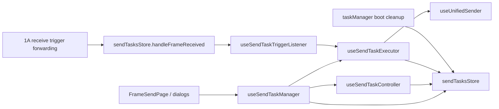

# Code reality checkpoint before 1B cleanup plan

## 1. Context recap

Checkpoint answer:

- 当前代码支持的最强结论是：send-task cluster 是本地发送执行 / 调度 / 监控簇，不是中心任务系统事实源。
- 本文只做 1B cleanup plan 前的代码现实核对；它不是 1B cleanup plan，不写实现步骤，不设计中心任务生命周期，不设计任务字段，也不把当前 `TaskStatus` 升格为目标架构。
- 1B 可以和 1A 并行读证，但流程上不能抢在 1A cleanup 完成前进入 1B cleanup plan 或实现。当前文档链只证明 1A first-cut cleanup plan 已形成，不证明 1A cleanup 已完成。
- 本轮综合了 4 个子 agent 输入：`1b scope extraction memo`、`1b module mapping memo`、`1b challenge memo`、`1b validation surface memo`。主线程另行核对了限定代码范围和两个边界文件。

Evidence:

- Guardrail 说明当前阶段目的是先清理事实源和边界，防止把 `receiveFramesStore`、`sendTasksStore`、`useUnifiedSender`、SCOE 特判、history/storage/files 工具层误升格为目标架构事实。`easysdd/compound/2026-04-24-cleanup-to-design-process-guardrail.md:17-25`
- Guardrail 当前状态仍列出 1A plan、cleanup plan、implementation cleanup、F03-F06 re-gate 等尚未完成，并裁定当前下一步只能进入 `1A first-cut cleanup plan`，不得直接进入实现、feature design 或 spec 字段设计。`easysdd/compound/2026-04-24-cleanup-to-design-process-guardrail.md:42-67`
- Sequencing 裁定主依赖顺序是 `1A -> 1B -> 1C`，并说明并行只限文档观察、保护面梳理和停止条件梳理。`easysdd/compound/2026-04-24-batch-1abc-cleanup-sequencing-and-first-cut-scope.md:90-109`
- 1B scope memo 明确：本 memo 不写实现方案、不定义 spec 字段、不设计未来任务状态机、不把现有 `sendTasksStore` 当作未来中心任务系统。`easysdd/compound/2026-04-24-batch-1b-send-task-lifecycle-cleanup-scope-memo.md:27-31`
- 架构文档明确层级关系是中心任务上下文 > 用例执行上下文 > 本地发送执行对象。`refactor/docs/03-architecture/06-任务系统归口方式.md:163-180`

## 2. Actual send-task cluster chain

Code reality:

- 当前主链不是单一 task engine，而是页面/对话框入口、manager 门面、store 本地任务集合、executor 执行副作用、controller 控制动作、trigger listener、unified sender 和 boot 兜底清理共同形成的本地发送执行链。
- 1A 交界在 `sendTasksStore.handleFrameReceived -> useSendTaskTriggerListener`；1C 交界在 `useSendTaskExecutor.sendFrameToTarget -> useUnifiedSender.sendFrameInstance`。

Evidence:

- `useSendTaskManager` 聚合 `useSendTasksStore`、creator、executor、controller，并在 return 面暴露创建、启动、停止、暂停、恢复、状态查询、监听器查询和统计。`src/composables/frames/sendFrame/useSendTaskManager.ts:15-23`, `src/composables/frames/sendFrame/useSendTaskManager.ts:180-222`
- `sendTasksStore` 持有 `tasks`、`statusIndexes`、`taskMap`、active/running/completed/error/waiting-trigger 计算视图，以及 trigger listener 实例。`src/stores/frames/sendTasksStore.ts:145-214`, `src/stores/frames/sendTasksStore.ts:149-150`
- `useSendTaskExecutor` 持有本地 `isProcessing`、`processingError` 和 `frameInstanceCaches`，并按 task type 分发到 sequential / timed / triggered。`src/composables/frames/sendFrame/useSendTaskExecutor.ts:33-48`, `src/composables/frames/sendFrame/useSendTaskExecutor.ts:451-485`
- `sendTasksStore.handleFrameReceived` 只把接收帧转发给 trigger listener。`src/stores/frames/sendTasksStore.ts:553-562`
- Trigger listener 匹配 frame/source，读取本地任务状态，条件满足后动态导入 executor 执行触发任务。`src/composables/frames/sendFrame/useSendTaskTriggerListener.ts:70-92`, `src/composables/frames/sendFrame/useSendTaskTriggerListener.ts:223-305`
- Executor 的发送落点是 `useUnifiedSender().sendFrameInstance`，目标不可用时会把本地任务写成 `paused`。`src/composables/frames/sendFrame/useSendTaskExecutor.ts:220-247`
- `FrameSendPage` 直接提供即时发送、定时发送、触发发送、顺序发送和任务监控入口。`src/pages/FrameSendPage.vue:109-193`, `src/pages/FrameSendPage.vue:264-400`
- `taskManager.ts` 在 boot 阶段初始化 network store，并在 `beforeunload` 里扫描 send tasks 清理 timer 和网络连接。`src/boot/taskManager.ts:8-15`, `src/boot/taskManager.ts:17-44`

## 3. Current lifecycle writes and deletes

Code reality:

- `TaskStatus` 是当前本地发送任务枚举；它覆盖 `idle / running / paused / completed / error / waiting-trigger / waiting-schedule`，但代码没有可靠 `stopped` 事实。
- `completed` 当前会触发删除任务，因此不是稳定终态留痕。自然完成、手动 stop、一次性触发完成都可能走到 `completed`，这只能作为现状兼容行为和禁止继承项。

Evidence:

- `TaskStatus` 当前枚举包括 `idle / running / paused / completed / error / waiting-trigger / waiting-schedule`。`src/stores/frames/sendTasksStore.ts:23-30`
- `SendTask` 同时持有 `type`、`status`、`config`、`progress`、`timers`、`errorInfo` 和创建/启动/完成/更新时间。`src/stores/frames/sendTasksStore.ts:109-122`
- `addTask` 同时写入 `taskMap`、状态索引和 `tasks` 数组。`src/stores/frames/sendTasksStore.ts:364-385`
- `updateTaskStatus` 写状态和时间戳，在 `running` 时写 `startedAt`，在 `error` 时写 `completedAt`，在 `completed` 时立即调用 `removeTask(id)`。`src/stores/frames/sendTasksStore.ts:401-434`
- `removeTask` 会从状态索引、`taskMap` 和 `tasks` 数组中移除任务。`src/stores/frames/sendTasksStore.ts:461-477`
- 顺序任务完成后写 `completed`；失败后写 `error`。`src/composables/frames/sendFrame/useSendTaskExecutor.ts:516-535`
- 定时任务达到次数限制或完成后清 timer、写 `completed`、清缓存；失败后写 `error`。`src/composables/frames/sendFrame/useSendTaskExecutor.ts:558-568`, `src/composables/frames/sendFrame/useSendTaskExecutor.ts:595-605`, `src/composables/frames/sendFrame/useSendTaskExecutor.ts:615-624`
- 条件触发任务启动时写 `waiting-trigger` 并注册 listener。`src/composables/frames/sendFrame/useSendTaskExecutor.ts:754-780`
- 时间触发任务启动时写 `waiting-schedule`，到时写 `running`，重复任务下一轮再写 `waiting-schedule`，结束时写 `completed`。`src/composables/frames/sendFrame/useSendTaskExecutor.ts:812-878`, `src/composables/frames/sendFrame/useSendTaskExecutor.ts:899-929`
- `stopTask` 只处理 `running / paused / waiting-trigger`，清 timer/listener 后写 `completed`。`src/composables/frames/sendFrame/useSendTaskController.ts:26-57`
- `pauseTask` 只允许 `running -> paused`，注释说明具体暂停逻辑仍需在各任务执行函数实现；`resumeTask` 只把 `paused` 改回 `running`，注释说明实际 timer 恢复需要重新启动任务。`src/composables/frames/sendFrame/useSendTaskController.ts:70-111`
- `forceCleanupTask` 清 timer/listener 后清空 timer 记录，并写 `error`。`src/composables/frames/sendFrame/useSendTaskController.ts:191-220`

## 4. Timer / listener / cache / local execution state

Code reality:

- Timer、listener、cache 和 executor 内存状态都是真实本地执行资源，但都不能证明中心任务生命周期事实。
- 当前存在多套同步面：`tasks` 数组、`taskMap`、`statusIndexes`、progress/config cache、executor `frameInstanceCaches`、trigger listener map、`task.timers`。未来任何 cleanup plan 都必须把这些列为保护/风险面，但本 checkpoint 不设计怎么清。

Evidence:

- Store 有 `progressCache`、`configCache` 和批量更新 timer；重要状态变更为 `completed / error / paused` 时会先 `forceSyncCache()`。`src/stores/frames/sendTasksStore.ts:152-158`, `src/stores/frames/sendTasksStore.ts:265-358`, `src/stores/frames/sendTasksStore.ts:408-411`
- `FrameInstanceInTask` 绑定发送实例、目标、间隔、实例局部 status/error、参数变化配置。`src/stores/frames/sendTasksStore.ts:43-54`
- Executor 的 `CachedFrameInstance` 持有原始实例、缓存实例和参数变化游标，`frameInstanceCaches` 按 `taskId` 保存。`src/composables/frames/sendFrame/useSendTaskExecutor.ts:20-28`, `src/composables/frames/sendFrame/useSendTaskExecutor.ts:46-48`
- Executor 初始化、读取、清理本地实例缓存。`src/composables/frames/sendFrame/useSendTaskExecutor.ts:51-75`, `src/composables/frames/sendFrame/useSendTaskExecutor.ts:103-121`
- `isTaskStillRunning` 默认只把 `running` 和 `waiting-trigger` 当作仍在运行；时间触发路径另行传入 `waiting-schedule / running`。`src/composables/frames/sendFrame/useSendTaskExecutor.ts:123-135`, `src/composables/frames/sendFrame/useSendTaskExecutor.ts:812-818`
- Executor 为任务生成 timer id，并通过 `useTimerManager(false)` 注册 interval/timeout；定时和时间触发路径会把 timer ids 写回 `task.timers`。`src/composables/frames/sendFrame/useSendTaskExecutor.ts:39-40`, `src/composables/frames/sendFrame/useSendTaskExecutor.ts:140-159`, `src/composables/frames/sendFrame/useSendTaskExecutor.ts:638-647`, `src/composables/frames/sendFrame/useSendTaskExecutor.ts:712-715`, `src/composables/frames/sendFrame/useSendTaskExecutor.ts:920-929`, `src/composables/frames/sendFrame/useSendTaskExecutor.ts:959-962`
- Trigger listener 本地持有 `activeTriggerListeners` map，注册/注销只改变监听资源表。`src/composables/frames/sendFrame/useSendTaskTriggerListener.ts:28-65`
- Trigger listener 在匹配后会回读 `sendTasksStore.getTaskById` 并要求任务仍为 `waiting-trigger`；条件字段还会回读 `receiveFramesStore.mappings`。`src/composables/frames/sendFrame/useSendTaskTriggerListener.ts:70-92`, `src/composables/frames/sendFrame/useSendTaskTriggerListener.ts:160-184`
- 1B scope memo 已把 timer/listener 是否存在列为禁止外放项，不能作为正式等待调度、等待触发或运行事实。`easysdd/compound/2026-04-24-batch-1b-send-task-lifecycle-cleanup-scope-memo.md:276-295`
- 架构文档明确“监听器已经注册”“定时器已经登记”“监控面板某一行显示运行中”等只能降为局部执行状态、展示态或实现细节。`refactor/docs/03-architecture/06-任务系统归口方式.md:290-307`

## 5. Page monitoring and boot behavior

Code reality:

- `FrameSendPage` 是发送工作台、即时发送入口、任务配置入口和任务监控入口；它持有的是 UI/页面态，不是任务主事实。
- 本 checkpoint 只把 `ActiveTasksMonitor` 作为 `FrameSendPage` 挂载的监控入口识别，不把监控组件内部交互纳入 1B primary code scope。
- `taskManager.ts` 是应用 boot 与退出兜底，不是正常生命周期 owner。

Evidence:

- `FrameSendPage` 本地持有搜索、发送中、批量编辑、发送错误、排序和四个弹窗开关。`src/pages/FrameSendPage.vue:33-50`
- 即时发送直接使用 `useUnifiedSender`，目标不可用或发送失败会写页面本地 `sendError`。`src/pages/FrameSendPage.vue:29-31`, `src/pages/FrameSendPage.vue:109-151`
- 页面打开定时发送、触发发送、顺序发送和任务监控弹窗。`src/pages/FrameSendPage.vue:153-193`
- 页面定时刷新发送实例统计。`src/pages/FrameSendPage.vue:227-231`
- 页面中部按钮打开任务监控，模板底部挂载 `ActiveTasksMonitor`。`src/pages/FrameSendPage.vue:264-267`, `src/pages/FrameSendPage.vue:399-400`
- `taskManager.ts` boot 初始化 network store；`beforeunload` 扫描 `sendTasksStore.tasks`，对 `task.timers` 调用 `clearTimeout / clearInterval`，并清理网络监听和连接；`visibilitychange` 只记录页面隐藏/可见日志。`src/boot/taskManager.ts:8-15`, `src/boot/taskManager.ts:17-57`
- 架构文档明确页面和组件可以提供入口、控制意图和监控视图，但不能直接改写任务级或用例级生命周期事实，也不能通过按钮态或监控视图状态定义系统状态。`refactor/docs/03-architecture/06-任务系统归口方式.md:274-289`

## 6. 1A input dependency

Code reality:

- 1B 的输入前提依赖 1A 把接收事实/触发候选边界先清楚；当前代码里 listener 仍在 1A/1B 交界回读接收映射和本地任务状态。
- 因此本 checkpoint 可以给未来 1B plan 提供现状证据，但不能绕过 1A cleanup completion 直接进入 1B cleanup plan。

Evidence:

- Sequencing 裁定 1A 必须先落出 cleanup plan，因为它决定后续任务系统或 send-task cluster 能消费什么输入；1B 紧随 1A。`easysdd/compound/2026-04-24-batch-1abc-cleanup-sequencing-and-first-cut-scope.md:99-105`
- 1B scope memo 要求 1B 只接收 1A 已经归一后的触发候选输入或等价运行输入，不应要求下游回读 `groups / mappings / allReceiveFrameData` 来补齐本地任务语义。`easysdd/compound/2026-04-24-batch-1b-send-task-lifecycle-cleanup-scope-memo.md:296-310`
- 任务系统文档要求任务系统消费接收主链输出，不是接收 store 当前长什么样；这些输入不应需要任务系统回头读接收缓存、接收显示态或历史态来补齐语义。`refactor/docs/03-architecture/06-任务系统归口方式.md:326-349`
- 1A cleanup plan 已把 listener 回读 `mappings`、读取任务状态、动态进入 executor 识别为 1A/1B 交界混合事实点。`easysdd/compound/2026-04-24-batch-1a-first-cut-cleanup-plan.md:183-205`
- 当前代码中 trigger listener 回读 `receiveFramesStore.mappings`，再回读 `sendTasksStore` 的任务状态并进入 executor。`src/composables/frames/sendFrame/useSendTaskTriggerListener.ts:160-184`, `src/composables/frames/sendFrame/useSendTaskTriggerListener.ts:223-305`

## 7. 1C sender dependency

Code reality:

- 1B 的发送落点依赖 1C 的 common sender 边界：executor 当前拿到的是 `UnifiedSendResult`，并据此处理本地暂停或错误；它不能把发送成功/失败直接解释成中心任务完成、用例结果或报告事实。
- 本文只确认当前依赖链，不设计显式 request 或标准 result 字段。

Evidence:

- Executor 的 `sendFrameToTarget` 调用 `useUnifiedSender().sendFrameInstance`，当发送失败且目标不可用时写 `paused`，其他失败抛错进入 error 路径。`src/composables/frames/sendFrame/useSendTaskExecutor.ts:220-247`
- `UnifiedSendResult` 当前只有 `success / message / error / targetId / targetType`。`src/composables/frames/sendFrame/useUnifiedSender.ts:16-24`
- `useUnifiedSender` 当前负责表达式字段发送前计算、factor 处理、目标解析、serial/network 落地发送、发送统计和 SCOE 固定目标记录副作用。`src/composables/frames/sendFrame/useUnifiedSender.ts:69-169`
- 1B scope memo 要求 1B 后向 1C 暴露的只是本地发送执行载体可被翻译出的显式发送请求和上下文引用，不能把完整 `SendTask`、当前 `TaskStatus`、timer/listener 资源状态或页面监控状态交给 1C 解释。`easysdd/compound/2026-04-24-batch-1b-send-task-lifecycle-cleanup-scope-memo.md:311-323`
- 1C scope memo 明确 common sender 接受上游已归口后的显式发送请求，返回标准发送执行结果，而不是任务完成事实、用例结果事实、报告事实或 SCOE 领域记录。`easysdd/compound/2026-04-24-batch-1c-unified-sender-and-target-cleanup-scope-memo.md:98-117`

## 8. Supported conclusions

Code reality:

- 当前 send-task cluster 可以被描述为本地发送执行对象、执行资源、页面监控视图和退出兜底清理组成的现状簇。
- `sendTasksStore` 是本地任务集合、状态索引、缓存同步和 listener 转发入口，不是中心任务事实源，也不是 F06 single writer。
- `useSendTaskExecutor` 是本地执行副作用集中点；它能证明现有顺序/定时/条件触发/时间触发发送能力存在，但不能证明未来中心任务启动模型。
- `useSendTaskController` 只能证明当前 stop/pause/resume/force cleanup 的本地控制动作和风险点；它不拥有未来正式生命周期解释权。
- `FrameSendPage` 的任务监控入口是入口/观察面，不能定义任务主事实。
- `taskManager.ts` 的 unload cleanup 只是退出兜底，不能作为正常任务完成、停止、暂停、等待调度或清理 owner。
- `useUnifiedSender` 返回的是发送执行结果，不能反向宣布中心任务完成、用例完成或结果归口完成。

Evidence:

- 1B scope memo 最终裁定当前 send-task cluster 应被收窄为本地发送执行 / 调度 / 监控簇。`easysdd/compound/2026-04-24-batch-1b-send-task-lifecycle-cleanup-scope-memo.md:351-362`
- 任务系统文档明确现有发送任务对象应降为任务系统内部或发送主链前的局部执行载体，不拥有中心任务定义权或用例生命周期定义权。`refactor/docs/03-architecture/06-任务系统归口方式.md:163-180`
- 任务生命周期控制、时间推进、调度、等待触发、停止、完成、清理都应归任务系统，而不是局部状态、页面状态、监控状态、timer/listener 资源。`refactor/docs/03-architecture/06-任务系统归口方式.md:182-206`, `refactor/docs/03-architecture/06-任务系统归口方式.md:220-307`
- 1B scope memo 明确禁止外放 `SendTask`、`SendTask.status`、当前 `completed / paused / waiting-trigger / waiting-schedule / running`、`stopTask -> completed`、timer/listener、active tasks、manager stats、监控视图、boot cleanup 和本地任务删除等现状事实。`easysdd/compound/2026-04-24-batch-1b-send-task-lifecycle-cleanup-scope-memo.md:276-295`

## 9. Inferences only

Inference:

- “1B cleanup plan 未来应该如何拆步骤”不是本 checkpoint 的结论；当前只能说代码证据已足够支撑未来计划时识别风险面。
- “本地发送执行对象未来会如何落到任务系统或发送主链前”是架构层推断；当前代码没有正式对象边界。
- “未来中心任务状态机包含哪些正式状态、如何命名、如何映射旧 `TaskStatus`”仍未决；当前 `TaskStatus` 只能作为禁止继承的现状证据。
- “1A 输出的触发候选输入或等价运行输入具体字段是什么”仍未决；当前代码只证明 listener 仍依赖 `frameId / sourceId / DataItem[]` 和接收映射回读。
- “1C 显式发送 request 和标准 result 的字段形态”仍未决；当前 `UnifiedSendResult` 只能作为现状发送执行结果证据。
- “任务监控组件内部如何展示或控制各状态”未在本 checkpoint 的 primary code scope 内展开；未来若 1B cleanup plan 依赖监控组件内部交互，需要单独补代码核对。
- “是否需要把验证面自动化成测试”未决；当前 `package.json` 的 `test` 只是 `echo "No test specified" && exit 0`，不能作为回归充分证据。`package.json:8-15`

## 10. Stop conditions

Stop conditions:

- 开始写 1B cleanup plan、实现步骤、文件级 patch 或重构方案。
- 开始设计中心任务上下文、用例执行上下文、生命周期控制状态、结果归口状态的字段结构。
- 开始设计生命周期枚举，或把当前 `TaskStatus` 映射/改名成目标架构状态。
- 开始把 `SendTask.status`、`activeTasks`、manager stats、timer/listener 注册状态、任务监控视图或页面按钮态当作中心任务事实。
- 开始把 `completed`、`stopTask -> completed`、任务删除、本地发送实例完成或发送成功解释为中心任务完成、用例结果或结果归口完成。
- 开始定义 1A trigger candidate 字段，或要求 1B 继续回读 `groups / mappings / allReceiveFrameData` 补任务语义。
- 开始定义 1C 显式发送 request/result 字段，或让 common sender 解释任务完成、用例结果、报告交付或 SCOE 领域成功。
- 开始移动 SCOE、history/storage/files、result/report、Platform API / `contextIsolation` / `contextBridge` / `window.electron.*` / `src/api/common/*Api.ts`。

Evidence:

- Guardrail 总 stop conditions 明确列出字段、DTO、JSON 报告 schema、生命周期枚举、`SendTask.status`、接收共享状态、common sender、result、北向协议、Platform API 等停线信号。`easysdd/compound/2026-04-24-cleanup-to-design-process-guardrail.md:180-199`
- 1B deferred 列出中心任务/用例执行/生命周期/结果归口字段、未来状态机、pause/resume、终态关系、手工发送入口、局部重试/延时/超时、F09-F12、SCOE 接入均不拍板。`easysdd/compound/2026-04-24-batch-1b-send-task-lifecycle-cleanup-scope-memo.md:337-350`
- 1A cleanup plan 也把进入 1B lifecycle、1C common sender、SCOE、result/report、Platform API、当前热点升格为目标架构列为停线条件。`easysdd/compound/2026-04-24-batch-1a-first-cut-cleanup-plan.md:225-245`

## 11. Readiness for future 1B cleanup plan

Readiness:

- Code reality readiness: enough for future 1B cleanup plan input.
- Sequence readiness: blocked until 1A cleanup is actually completed.
- Implementation readiness: not ready in this round.

Supported future input:

- Future 1B cleanup plan can cite this checkpoint for current module chain, status writes/deletes, timer/listener/cache/local execution state, page monitoring, boot cleanup, 1A dependency and 1C dependency.
- Future 1B cleanup plan must treat the validation surface as “behaviors to protect and risks to observe”: task collection/index consistency, sequential/timed/condition-trigger/time-trigger execution, stop/pause/resume/force cleanup compatibility, listener/timer/cache resource release, send failure local state changes, page entry reachability, boot unload fallback.
- This checkpoint does not grant permission to design target lifecycle, design task fields, rename statuses, or implement cleanup.

Evidence:

- Sequencing says 1B 紧随 1A，并且并行只限文档观察、保护面梳理和停止条件梳理。`easysdd/compound/2026-04-24-batch-1abc-cleanup-sequencing-and-first-cut-scope.md:99-109`
- Guardrail Gate 3 要求进入实现 cleanup 必须已有 cleanup plan、回归保护或明确可验证路径、小范围可回滚且不引入 feature behavior。`easysdd/compound/2026-04-24-cleanup-to-design-process-guardrail.md:138-154`
- 1A first-cut cleanup plan final gate 只允许下一轮申请进入 Batch 1A implementation cleanup，不允许直接进入 1B lifecycle 改造或 1C common sender 改造。`easysdd/compound/2026-04-24-batch-1a-first-cut-cleanup-plan.md:328-331`

Final checkpoint:

- 本文完成的是 `code reality checkpoint before 1B cleanup plan`。
- 本文不进入 1B cleanup plan。
- 本文不改代码。
- 本文不设计中心任务生命周期。
- 本文不设计任务字段。
- 本文不把当前 `TaskStatus` 升格为目标架构。
