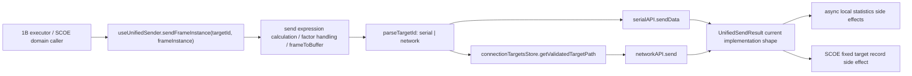

# Code reality checkpoint before 1C cleanup plan

## Context recap

Evidence:

- Batch 1C scope memo 限定本文只收窄责任边界，不写实现方案，不定义 spec 字段，不设计发送请求字段，不把 SCOE 固定目标写成通用发送规则。`easysdd/compound/2026-04-24-batch-1c-unified-sender-and-target-cleanup-scope-memo.md:26-30`
- Batch 1C 的 final scope decision 是：`useUnifiedSender` 收窄为通用发送执行边界，`connectionTargetsStore` 收窄为通用连接目标目录与校验边界，任务生命周期、领域目标、SCOE 记录、领域反馈、结果事实、报告交付都不应继续沉积在 common sender。`easysdd/compound/2026-04-24-batch-1c-unified-sender-and-target-cleanup-scope-memo.md:178-185`
- 1ABC sequencing 已裁定 1C 可以与 1B 做读证并行，但 cleanup plan 的执行顺序应晚于 1B 的边界裁剪，且不能抢先把 1B 的本地执行态解释成发送请求或发送结果。`easysdd/compound/2026-04-24-batch-1abc-cleanup-sequencing-and-first-cut-scope.md:99-105`
- Guardrail 明确：开始讨论字段名、DTO、JSON 报告 schema、生命周期枚举，或开始让 common sender 解释任务完成、用例结果、报告交付或 SCOE 领域成功，都必须停回上一级仲裁。`easysdd/compound/2026-04-24-cleanup-to-design-process-guardrail.md:180-188`
- 发送主链文档要求主链只能消费明确边界输入、产出明确边界结果，不能依赖共享状态补齐语义。`refactor/docs/03-architecture/05-接收主链与发送主链组织方式.md:31-42`
- SCOE 文档把 SCOE 定位为二级领域模块，并明确它通过显式领域入口、显式发送请求、显式任务接入与统一运行骨架发生关系，不拥有总骨架定义权。`refactor/docs/03-architecture/07-SCOE 的架构位置.md:85-97`

Code reality:

- 本 checkpoint 只核对 `useUnifiedSender`、`connectionTargetsStore` 及必要边界文件的当前代码现实。
- 本 checkpoint 不进入 1C cleanup plan，不写迁移步骤，不设计发送 request/result，不设计 target schema，不解释任务完成、用例结果、SCOE 成功或报告交付。
- 综合前已按要求使用 analyst、architect、critic、test-engineer 四个子 agent 做只读 memo；本文只吸收其事实核对结果，不把 challenge 或 validation surface 扩写成实现方案。

## Actual unified sender chain

Evidence:

- `useUnifiedSender.ts` 文件头将其定义为“统一发送路由器”，按连接目标类型路由到相应发送方法。`src/composables/frames/sendFrame/useUnifiedSender.ts:1-4`
- 当前 `UnifiedSendResult` 只有 `success`、可选 `message`、可选 `error`、`targetId`、`targetType`。`src/composables/frames/sendFrame/useUnifiedSender.ts:15-24`
- `parseTargetId` 只把 target id 解析为 `serial` 或 `network`；缺少 identifier 或类型不支持时抛错。`src/composables/frames/sendFrame/useUnifiedSender.ts:31-50`
- `sendFrameInstance` 当前入口是 `targetId: string` 与 `frameInstance: SendFrameInstance`，不是已成形的显式 request 对象。`src/composables/frames/sendFrame/useUnifiedSender.ts:69-72`
- 发送前，sender 会计算发送表达式字段、处理非 bytes 字段的 factor，再调用 `frameToBuffer` 得到 `data`。`src/composables/frames/sendFrame/useUnifiedSender.ts:74-100`
- 串口分支把 `identifier`、`data`、`targetId` 交给 `sendToSerial`。`src/composables/frames/sendFrame/useUnifiedSender.ts:105-107`
- 网络分支先调用 `connectionTargetsStore.getValidatedTargetPath(targetId)`，目标无效时直接返回失败结果。`src/composables/frames/sendFrame/useUnifiedSender.ts:108-117`
- 网络分支当前用 `targetPath.includes(':') && targetPath.split(':').length === 3` 区分 UDP remote host，再拆出 `connectionId` 与 `targetHost`；否则把 `targetPath` 当 TCP 主连接 id。`src/composables/frames/sendFrame/useUnifiedSender.ts:118-136`
- `sendToSerial` 调用 `serialAPI.sendData(portPath, data)`，再把底层返回包装为当前 `UnifiedSendResult`。`src/composables/frames/sendFrame/useUnifiedSender.ts:187-219`
- `sendToNetwork` 调用 `networkAPI.send(connectionId, data, targetHost)`，再把底层返回包装为当前 `UnifiedSendResult`。`src/composables/frames/sendFrame/useUnifiedSender.ts:228-260`
- 目标可用性查询当前只是委托 `connectionTargetsStore.isTargetAvailable(targetId)`。`src/composables/frames/sendFrame/useUnifiedSender.ts:267-270`

Code reality:

- 当前 unified sender 实际链路是“帧实例载荷准备 -> 目标 id 解析 -> serial/network 落地发送 -> 当前返回值包装 -> 异步副作用”。
- 当前入口和返回值都是现有实现形态，不能直接升格为未来发送 request/result 的字段设计。
- 目标适配目前部分沉在 sender 内，尤其 UDP remote host 的字符串拆分；这只是当前实现事实，不是 target schema 结论。

## Connection target store responsibilities

Evidence:

- `connectionTargetsStore` 注释定义为统一管理所有类型连接目标，避免重复创建和频繁刷新。`src/stores/connectionTargetsStore.ts:8-11`
- store 当前依赖 `serialStore` 与 `networkStore`，本地维护 `availableTargets` 与 `isLoading`。`src/stores/connectionTargetsStore.ts:13-19`
- 它提供 `serialTargets`、`networkTargets`、`connectedTargets` 这三个按类型或连接状态过滤的 computed 视图。`src/stores/connectionTargetsStore.ts:21-32`
- `refreshTargets` 从 `serialStore.availablePorts` 构造 `serial:${port.path}` 目标，并用 `serialStore.isPortConnected(port.path)` 投影连接状态。`src/stores/connectionTargetsStore.ts:35-64`
- 网络目标来自 `networkStore.getActiveConnections()`。`src/stores/connectionTargetsStore.ts:67-69`
- TCP 与 TCP Server 当前各自生成单一 `network:${connection.id}` 目标，记录 `address`、`status`、`description`、`connectionId`。`src/stores/connectionTargetsStore.ts:71-100`
- UDP 当前只把启用的 `remoteHosts` 生成为发送目标，id 为 `network:${connection.id}:${remoteHost.id}`，并保存 `connectionId` 与 `remoteHostId`。`src/stores/connectionTargetsStore.ts:101-120`
- `parseTargetType` 现状可识别 `serial`、`network`、`bluetooth`、`other`；这比 unified sender 的实际发送支持范围更宽。`src/stores/connectionTargetsStore.ts:145-155`, `src/composables/frames/sendFrame/useUnifiedSender.ts:31-50`
- `parseTargetPath` 只是把首段 type 后面的内容重新 join 成 path。`src/stores/connectionTargetsStore.ts:157-164`
- `getValidatedTargetPath` 当前把 serial 目标转成 `path`，把 TCP/TCP Server 网络目标转成 `connectionId`，把 UDP remote host 目标转成 `${target.connectionId}:${target.address}`。`src/stores/connectionTargetsStore.ts:166-197`
- `isTargetAvailable` 只判断目标对象的 `status` 是否为 `connected`。`src/stores/connectionTargetsStore.ts:208-216`
- 初始化时会调用 `refreshTargets()`，随后通过两个 `watchEffect` 监听串口连接状态和网络 connected count 变化并刷新目标列表。`src/stores/connectionTargetsStore.ts:218-235`
- `serialStore` 的串口可用性来自 `availablePorts` 与 `portConnectionStatuses`；`isPortConnected` 只按 `portConnectionStatuses[portPath] === 'connected'` 判断。`src/stores/serialStore.ts:35-42`, `src/stores/serialStore.ts:105-108`
- `networkStore.getActiveConnections()` 返回 `connectedConnections`。`src/stores/netWorkStore.ts:31-43`, `src/stores/netWorkStore.ts:188-193`

Code reality:

- `connectionTargetsStore` 当前更像“连接目标目录 + 状态投影 + 目标引用校验 / 路径解析服务”。
- 它没有代码证据表明自己能承担设备事实、领域目标、交付目标、任务许可或结果归口判断。
- `bluetooth` / `other` 只出现在 target type 解析面；unified sender 当前没有发送实现支持它们。

## Current send result / callback / side-effect surface

Evidence:

- 当前返回值包装字段是实现内的 `UnifiedSendResult`，不是架构文档中的正式结果对象。`src/composables/frames/sendFrame/useUnifiedSender.ts:15-24`
- serial 分支把底层 `message` 放入 `sendResult.message`，并在 `!result.success` 时同时作为 `sendResult.error`。`src/composables/frames/sendFrame/useUnifiedSender.ts:193-209`
- network 分支把底层 `message` 与 `error` 透传到当前返回值。`src/composables/frames/sendFrame/useUnifiedSender.ts:235-251`
- `sendFrameInstance` catch 分支返回失败结果，但 `targetType` 默认写成 `serial`。`src/composables/frames/sendFrame/useUnifiedSender.ts:170-176`
- 发送成功后，sender 用 `setTimeout(..., 0)` 异步更新发送实例统计、全局发送包数和发送字节数。`src/composables/frames/sendFrame/useUnifiedSender.ts:146-153`
- 发送失败后，sender 用 `setTimeout(..., 0)` 异步增加通信错误统计。`src/composables/frames/sendFrame/useUnifiedSender.ts:162-166`
- `useSendTaskExecutor` 通过 `useUnifiedSender()` 取得 `sendFrameInstance` 和 `isTargetAvailable`。`src/composables/frames/sendFrame/useSendTaskExecutor.ts:33-40`
- task executor 的 `sendFrameToTarget` 只看当前 result 的 `success`；失败后再调用 `isTargetAvailable(targetId)`，若不可用则把本地任务状态更新为 `paused`，否则抛出 `result.error || '帧发送失败'`。`src/composables/frames/sendFrame/useSendTaskExecutor.ts:222-247`
- `processInstance` 会把实例状态写为 `running`、发送成功后写 `completed`，异常时写 `error` 和 `errorMessage`。`src/composables/frames/sendFrame/useSendTaskExecutor.ts:323-389`

Code reality:

- 当前 `UnifiedSendResult.success` 已被本地任务执行器消费，用于本地执行态和错误路径判断。
- 当前 sender 内的统计更新是本地统计 / 展示副作用；它们不是任务完成事实、用例结果事实、报告素材或交付依据。
- 当前 catch 分支的 `targetType: 'serial'` 是实现事实与回归风险，不能被当成未来结果口径。

## SCOE fixed target and record side effects

Evidence:

- `useUnifiedSender` 直接 import `useScoeStore`，并在组合式函数内部实例化 `scoeStore`。`src/composables/frames/sendFrame/useUnifiedSender.ts:13`, `src/composables/frames/sendFrame/useUnifiedSender.ts:61`
- 当发送成功且 `targetId === 'network:scoe-udp:scoe-udp-remote'` 时，sender 会把发送 bytes 转成大写 hex 字符串并调用 `scoeStore.addSendData(...)`。`src/composables/frames/sendFrame/useUnifiedSender.ts:146-160`
- `scoeStore` 也 import `useUnifiedSender`，并在 store 初始化时取 `sendFrameInstance`。`src/stores/scoeStore.ts:15`, `src/stores/scoeStore.ts:23`
- `scoeStore.checkSatelliteLoad` 会在 SCOE 帧加载后连接固定 UDP：connection id 为 `scoe-udp`，remote host id 为 `scoe-udp-remote`。`src/stores/scoeStore.ts:216-246`
- `scoeStore.sendScoeFrames` 在 `udpConnected` 时直接调用 `sendFrameInstance('network:scoe-udp:scoe-udp-remote', instance)`。`src/stores/scoeStore.ts:275-287`
- `scoeStore` 暴露的测试工具面包含 `addSendData`、`addReceiveData`、`sendDataList`、`receiveDataList` 等记录相关状态和方法。`src/stores/scoeStore.ts:23-39`, `src/stores/scoeStore.ts:371-380`
- `readFileAndSend` 构建 `FrameInstanceInTask` 时，如果实例没有 targetId，会默认写入 `network:scoe-udp:scoe-udp-remote`。`src/composables/scoe/commands/readFileAndSend.ts:89-115`
- `readFileAndSend` 随后通过 `useSendTaskManager()` 创建 timed task，并启动该 task。`src/composables/scoe/commands/readFileAndSend.ts:118-143`
- SCOE 架构文档明确当前统一发送链内部已经存在 `network:scoe-udp:scoe-udp-remote` 的领域特例处理，这是 SCOE 反向侵入通用发送链的证据。`refactor/docs/03-architecture/07-SCOE 的架构位置.md:263-267`
- SCOE 架构文档明确固定目标解析应在 SCOE 领域边界内完成，测试工具记录应由 SCOE 领域记录层消费标准发送结果，不应写进通用发送层。`refactor/docs/03-architecture/07-SCOE 的架构位置.md:313-318`

Code reality:

- `network:scoe-udp:scoe-udp-remote` 是当前代码中可见的固定领域目标。
- `scoeStore.addSendData` 是当前 unified sender 成功分支里的领域记录副作用。
- `useUnifiedSender <-> scoeStore` 已经形成可见双向依赖；这支持“当前 common sender 知道 SCOE”的代码事实，但不支持在本文中设计 SCOE 记录层、反馈层或接入对象。

## 1B dependency

Evidence:

- 1ABC sequencing 明确 1C 可以与 1B 做读证并行，但 cleanup plan 的执行顺序应晚于 1B 的边界裁剪。`easysdd/compound/2026-04-24-batch-1abc-cleanup-sequencing-and-first-cut-scope.md:99-105`
- 1B memo 明确，1B 向 1C 暴露的应只是本地发送执行载体可被翻译出的显式发送请求和上下文引用，不应交出完整 `SendTask`、当前 `TaskStatus`、timer/listener 资源状态或页面监控状态。`easysdd/compound/2026-04-24-batch-1b-send-task-lifecycle-cleanup-scope-memo.md:311-323`
- `useSendTaskExecutor` 当前从 `useUnifiedSender()` 拿到 `sendFrameInstance` 与 `isTargetAvailable`。`src/composables/frames/sendFrame/useSendTaskExecutor.ts:33-40`
- `sendFrameToTarget` 当前把 `targetId` 与 `SendFrameInstance` 直接传给 unified sender。`src/composables/frames/sendFrame/useSendTaskExecutor.ts:222-230`
- `processSingleInstance` 从本地 `FrameInstanceInTask` 中取 `instanceConfig.targetId` 与 `cachedInstance.cachedInstance`，然后调用 `sendFrameToTarget`。`src/composables/frames/sendFrame/useSendTaskExecutor.ts:265-291`
- 条件触发任务、定时任务和顺序任务的本地执行逻辑都会进入 `processMultipleInstances` / `processInstance` / `processSingleInstance` 这组执行链。`src/composables/frames/sendFrame/useSendTaskExecutor.ts:397-444`, `src/composables/frames/sendFrame/useSendTaskExecutor.ts:490-537`, `src/composables/frames/sendFrame/useSendTaskExecutor.ts:661-728`, `src/composables/frames/sendFrame/useSendTaskExecutor.ts:733-789`

Code reality:

- 当前 1B 到 1C 的实际代码接口是“本地执行器把 targetId 与帧实例传给 unified sender”。
- 当前 task executor 会把 sender 的 `success` 与目标可用性解释为本地任务状态变化；这个解释属于 1B 本地执行态，不属于 1C common sender 的解释权。
- 本 checkpoint 可以描述现状依赖，但不能抢先定义 1B 未来暴露给 1C 的发送 request，也不能定义 1C future result。

## Supported conclusions

以下结论有代码与文档共同支撑：

- `useUnifiedSender` 当前真实承担了帧实例发送前处理、target id 解析、serial/network 分发、底层发送调用、当前返回值包装、目标状态查询委托，以及发送成功/失败后的异步统计副作用。`src/composables/frames/sendFrame/useUnifiedSender.ts:69-169`, `src/composables/frames/sendFrame/useUnifiedSender.ts:187-270`
- `connectionTargetsStore` 当前真实承担连接目标目录、serial/network 状态投影、目标分组、目标可用性判断、target id/path 解析和验证。`src/stores/connectionTargetsStore.ts:8-19`, `src/stores/connectionTargetsStore.ts:21-32`, `src/stores/connectionTargetsStore.ts:35-133`, `src/stores/connectionTargetsStore.ts:145-216`
- 当前 `connectionTargetsStore` 支持的目标目录表达面比 `useUnifiedSender` 的发送执行支持面更宽：前者解析 `bluetooth` / `other`，后者只发送 `serial` / `network`。`src/stores/connectionTargetsStore.ts:145-155`, `src/composables/frames/sendFrame/useUnifiedSender.ts:31-50`
- 当前 UDP remote host 依赖 `connectionId:address` 中间字符串和 sender 内冒号数量判断。`src/stores/connectionTargetsStore.ts:190-193`, `src/composables/frames/sendFrame/useUnifiedSender.ts:118-135`
- 当前 common sender 已混入 SCOE 固定目标记录副作用；这是代码级 SCOE 反侵证据。`src/composables/frames/sendFrame/useUnifiedSender.ts:13`, `src/composables/frames/sendFrame/useUnifiedSender.ts:61`, `src/composables/frames/sendFrame/useUnifiedSender.ts:146-160`, `refactor/docs/03-architecture/07-SCOE 的架构位置.md:263-267`
- 当前 1B 本地执行器依赖 unified sender 的 `success` 和 target availability，并把这些解释成本地任务状态变化。`src/composables/frames/sendFrame/useSendTaskExecutor.ts:222-247`, `src/composables/frames/sendFrame/useSendTaskExecutor.ts:323-389`
- 文档层面已支持的 1C 结论是“通用发送执行与目标目录边界需要保持窄”，不是“现有字段就是未来正式对象”。`easysdd/compound/2026-04-24-batch-1c-unified-sender-and-target-cleanup-scope-memo.md:178-185`

## Inferences only

以下内容只能保留为推断或待决项，不能在本 checkpoint 中升格为 1C cleanup 结论：

- “显式发送请求”只能作为边界语言存在；当前代码没有一个已成形、可继承的 request 对象。证据仅支持当前入口是 `targetId + SendFrameInstance`。`src/composables/frames/sendFrame/useUnifiedSender.ts:69-72`
- 当前 `UnifiedSendResult` 只能作为实现事实；不能把 `success/message/error/targetId/targetType` 当成未来标准 result 字段设计。`src/composables/frames/sendFrame/useUnifiedSender.ts:15-24`
- UDP remote host 的 `${connectionId}:${address}` 只能作为当前中间格式；不能把它当成未来 target schema。`src/stores/connectionTargetsStore.ts:190-193`, `easysdd/compound/2026-04-24-batch-1c-unified-sender-and-target-cleanup-scope-memo.md:156-177`
- `connectionTargetsStore.parseTargetType` 中的 `bluetooth` / `other` 不能推断为 unified sender 已支持这些发送能力。`src/stores/connectionTargetsStore.ts:145-155`, `src/composables/frames/sendFrame/useUnifiedSender.ts:31-50`
- 发送实例统计、全局发送统计、通信错误统计不能推断为用例结果事实、任务汇总事实、报告素材或交付回执。`src/composables/frames/sendFrame/useUnifiedSender.ts:146-167`, `easysdd/compound/2026-04-24-cleanup-to-design-process-guardrail.md:180-188`
- SCOE 固定 target 与 `addSendData` 只能证明当前反侵点；不能在本文中决定 SCOE 固定目标配置来源、SCOE 记录层落点、领域反馈对象或领域成功条件。`src/composables/frames/sendFrame/useUnifiedSender.ts:154-160`, `refactor/docs/03-architecture/07-SCOE 的架构位置.md:304-318`
- `readFileAndSend` 证明 SCOE 可通过 timed task 进入当前本地发送任务链；不能据此让 1C 解释长流程完成、任务接入对象或结果归口。`src/composables/scoe/commands/readFileAndSend.ts:118-143`, `refactor/docs/03-architecture/07-SCOE 的架构位置.md:347-349`

## Stop conditions

后续讨论或工作一旦出现以下情况，应停止并回到上一级边界仲裁：

- 开始设计发送 request 字段、result 字段、target schema、DTO、JSON 报告 schema、生命周期枚举或北向协议。`easysdd/compound/2026-04-24-cleanup-to-design-process-guardrail.md:180-188`, `easysdd/compound/2026-04-24-batch-1abc-cleanup-sequencing-and-first-cut-scope.md:231-237`
- 开始让 common sender 解释任务完成、用例结果、报告交付或 SCOE 领域成功。`easysdd/compound/2026-04-24-cleanup-to-design-process-guardrail.md:184-188`, `easysdd/compound/2026-04-24-batch-1abc-cleanup-sequencing-and-first-cut-scope.md:231-236`
- 开始把当前 `UnifiedSendResult` 当作未来标准 result 的字段基础，而不是当前实现口径。`src/composables/frames/sendFrame/useUnifiedSender.ts:15-24`
- 开始把 UDP `connectionId:address` 中间字符串当作 target schema。`src/stores/connectionTargetsStore.ts:190-193`, `easysdd/compound/2026-04-24-batch-1c-unified-sender-and-target-cleanup-scope-memo.md:167-177`
- 开始把 `connectionTargetsStore` 扩展成设备事实、领域目标、交付目标、任务许可或结果归口注册表。`easysdd/compound/2026-04-24-batch-1c-unified-sender-and-target-cleanup-scope-memo.md:87-97`
- 开始触碰 SCOE 领域入口、固定目标来源、领域记录、领域反馈或领域完成条件并试图在 1C 内解释，应先补 Batch 1D SCOE observation / scope。`easysdd/compound/2026-04-24-batch-1abc-cleanup-sequencing-and-first-cut-scope.md:196-202`
- 开始触碰结果、报告、历史、文件交付，应先补 result boundary observation。`easysdd/compound/2026-04-24-batch-1abc-cleanup-sequencing-and-first-cut-scope.md:196-202`
- 开始修改 `contextIsolation` / `contextBridge` / `window.electron.*` / `src/api/common/*Api.ts` 等 Platform API 边界，应先补 Platform API boundary analysis。`easysdd/compound/2026-04-24-cleanup-to-design-process-guardrail.md:180-199`

## Readiness for future 1C cleanup plan

Code reality:

- 本 checkpoint 已经核对当前 unified sender 链路、connection target store 职责、当前 result / callback / side-effect surface、SCOE 固定 target 反侵点和 1B 依赖面，因此可以作为未来 1C cleanup plan 的事实输入。
- 本文不是 cleanup plan，也没有让未来 request/result 或 target schema 进入可设计状态。
- 当前最强的可支撑前提很窄：未来计划只能保护现有 serial/network 发送、目标目录刷新 / 校验、1B 对 sender result 的现有消费，以及当前可观察的统计 / SCOE side-effect 行为；同时必须防止这些现状形态被继承为正式架构。
- 未来 1C cleanup plan 仍应位于 1B boundary 裁剪之后；否则会被迫解释本地 send-task execution state。`easysdd/compound/2026-04-24-batch-1abc-cleanup-sequencing-and-first-cut-scope.md:99-105`
- 若后续需要决定 SCOE 固定 target 来源、SCOE record consumer、task request handoff、result/report material 或 target schema，应停止并路由到对应 boundary observation，不应在 1C 内解决。
