# 当前系统方案设计报告

## 系统设计

### 系统概述

本系统面向集成测试系统协同和现场测试执行场景，部署于测试工作站，以桌面化操作界面承载设备链路管理、协议帧配置、数据收发、过程展示、状态监视、历史记录和文件导出等工作。系统围绕测试执行、数据采集、结果整理和文件交付形成闭环，既支持现场人员进行本地联调和测试操作，也为上级集成测试系统提供任务执行、状态反馈和结果材料来源。

系统的主要组成包括桌面操作界面、串口链路、TCP/UDP 网络链路、通信目标、协议帧和测试帧、接收解析结果、发送控制动作、执行状态、历史记录、结果文件以及扩展指令接入能力。现场人员通过桌面界面完成连接、配置、发送、接收、查看和导出；系统通过内部收发解析和结果整理能力，将现场测试过程转化为可展示、可追溯、可交付的数据和文件材料。

系统范围按本地测试能力、上级系统协同、现场运行环境和扩展指令接入四类组织。本地测试能力负责设备链路、协议处理、收发控制、历史记录和文件导出；上级系统协同负责任务、状态、结果和文件材料交互；现场运行环境以测试工作站、串口设备、网络设备和本地文件存储为基础；扩展指令接入能力用于承接特定外部指令、控制反馈和状态记录。

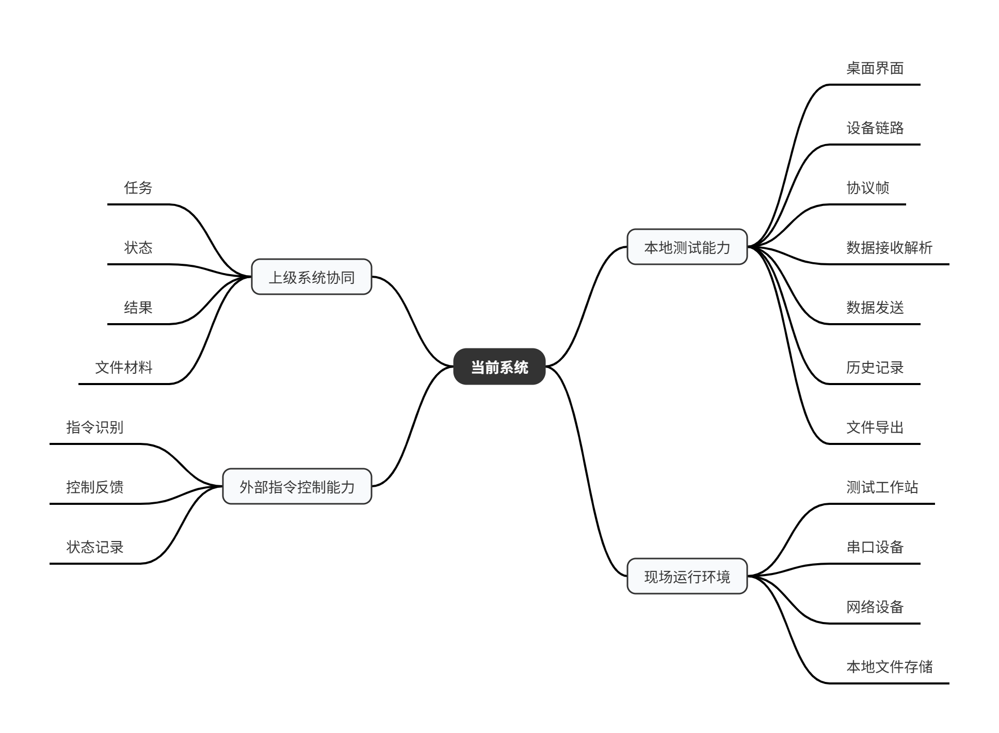

如图所示，系统不是单一接口模块，而是覆盖本地测试、设备通信、数据采集、过程记录、结果整理和上级协同的综合测试软件。扩展指令接入能力在图中作为旁支能力表达，用于说明系统具备额外指令接收、反馈和记录能力。

### 总体架构

系统总体架构由入口层、执行控制层、通信链路层、协议处理层、结果与文件层、状态运维层和扩展指令接入层组成。入口层包括本地桌面操作入口和上级系统协同入口；执行控制层负责把本地测试操作或上级协同要求转换为发送、接收、停止、记录和结果整理动作；通信链路层统一承接串口、TCP、TCP Server、UDP 远端目标等现场链路；协议处理层负责协议帧、测试帧、原始数据接收、帧匹配、字段解析、表达式计算和状态值展示；结果与文件层负责过程数据留痕、历史查询、CSV 或相关文件导出，并为结果材料和报告材料提供来源。

从运行关系看，本地桌面界面和上级系统协同入口均通过系统内部的执行控制和通信链路完成测试动作。发送侧将手动发送、按目标发送、顺序发送、定时发送和触发发送统一落到串口或网络目标；接收侧将来自测试设备或被测设备的原始数据送入接收处理流程，经过帧匹配、字段解析和结果归一后，形成界面展示、状态指示、触发判断、历史记录和结果整理所需的数据事实。状态运维层基于连接状态、收发状态、执行状态和异常信息形成统一运行视图。

扩展指令接入能力在总体架构中作为独立能力接入。该能力可复用通信链路、协议帧、发送和接收基础能力，其来源、目标、命令识别、反馈语义和工具记录由扩展指令接入层承接，与上级系统协同任务按不同入口分别组织。

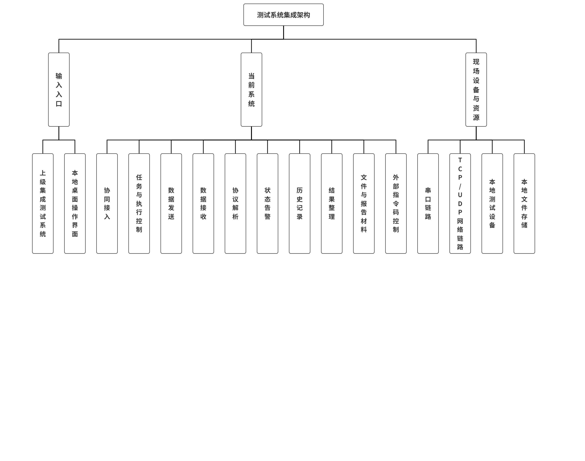

如图所示，上级集成测试系统和本地桌面操作界面分别作为系统入口进入协同接入和执行控制模块。执行控制向下驱动数据发送、数据接收和协议解析，解析结果回流到状态告警、历史记录和结果整理，文件与报告材料再用于本地导出或对外协同。该结构体现了入口、执行、收发、解析、记录和结果材料之间的主链关系。

### 系统工作原理

系统围绕“输入、执行、采集、整理、输出”的闭环运行。当上级协同要求或本地测试操作进入系统后，系统首先识别执行意图和关联的测试对象、协议配置、发送目标或接收条件，再根据当前链路状态、执行状态和配置内容判断是否具备执行条件。发送类动作按照协议帧和测试帧定义完成组帧与参数处理，并通过串口或网络链路发送到测试设备或被测设备；接收类动作从串口或网络链路获取原始数据，进入接收处理流程，并根据协议配置完成帧匹配、字段解析、状态值提取和统计处理。

在测试执行过程中，系统持续维护连接状态、发送状态、接收状态、执行状态和异常状态。本地操作产生的手动发送、顺序发送、定时发送和触发发送形成对应的执行记录；接收解析产生的参数值、状态值、统计值和表达式结果进入实时展示、状态指示、历史记录和结果整理流程。对于由接收数据驱动的动作，解析结果可作为触发判断或执行推进的输入。

一次测试或发送执行结束后，系统沉淀过程数据、执行结果、异常信息和必要文件材料。历史记录和 CSV 导出用于现场追溯、分析和材料整理；结果文件和报告材料在系统协同场景中作为对外结果输出的来源。涉及扩展指令接入时，系统按指令规则完成识别、反馈、状态更新和记录。

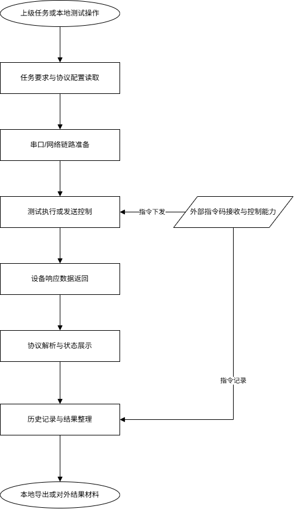

如图所示，系统从任务或本地操作进入，依次完成配置读取、链路准备、测试执行、设备响应接收、协议解析、状态展示、历史记录和结果整理，最终形成本地导出或对外结果材料。该流程体现了测试输入、现场执行、数据采集、结果整理和输出交付之间的闭环。

### 软件体系架构

软件体系采用本地桌面应用形态组织，面向测试工作站上的现场操作和设备接入场景。界面层提供功能导航、连接管理、帧配置、发送、接收、存储、历史、设置和扩展指令控制等操作入口；应用服务层承接本地操作和上级协同输入，将其转换为发送请求、接收处理、执行控制、状态更新和结果整理动作；通信适配层负责串口、TCP、TCP Server、UDP 远端目标以及本地文件能力的统一接入；协议与领域处理层负责帧资产、字段解析、表达式计算、发送组包、触发判断和指令处理等测试业务规则；数据与结果层负责历史数据、过程记录、CSV 导出、结果材料和文件材料。

各层之间按照职责分工协同工作。界面层提供操作入口和状态展示；通信适配层把串口、网络和文件系统能力稳定提供给业务层；协议与执行层负责把测试配置、发送控制和接收解析转化为可追溯的执行事实；结果与文件层负责在执行事实基础上形成历史记录和可交付材料；状态运维层综合连接、执行、异常和扩展指令状态，为本地操作人员和系统协同提供统一状态视图。

这种体系结构既能保持本地上位机测试工具的现场操作效率，也能为集成测试系统协同提供稳定的执行、状态和结果来源。系统内部以协议帧、通信链路、执行控制、接收解析和结果整理作为主干，将本地发送任务、串口/网络目标、历史文件和扩展指令记录分别归入对应功能层，保证现场测试能力与上级协同能力在同一系统内清晰分层。

## 系统功能设计

### 设备监控管理功能

系统提供面向现场测试人员的桌面化操作入口，集中呈现连接、帧配置、发送、接收、存储、历史和设置等功能导航。测试人员可在测试工作站内完成链路准备、运行状态查看、配置加载、历史数据查看和必要的人工操作。系统启动后加载帧配置、发送实例、接收配置、串口、通信目标、统计信息和历史数据采集等运行材料，使现场测试操作能够与后续任务执行和结果整理形成连续过程。

设备监控管理以通信链路和通信目标为核心，支持串口链路以及 TCP、TCP Server、UDP 等网络链路的连接、断开、状态刷新和目标汇聚。串口路径、TCP 连接、UDP 远端地址等在系统内整理为可选择的通信目标，用于发送、接收和链路状态观察。业务设备身份由接口和任务上下文统一表达，通信目标主要表达现场实际收发路径，二者共同支撑测试执行和过程追溯。

系统可展示连接状态、目标可用性、发送接收状态和异常信息，帮助测试人员判断链路是否可用、是否已断开、是否存在解析失败、目标不可达或运行异常。系统还支持基于接收解析结果形成状态展示，例如将接收数据项的当前值映射为状态指示灯颜色，并按周期检查数值变化。该能力将底层链路数据、解析值和运行状态转化为现场人员可观察的状态信号，配合连接页、接收页、发送页和设置页形成本地监控闭环。

### 设备测试管理功能

设备测试管理围绕协议帧和测试帧组织。系统提供帧资产的列表、编辑、复制、删除、导入和导出能力，帧定义中包含字段结构、收发规则以及后续解析、组包所需的基础配置；接收配置和发送实例均以这些帧资产为基础运行。测试过程中，来自串口或网络链路的原始数据进入接收处理流程，系统依据帧配置完成匹配、字段解析、表达式计算和统计更新，并将参数值、状态值、最近数据包、解析成功或失败信息展示给本地用户。

在数据接收方向，系统支持把原始字节流转换为可读的参数、状态和统计结果。解析成功后，系统更新接收帧数据缓存、当前数据项、表达式结果、统计信息和相关展示内容；未匹配或解析失败的数据形成失败记录和提示信息，便于现场人员追溯原始数据与协议配置之间的差异。接收解析结果也可作为本地自动发送的触发条件，在指定帧、来源和字段值满足条件时驱动后续发送动作；其任务身份和结果归口由任务执行和接口协同流程统一管理。

在数据发送方向，系统支持手动发送、按目标发送、顺序发送、循环发送、定时发送和触发发送。发送时，系统根据发送实例和目标配置完成字段取值、表达式或因子计算、组包和目标校验，再通过串口或网络链路落地发送，并返回发送成功、失败、发送字节数、时间和错误信息等结果。发送任务可呈现运行中、暂停、等待触发、等待调度、完成和错误等状态，用于现场操作、联调排障和执行过程记录。

### 测试任务与执行控制功能

系统面向现场测试执行场景，提供本地测试任务、本地发送任务和执行控制能力。测试人员可在桌面界面中组织一次测试操作所需的发送对象、通信目标、执行顺序、触发条件和时间控制要求，并围绕启动、停止、等待触发、等待调度、执行中、完成和异常等状态观察测试过程。该能力用于把人工操作、协议帧配置、链路准备和自动发送动作组织成可观察、可停止、可追溯的执行过程。

执行控制支持手动启动和停止，支持按已配置的发送实例进行单次发送、组合发送和顺序发送，也支持围绕时间条件、定时周期或接收数据触发条件自动推进发送。触发类执行在接收到下位机或网络侧数据后，经协议帧匹配和字段解析形成可判断的接收结果，再由本地触发条件决定是否执行后续发送动作；定时类执行按本地配置的周期或延时推进发送，并在执行过程中记录当前状态、发送结果和异常信息。

本地发送任务是系统测试执行的基础能力，可服务于现场帧发送、联调和自动化执行。任务执行过程中形成的发送结果、接收解析结果、链路状态和过程记录，可作为任务上下文、用例结果、任务级结果和对外交付材料的事实来源。

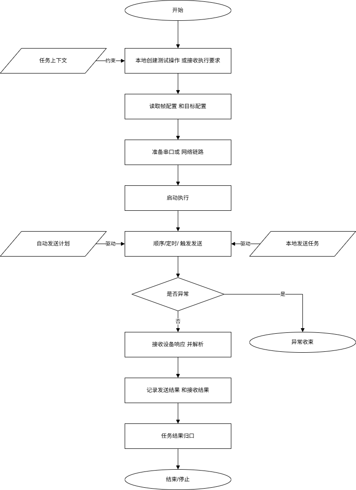

如图所示，测试任务从本地创建测试操作或接收执行要求开始，经过帧配置和目标配置读取、串口或网络链路准备、启动执行、顺序/定时/触发发送、设备响应接收与解析，最终记录发送结果、接收结果和执行状态，并进入结束、停止或异常收束。

### 测试结果与文件报告功能

系统围绕测试过程形成本地结果记录和文件材料。接收数据进入解析流程后，系统可保存原始接收信息、帧匹配结果、字段值、表达式计算值、统计信息和显示用当前值；发送流程中，系统可记录发送目标、发送数据、发送成功或失败结果以及相关异常信息。这些过程数据共同构成测试结果整理基础，可用于现场复核、异常定位、关键参数回看和结果支撑材料提取。

系统提供历史记录查询和 CSV 导出能力，可按时间范围、数据类型等条件查看历史过程数据，并将选定数据导出为本地文件。对于高频或大流量数据，系统具备本地高速存储能力，可按配置规则将特定网络数据写入本地文件，作为后续分析和归档材料。历史记录、CSV 文件和本地存储文件主要承担过程追溯、证据留存和报告材料来源职责。

在报告支撑方面，系统可将历史记录、解析值、统计值、异常说明、发送结果和导出文件作为报告编制素材。对外交付时，结果材料可结合任务上下文、结果口径、文件命名和交付规则整理为结构化报告、结果附件或文件通知。

### 状态告警与运维辅助功能

系统提供面向测试现场的状态展示与异常提示能力。系统可展示串口连接状态、网络连接状态、通信目标可用性、发送执行状态、接收解析状态、数据统计状态和关键数据项状态，并通过状态指示灯等方式把解析后的状态值映射为更直观的运行提示。测试人员可据此判断链路是否可用、当前是否正在执行、最近一次发送或接收是否异常，以及是否需要人工干预或重新配置。

异常提示主要围绕链路不可用、目标不可达、发送失败、接收解析失败、帧未匹配、数据校验失败、文件读写失败等现场问题展开。系统同时提供配置导入导出、帧配置管理、连接刷新、历史查询、CSV 导出和存储状态查看等辅助能力，帮助测试人员确认配置是否正确、链路是否连通、数据是否进入系统以及结果是否已经留存。

扩展指令接入能力可围绕固定来源、固定目标、命令识别、参数校验、状态循环、反馈发送和测试工具记录进行处理，用于特定指令接入和联调场景。其状态和收发记录纳入系统状态和历史材料体系，便于后续复核和问题定位。

## 软件部署图

### 部署拓扑

系统采用现场测试工作站本地部署方式运行。测试工作站安装并运行桌面应用，在同一工作站内提供可视化操作界面、设备链路管理、协议帧配置、数据接收解析、数据发送控制、状态展示、历史记录和文件导出等能力。测试工作站通过串口链路和 TCP/UDP 网络链路连接测试设备或被测设备，形成面向现场测试执行的数据收发闭环。

在集成测试协同中，上级集成测试系统位于系统外部，承担任务协同、状态获取和结果材料接收职责。测试工作站作为现场执行节点承接设备通信、协议解析、过程记录和结果整理工作。扩展指令控制源可作为独立外部节点接入，并通过单独链路完成指令收发、反馈和状态记录。

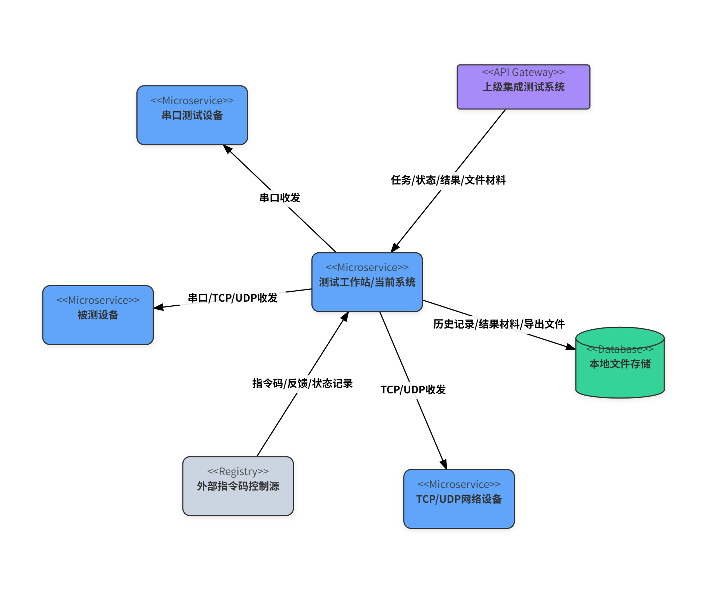

如图所示，测试工作站位于部署拓扑中心，上级集成测试系统通过协同接口与其交互，现场设备通过串口或 TCP/UDP 链路与其收发数据，本地文件存储承担历史记录、结果材料和导出文件的承载职责。该部署方式明确区分了上级协同接口、现场设备链路和本地文件存储三类资源。

### 设备连接拓扑

系统面向现场设备提供串口和网络两类主要连接方式。串口链路用于连接具备串口通信能力的测试设备、转换设备或被测对象，系统通过端口选择、连接、断开、收发记录和异常提示管理链路状态。网络链路用于连接 TCP、TCP Server 或 UDP 形态的通信端点，系统按网络地址、端口和远端主机信息组织通信目标，并在发送和接收过程中记录链路可用性、数据流向和执行结果。

通信目标用于描述本地实际收发路径，例如串口端口、TCP 连接、UDP 远端主机等；设备对象用于表达业务身份、设备清单和任务归属。现场设备控制和数据采集通过协议帧、测试帧、原始数据接收、协议解析、参数值展示和状态提示形成闭环，使操作人员能够在桌面界面中判断链路是否可用、数据是否进入系统、解析结果是否可用于后续结果整理。

### 文件与报告服务

系统的文件服务以本地文件存储为基础。运行过程中，系统保存帧配置、发送实例、接收配置、扩展指令配置、历史记录、高速存储数据、CSV 导出文件和其他结果支撑材料。这些文件服务于本地配置复用、过程追溯、历史查询、结果整理和人工交付材料准备。原始数据、解析结果、状态记录和发送记录通过本地存储形成可查询、可导出、可复核的过程材料。

报告服务与本地文件存储按职责衔接。历史记录、CSV 导出和本地结果文件是报告整理和结果材料形成的数据来源。面向对外交付时，系统从已落定的测试结果、历史记录和相关附件中整理报告材料，再依据接口约定形成报告对象、文件材料或交付通知；本地存储继续保留源数据、导出副本和追溯材料，支持后续复核和重新整理。

## 软件运行环境

### 硬件运行环境

系统运行硬件以现场测试工作站为核心。测试工作站应具备满足桌面界面显示、协议配置、数据收发、实时解析、状态展示、历史记录写入和文件导出的计算资源，并配置显示器、键盘鼠标、网络接口、本地磁盘以及必要的串口或 USB 转串口适配设备。工作站本地磁盘需保留足够空间，用于保存运行配置、历史记录、CSV 文件、高速存储数据和结果支撑材料。

现场设备侧包括通过串口接入的测试设备、转换设备或被测对象，以及通过 TCP/UDP 网络接入的测试设备、网络设备或被测设备。若启用扩展指令接入能力，应将扩展指令控制源作为独立外设或外部系统节点布置，并为其配置独立通信链路，与普通串口、网络测试设备和上级集成测试系统链路分开管理。

### 软件运行环境

系统以本地桌面应用形态运行，运行环境由桌面应用包、界面运行组件、平台能力承接组件、串口通信能力、网络通信能力、文件读写能力、协议解析能力、历史记录和存储能力共同组成。系统启动后加载帧配置、发送实例、接收配置和扩展指令配置，初始化连接目标、状态统计和历史记录能力，并通过桌面界面向操作人员提供导航、配置、收发、存储、历史和扩展指令控制入口。

软件运行环境需具备串口驱动、网络访问权限、本地文件读写权限和应用数据目录写入权限。串口、网络、文件和定时器等平台资源由桌面运行环境统一承接，业务操作通过系统界面和内部能力入口访问这些资源，保证现场操作、数据接收、发送控制、结果记录和文件导出能够在同一工作站内闭环运行。

### 网络与链路环境

系统的现场链路环境包括串口链路和 TCP/UDP 网络链路。串口链路应保证端口识别、波特率等通信参数与现场设备一致；网络链路应保证测试工作站与网络设备、被测设备或通信端点之间的 IP 地址、端口、路由和防火墙策略满足收发要求。对于 TCP Server 或 UDP 远端主机接入场景，还应在测试前核对远端主机地址、端口和发送方向。

在上级集成测试系统协同部署中，测试工作站还应与上级系统或文件服务所在网络保持可达，并依据接口约定配置访问网络和文件交换网络。该协同链路与本地串口、TCP/UDP 设备链路应在网络地址、身份标识和职责上分开管理，避免将本地通信目标误作为上级系统的设备身份。

### 文件存储环境

系统文件存储环境应提供稳定、可写、可追溯的本地数据目录，用于保存运行配置、帧模板、发送实例、接收配置、扩展指令配置、历史记录、高速存储数据、CSV 导出文件和结果支撑材料。历史记录和过程数据可按时间、任务或链路维度组织，便于操作人员按测试过程回溯数据来源、查看解析结果、导出文件并辅助形成报告材料。

文件存储环境需要关注目录权限、磁盘容量、文件命名、保留周期和备份策略。对外交付所需的报告材料应从本地记录和结果材料中整理形成，并与本地历史文件、CSV 导出文件按用途分别管理；本地文件主要承担运行记录、追溯、导出和材料准备职责，正式报告对象和对外交付动作由结果整理与接口协同环节承接。

## 接口设计

### 接口总体说明

系统接口围绕集成测试协同和现场设备通信两类职责组织。上级系统协同接口承接测试任务、系统状态、测试结果、报告材料和文件交付等业务协同职责；本地设备通信接口承接串口、TCP、TCP Server、UDP 等现场链路的数据收发职责。两类接口共同支撑系统在测试工作站内完成设备通信、协议解析、过程记录、结果整理和文件材料输出。

上级系统侧以业务对象表达协同内容，包括任务、用例、状态、告警、结果、报告和文件记录。系统本地侧以协议帧、发送实例、接收解析、历史记录、CSV 导出、高速存储和本地文件材料提供数据来源。测试执行时，任务要求进入系统后，由任务与执行控制能力转化为可执行动作；串口和网络链路完成现场收发；接收解析和发送结果进入结果整理；最终形成状态反馈、结果材料、报告材料和文件交付信息。

接口通信采用消息接口与文件传输配合的方式。任务下发、启动停止、状态查询、心跳、告警、结果通知和文件完成通知等轻量协同动作由 HTTP/REST 消息接口承接；测试数据文件、日志文件、报告文件、脚本文件和其他附件材料由 FTP 或约定的文件传输方式承接。扩展指令接入能力按独立指令链路表达，用于说明固定来源、固定目标、命令识别、反馈发送和记录等职责。

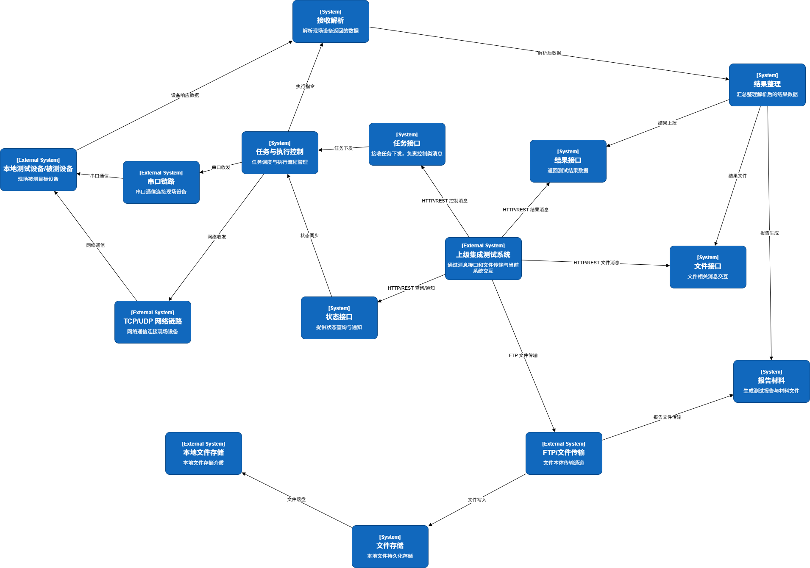

如图所示，上级集成测试系统通过 HTTP/REST 消息接口和 FTP/文件传输与系统协同接入模块连接；协同接入下分任务接口、状态接口、结果接口和文件接口。系统内部通过任务与执行控制、接收解析、结果整理、报告材料和文件存储完成业务处理，右侧串口链路和 TCP/UDP 网络链路负责与测试设备或被测设备进行实际收发。

### 任务类接口

任务类接口用于承接上级集成测试系统对测试任务的协同要求，主要包括任务接收、任务启动和任务停止控制。任务接收接口负责接收任务标识、任务名称、用例或执行项、任务参数、资源信息和文件交付信息等上下文，使系统能够建立一次完整的测试执行上下文。任务启动接口用于触发已经进入系统的任务执行；任务停止接口用于在执行过程中接收停止控制，并推动执行控制、链路收发、状态记录、结果整理和文件材料进入收束流程。

任务类接口表达上级系统维度的任务生命周期。本地发送任务、顺序发送、定时发送和触发发送是系统执行测试动作的现场能力，可作为任务执行过程中的发送控制手段。系统在执行任务时，将任务上下文与本地收发能力衔接起来：任务接口提供任务身份、用例列表、参数和结果归口；本地执行能力负责完成串口或网络链路上的发送、接收、解析和记录。

任务类接口的同步响应主要表达请求受理情况、当前状态是否满足执行条件、任务是否已进入执行流程以及停止请求是否已完成收束。具体测试过程和最终结论通过状态类接口、结果类接口和文件类接口继续表达，使任务控制、状态观察、结果归集和文件交付各自保持清晰职责。

### 状态类接口

状态类接口用于向上级系统表达系统在线状态、执行条件、任务状态、链路状态、设备状态、异常信息和告警信息。状态查询类接口以请求响应方式提供当前状态视图，心跳类接口用于持续表达系统间链路可达和在线情况，告警类接口用于在设备异常、链路异常、执行异常、文件异常等事件发生时进行反馈。状态查询、心跳和告警共同构成上级系统观察运行情况的主要通道。

状态来源包括串口连接状态、TCP/UDP 连接状态、通信目标可用性、发送执行状态、接收解析状态、状态指示灯、历史记录状态、文件处理状态以及扩展指令状态。系统将这些运行事实整理为统一状态视图，对外表达子系统整体状态、当前任务摘要、执行进度、异常提示和必要自检信息。这样既保留本地现场操作所需的细节，也为上级系统提供稳定的状态口径。

告警与异常反馈按事件来源、影响范围和处理结果组织。链路不可达、发送失败、接收解析失败、帧未匹配、文件读写失败、任务状态异常、停止收束异常等情况，可归入链路异常、任务异常、结果异常或文件异常，并通过状态响应或告警通知表达。扩展指令链路产生的状态和异常作为独立指令接入事实呈现，服务指令联调和工具记录。

### 结果类接口

结果类接口用于表达测试执行形成的业务结果，主要包括用例级结果、任务级汇总结果和报告材料结果。用例级结果用于在单个测试用例或执行单元完成后反馈结果状态、关键结果值、结果说明和异常说明；任务级汇总结果用于在整个任务结束、停止或异常收束后汇总各用例结果、开始结束时间、终止原因和总体结论；报告材料结果用于把任务级事实、用例结果、文件材料和附件索引整理为可归档、可交付的报告材料。

系统已有的接收解析结果、表达式计算值、统计值、发送结果、状态值、历史记录、CSV 导出和高速存储文件，是结果整理的重要来源。结果类接口围绕任务上下文和用例上下文对这些材料进行归集，明确结果属于哪个任务、哪个用例、哪个执行阶段，以及是否已经形成可交付事实。用例结果、任务结果和报告材料按照各自职责输出，便于上级系统进行任务闭环、结果归档和后续复核。

结果类接口与文件类接口配合工作。结果接口说明测试结论、执行状态和结果摘要；文件接口说明报告文件、数据文件、日志文件和附件材料的生成、传输和通知状态。若结果已经形成而文件传输发生异常，系统通过文件类接口表达传输异常，同时在结果材料中保留已形成的测试事实和结果口径。

### 文件类接口

文件类接口用于承接测试数据文件、日志文件、报告文件、脚本文件、配置文件、设备信息文件和其他约定附件的传输与完成通知。系统在本地运行过程中形成配置文件、历史记录、CSV 导出、高速存储数据、结果支撑材料和报告材料；需要交付给上级系统的文件，按任务、用例、文件类型、生成时间和交付用途整理为文件记录，再通过 FTP 或约定的文件传输方式完成交付。

文件交付流程包括文件生成、文件整理、文件传输和完成通知。FTP 或文件传输负责文件本体送达约定位置，HTTP/REST 消息接口负责向上级系统通知任务相关文件、通用文件或报告文件的传输结果。测试数据文件、测试报告文件等任务相关材料与任务上下文、用例上下文和结果状态关联；脚本、配置或其他通用文件按通用文件职责组织。

对于上级系统按约定请求获取文件的场景，文件类接口根据任务、用例、文件类型和交付用途定位本地文件材料，并按文件传输规则完成交付。文件接口与结果接口共同支撑测试闭环：结果接口回答测试结论，文件接口回答材料如何交付、何时完成以及发生异常时如何反馈。

### 主要数据对象说明

接口设计涉及的主要业务对象包括子系统、设备、通信目标、测试任务、测试用例、测试结果、测试报告、文件记录、状态记录和告警记录。子系统对象用于表达系统作为二级子系统或执行端的对外身份；设备对象用于表达业务上的设备或测试对象；通信目标用于表达本地串口端口、TCP 连接、TCP Server 接入、UDP 远端主机等实际收发路径。设备对象服务业务身份管理，通信目标服务现场传输路径管理。

测试任务对象表达一次由上级协同或本地执行组织起来的测试上下文，包含任务标识、任务名称、来源、参数、用例或执行项、当前状态、开始结束时间和结果归口状态。测试用例对象表达任务内的执行单元，承接输入参数、执行步骤、发送结果、接收解析事实和用例级结论。测试结果对象表达已经归集的结果事实，用于支撑用例结果上报和任务级汇总；测试报告对象是在结果事实、异常说明和文件材料基础上形成的交付材料。

文件记录对象用于描述结果文件、报告文件、日志文件或其他交付材料的生成、存储、传输和通知状态。状态记录对象用于描述子系统、任务、链路、设备或扩展指令接入能力的当前状态；告警记录对象用于描述异常事件来源、级别、说明和处理结果。扩展指令对象可引用通信链路、发送结果、接收结果和文件记录，用于指令链路说明和工具记录。

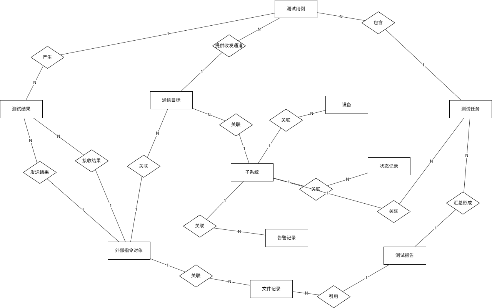

如图所示，子系统与设备、通信目标、测试任务、状态记录和告警记录发生关联；测试任务包含测试用例，测试用例产生测试结果，测试任务汇总形成测试报告，测试报告引用文件记录。通信目标连接串口、TCP/UDP 等现场链路，为测试用例执行提供收发通道；设备对象用于表达业务身份。

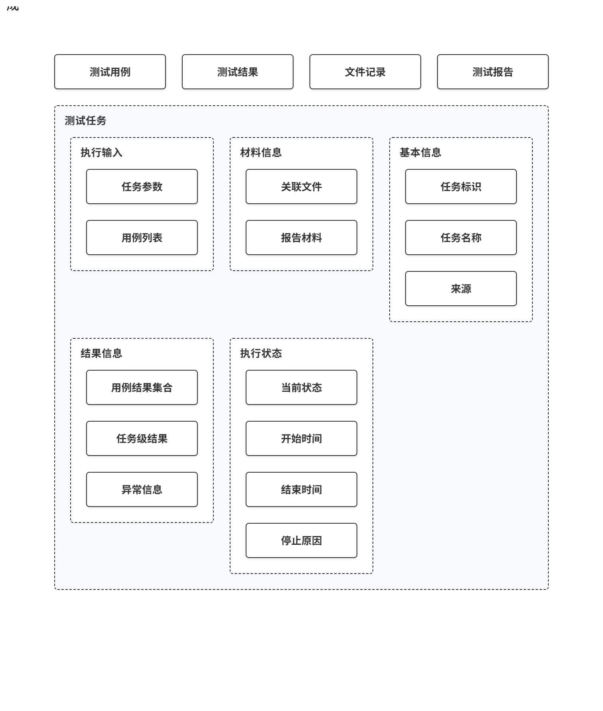

如图所示，测试任务对象包含任务标识、任务名称、来源、任务参数、用例列表、当前状态、开始时间、结束时间、停止原因、用例结果集合、任务级结果、异常信息、关联文件和报告材料等信息。该对象用于统一承载任务执行、结果归集和材料交付所需的上下文。

## 通信模式

### HTTP/REST 通信

HTTP/REST 通信用于承接上级集成测试系统与系统之间的消息类协同，适用于任务下发、任务启动、任务停止、状态查询、心跳、告警通知、用例结果通知、任务结果通知、文件传输完成通知和其他轻量请求响应动作。此类通信以请求和响应为基本形态，强调事务标识、子系统身份、处理状态和错误说明，使上级系统能够判断请求是否已受理、是否进入执行流程以及后续应查询状态、等待结果或接收文件材料。

在系统内，HTTP/REST 通信进入统一协同接入环节。任务类请求转换为任务与执行控制输入；状态类请求读取统一状态视图；结果和文件通知根据已经形成的结果事实或文件传输事实发出。对于状态冲突、参数缺失、任务不存在、文件不可交付等情况，系统在 HTTP/REST 层提供统一响应语义，便于上级系统按业务规则处理。

HTTP/REST 通信负责控制、查询、回执和通知；实际测试数据收发由串口、TCP/UDP 等现场链路完成，大文件本体交付由 FTP 或约定文件传输机制完成。通过这种分工，系统能够同时满足上级协同消息的实时性和测试文件交付的稳定性要求。

### FTP/文件传输

FTP/文件传输用于交付测试过程中产生的文件类材料，包括测试数据文件、日志文件、过程记录文件、测试报告文件、脚本文件、配置文件以及约定的其他附件材料。文件传输关注文件本体、目录、命名、类型、大小、格式和传输结果；消息接口关注传输完成后的通知、回执和异常说明。二者配合形成完整文件交付链路。

本地文件存储是文件传输的主要来源。系统运行中形成的历史记录、CSV 导出、高速存储数据、结果支撑材料和报告材料，按任务和用例上下文整理为可交付文件后进入传输流程。对于报告中引用的图片、数据文件、日志文件或附件，文件记录中保留文件类型、标题、格式、生成时间和关联任务信息，供报告材料和文件完成通知使用。

文件传输流程与业务结果流程协同推进。测试任务可以先形成用例结果和任务结果，再完成报告文件或附件传输；文件传输完成后，系统通过消息接口通知上级系统文件标识、文件类型、任务归属和传输状态。传输异常按文件交付异常反馈，并保留本地文件和过程记录用于复核。

### 串口通信

串口通信是系统连接测试设备、转换设备或被测对象的重要现场链路。系统通过桌面界面完成串口端口选择、连接、断开、状态刷新和异常提示，并将串口链路作为接收原始数据和发送协议帧的承载通道。串口链路接收到的数据进入原始数据接收和协议解析流程，解析后的参数值、状态值、统计值和异常信息用于本地展示、历史记录、触发判断和结果材料整理。

在发送方向，串口通信承接手动发送、按目标发送、顺序发送、循环发送、定时发送和触发发送等本地控制动作。系统根据协议帧和发送实例完成字段取值、组帧和目标校验，再通过串口端口发送到现场设备，并记录发送时间、发送结果、失败原因和相关状态。串口发送结果作为执行事实，进入测试过程记录和结果整理流程。

串口端口、串口路径和串口连接状态属于现场通信目标范畴，用于说明系统如何与设备完成实际通信。上级系统中的设备对象按业务身份、设备清单和项目编码规则表达；现场串口链路按传输通道表达。二者配合使用，可以支撑同一设备在不同链路配置下的稳定测试和追溯。

### TCP/UDP 网络通信

TCP/UDP 网络通信用于连接网络设备、被测设备、测试设备或扩展指令控制源。系统支持 TCP 客户端连接、TCP Server 接入和 UDP 远端主机等网络形态，并将其整理为本地可选择的通信目标。网络链路可用于接收外部数据、发送协议帧、承接高频数据存储、形成链路状态和异常提示，是测试执行和数据采集的重要通道。

TCP 通信适用于需要连接保持、双向收发和明确连接状态的设备场景；TCP Server 适用于外部设备主动接入系统的场景；UDP 通信适用于面向远端主机的报文收发或扩展指令链路。系统在网络通信中记录远端地址、端口、连接状态、发送结果、接收来源和异常信息，并把入站数据送入统一接收解析流程，把出站请求送入发送控制流程。

扩展指令接入能力可以使用 TCP/UDP 链路，并按独立指令链路标识。该能力的固定来源、固定目标、命令识别、状态循环和测试工具记录属于扩展指令领域规则，用于指令联调、记录和状态说明。普通 TCP/UDP 网络通信继续承担现场网络设备和被测设备的数据收发职责。

### 心跳与异常通信

心跳通信用于维持上级系统与本系统之间的链路可见性，表达系统在线、链路健康和协同可达状态。心跳偏向周期性链路监视，状态查询偏向当前运行视图，两者共同支撑上级系统对系统在线状态和任务调度条件的判断。系统可在心跳中表达子系统身份、当前可用状态、时间戳和基础健康状态，并在状态查询中提供更完整的任务、链路、设备和异常信息。

异常通信覆盖请求处理异常、任务状态异常、链路不可达、设备异常、结果生成失败、文件传输失败、报告交付异常等情况。同步请求产生的异常通过 HTTP/REST 响应表达；运行过程中发生的设备、链路或系统事件通过告警或状态视图表达；文件交付失败通过文件完成通知或交付回执表达；测试执行失败通过用例结果、任务结果和异常说明表达。

系统对异常信息进行业务化整理，使上级系统能够按失败、拒绝、不可执行、异常中止、交付失败等类型处理。串口错误、网络错误、帧解析失败、发送失败、文件读写失败、扩展指令错误等细分原因继续保留在本地记录和问题复核材料中，为现场排障和结果追溯提供依据。

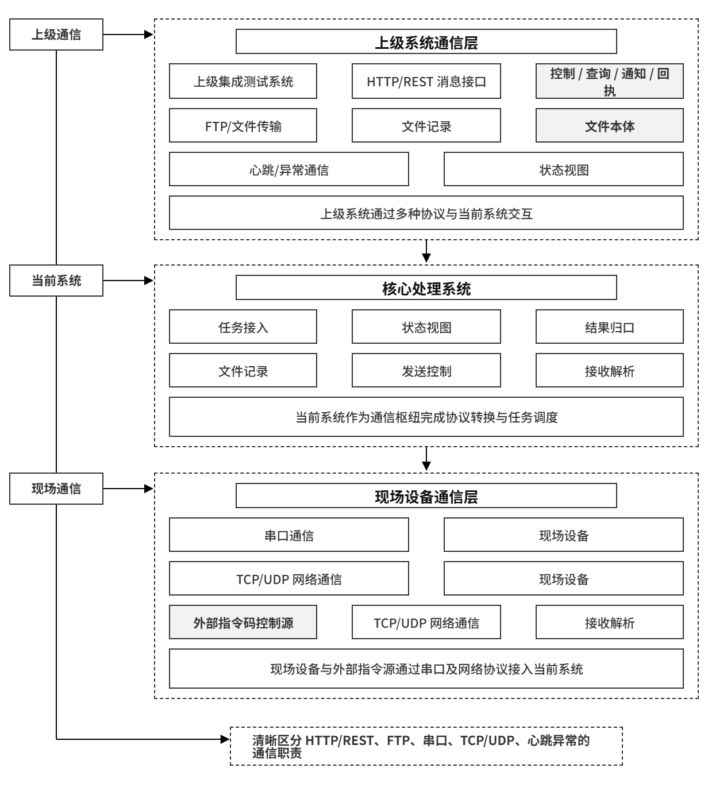

如图所示，上级集成测试系统通过 HTTP/REST 消息接口、FTP/文件传输、心跳与异常通信连接到系统协同接入；系统通过串口通信和 TCP/UDP 网络通信连接现场设备和扩展指令控制源。消息接口负责控制、查询、通知和回执，文件传输负责文件本体，串口和 TCP/UDP 负责现场数据收发，心跳与异常通信负责链路健康和运行异常反馈。

## 系统工作流程

### 测试任务执行流程

测试任务执行流程以本地执行控制能力为基础，面向集成测试协同提供现场执行和数据提供能力。流程开始于本地测试操作或上级协同要求进入系统，系统读取任务要求、用例或测试步骤、协议帧配置、发送实例、通信目标和必要参数，然后检查串口链路、TCP/UDP 网络链路、当前执行状态和本地配置是否满足执行条件。本地操作发起的测试可直接进入手动发送、顺序发送、定时发送或触发发送；上级协同发起的任务通过任务上下文衔接到本地收发、解析、记录和结果整理流程。

执行过程中，系统按照已配置的步骤推进发送、等待、接收、解析和状态更新。顺序类执行按配置顺序逐项发送；定时类执行按周期或延时推进；触发类执行等待指定接收帧、来源或数据项满足条件后再发起后续动作。系统持续记录启动、停止、等待触发、等待调度、执行中、完成和异常等状态，并把发送结果、接收解析结果、链路状态和异常信息作为后续结果整理的输入。

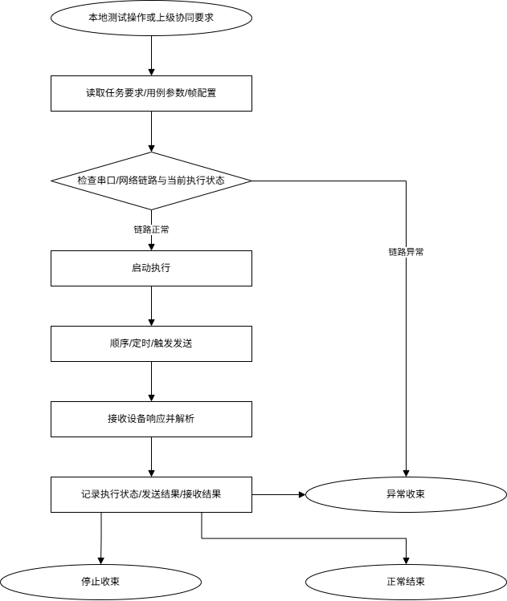

如图所示，任务执行流程从测试操作或协同要求进入系统开始，经过任务要求、用例参数和帧配置读取，完成链路与执行状态检查后启动执行。系统通过顺序、定时或触发方式推进现场发送和接收动作，并在任务结束、停止或异常收束时记录执行状态、发送结果和接收结果。

### 数据接收解析流程

数据接收解析流程从串口链路或 TCP/UDP 网络链路收到原始数据开始。系统首先保留数据来源、接收时间、原始载荷和链路信息，再按接收处理队列进入协议帧匹配过程。匹配成功后，系统依据帧定义和字段规则完成字段提取、表达式计算、统计更新和状态值整理；未匹配或解析失败的数据形成失败记录和异常提示，用于现场排查协议配置、数据格式或链路输入问题。

解析后的数据进入实时显示、状态指示、触发判断、历史记录和结果整理等后续流程。参数值、状态值、统计值和表达式结果可用于本地界面展示，也可作为触发发送的判断输入；历史记录和导出文件为结果复核、异常定位和报告材料整理提供依据。若数据来源属于扩展指令入口，系统按指令规则完成命令识别、状态循环、反馈发送和记录。

### 数据发送控制流程

数据发送控制流程从发送意图进入系统开始。发送意图可以来自本地手动操作、顺序发送计划、定时发送计划、接收触发条件或扩展指令动作。系统在发送前读取发送实例、协议帧定义、字段取值、表达式或因子配置，并校验目标链路是否可用。目标链路包括串口端口、TCP 连接、TCP Server 接入和 UDP 远端主机等通信目标，用于表达现场数据收发路径。

发送执行时，系统按照协议配置完成组帧和字节载荷生成，再通过对应串口或网络链路落地发送。发送后，系统记录发送时间、目标、字节数、成功或失败结果、错误说明和执行状态；对于顺序、定时和触发发送，系统继续根据当前计划推进下一步、继续等待或进入停止和异常收束。发送结果与后续接收结果共同构成测试过程记录，为历史查询、结果整理和本地导出提供事实来源。

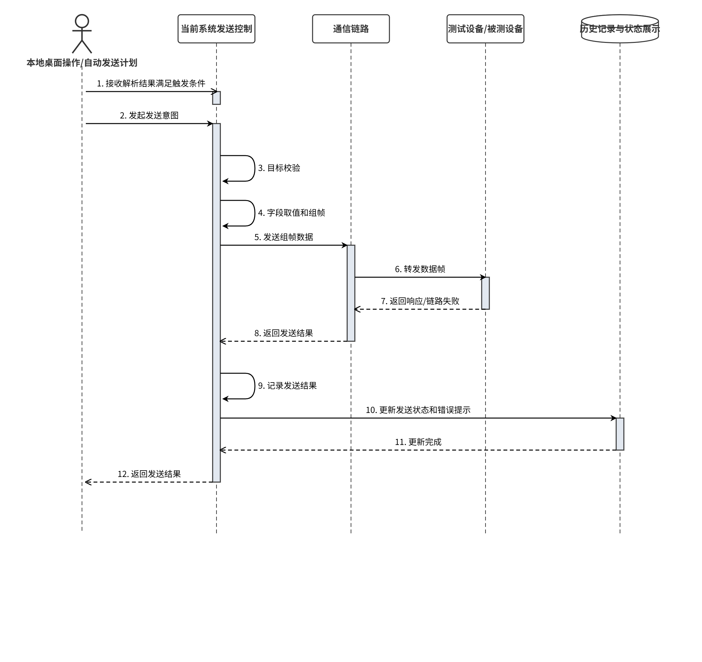

如图所示，发送控制由本地桌面操作或自动发送计划发起，系统完成目标校验和组帧后，通过串口、TCP 或 UDP 链路发送至测试设备或被测设备。设备响应或链路失败信息返回后，系统记录发送结果，并同步更新历史记录和状态展示。

### 结果生成与报告回传流程

结果生成流程以发送记录、接收解析结果、执行状态、异常信息、历史记录和相关文件材料为输入。系统在一次本地测试或发送执行过程中持续沉淀过程数据，包括原始接收信息、解析后的参数值和状态值、发送结果、链路异常、执行开始和结束信息等。执行结束后，系统根据这些已记录事实整理本地结果材料，用于现场复核、问题定位、CSV 导出和报告编制支撑。

面向上级系统的报告回传建立在任务上下文、用例结果和任务级结果已经归集的基础上。本地历史记录、CSV 导出和本地结果文件作为报告材料来源，报告对象、报告文件和交付通知依据接口约定形成。流程表达时按“结果事实形成、报告对象整理、文件材料准备、对外交付通知”的顺序组织，使本地结果材料和对外报告材料之间的来源关系清晰可追溯。

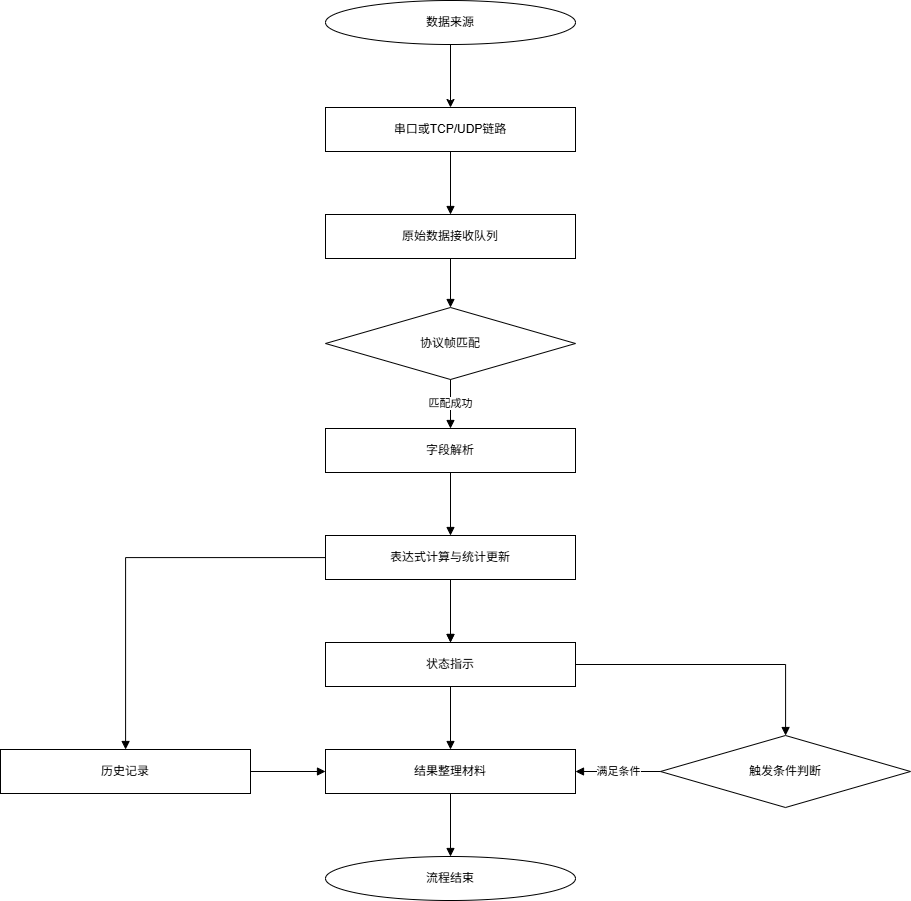

如图所示，发送结果、接收解析结果、执行状态、异常信息和历史记录共同汇入结果材料整理环节。系统在此基础上形成本地结果查看、CSV 或文件导出以及报告材料准备内容；在系统协同场景中，报告材料继续关联报告对象、文件材料和交付通知。

### 文件上传与通知流程

文件形成流程以本地文件存储为基础。系统在运行过程中保存帧配置、发送实例、接收配置、历史记录、高速存储数据、CSV 导出文件、扩展指令记录和其他结果支撑材料。操作人员可通过桌面界面查看历史记录、筛选过程数据、导出 CSV 或整理结果附件，从而形成可复核、可追溯、可用于报告编制的本地文件材料。

在集成测试协同中，文件上传与通知作为本地文件形成之后的对外交付流程处理。系统先明确文件来源、任务或用例归属、文件类型、文件路径、文件格式和交付状态，再依据接口约定完成文件放置、传输或通知。文件“已生成”“已整理”“已传输”“已通知”分别对应本地存储、材料整理、文件传输和消息通知职责。

### 异常告警处理流程

异常告警处理流程覆盖链路异常、数据异常、发送异常、接收解析异常、执行异常、文件读写异常和扩展指令异常等现场问题。系统在串口断开、网络目标不可达、发送失败、帧未匹配、数据校验失败、触发条件长期未满足、文件保存失败或指令校验异常时，记录异常来源、发生时间、影响范围和提示信息，并通过本地界面状态、错误提示、历史记录或工具记录向操作人员呈现。

异常处理通常按照“发现、提示、记录、收束、复核”的顺序进行。系统先在当前链路或执行流程中发现异常，再给出连接状态、执行状态或解析失败提示；随后将异常写入过程记录或结果材料，必要时停止后续发送、退出等待状态或进入异常收束。面向上级协同场景时，告警上报、状态查询和心跳共同形成对外状态反馈，使上级系统能够了解异常类型、影响范围和处理结果。

## 自动化运行能力

### 自动测试执行能力

系统具备围绕本地测试操作组织自动执行的能力。用户可基于已配置的协议帧、发送实例和通信目标设置顺序发送、循环发送、定时发送和触发发送，使系统按照预设步骤、周期或接收条件自动推进测试动作。执行过程中，系统自动维护发送进度、等待状态、发送结果、错误提示和执行记录，减少现场联调和设备测试中的重复人工操作。

自动测试执行能力在系统协同中作为执行支撑能力，为任务要求落地到本地链路收发、状态记录和结果整理提供基础。任务上下文负责任务身份、用例范围、结果归口和交付要求，本地自动发送计划负责现场动作推进，两者通过任务执行流程衔接。

### 自动数据采集能力

系统能够在串口和网络链路建立后自动接收数据，并将原始数据送入接收处理流程。接收流程按队列处理入站数据，自动完成来源识别、帧匹配、字段解析、表达式计算、统计更新和状态值刷新；对于未匹配或解析失败的数据，系统自动形成失败记录和提示，便于后续追溯。

自动数据采集还体现在历史记录和高速存储能力上。系统可持续沉淀接收过程中的当前值、统计结果和指定网络数据，并按本地存储规则形成历史记录、CSV 导出来源或高速存储文件。上述采集结果主要用于现场显示、过程复核、触发判断和报告材料整理。

### 自动结果整理能力

系统在测试执行和数据收发过程中自动整理可用于结果判断和报告支撑的材料。发送侧记录发送目标、发送时间、发送字节数、成功或失败状态；接收侧记录原始数据、帧匹配结果、字段值、表达式结果和统计信息；执行侧记录启动、停止、等待、完成、异常等过程状态。这些自动形成的事实材料共同支撑本地结果查看、异常复核、历史查询和文件导出。

在系统协同中，自动结果整理继续向用例结果、任务级结果和报告材料汇聚。系统将本地历史、统计值、CSV 文件和结果支撑材料按任务上下文归集，形成可被报告材料和文件交付环节引用的结果来源。这样能够把自动采集、自动解析、自动记录和报告材料准备连成一条可追溯链路。

### 自动文件回传能力

系统具备自动形成和管理本地文件材料的基础能力，包括历史记录写入、CSV 导出、高速存储文件生成、配置文件保存和扩展指令记录留存。这些文件材料可在测试完成后被整理为结果附件、复核材料或报告编制来源，并通过本地界面进行查询、筛选和导出。

面向上级系统的文件回传流程在本地文件材料形成后继续推进。系统根据任务或用例归属、文件类型、文件路径、文件格式和交付规则整理待交付材料，再通过文件传输和完成通知与上级系统协同。自动文件回传能力由本地文件生成、材料整理、文件传输和通知回执共同构成，支撑测试结果材料的闭环交付。

### 自动状态反馈能力

系统能够根据连接状态、发送状态、接收解析状态、执行状态、文件处理状态和扩展指令状态自动形成运行反馈。本地界面可展示串口和网络连接状态、通信目标可用性、最近发送接收结果、解析成功或失败情况、状态指示灯颜色、异常提示和历史记录状态，帮助操作人员持续掌握系统是否可执行、是否正在执行以及是否存在异常。

在集成测试系统协同场景下，状态反馈通过子系统身份、状态查询、心跳、结果上报和告警通知向外呈现。系统内的连接状态、执行状态、解析结果和异常信息作为状态来源，经过统一状态视图整理后提供给上级系统。这样能够保证本地状态展示、自动异常提示和上级系统状态反馈来源一致。

## 项目实施安排

### 方案整理

方案整理阶段面向系统建设和交付说明形成统一基线。该阶段首先明确系统范围、部署边界、功能组成、接口职责、运行环境和图件表达方式，保证后续实施、联调和验收均围绕同一套系统口径展开。系统范围以测试工作站、本地桌面应用、串口/TCP/UDP 设备链路、任务执行、数据接收解析、发送控制、历史记录、结果材料、文件交付和扩展指令接入能力为核心。

方案整理阶段同时完成接口职责和业务对象梳理。任务、状态、结果、报告、文件等协同内容按照接口章节统一组织；设备对象和通信目标分别表达业务身份和现场收发路径；历史记录、CSV 和本地文件作为报告材料来源，不直接混同为正式报告对象。通过上述梳理，可为后续现场部署、接口联调和系统验证提供一致依据。

本阶段输出包括系统方案设计报告、功能说明、接口职责说明、主要业务对象说明、部署拓扑图、接口结构图、流程图和实施安排材料。相关材料经确认后作为项目实施的基线文件，用于指导环境准备、接口联调、系统验证和交付收尾。

### 环境准备

环境准备阶段围绕测试工作站、现场设备链路、网络链路和文件存储环境展开。测试工作站需完成桌面应用安装、运行目录准备、串口驱动和网络访问环境配置，并保证本地磁盘具备足够空间保存配置、历史记录、CSV 导出、高速存储数据、结果支撑材料和报告附件。串口设备、USB 转串口适配设备、TCP/UDP 网络设备或被测对象需按现场测试要求完成连接和通信参数核对。

网络环境准备包括本地设备网络、上级系统访问网络和文件交换网络。TCP、TCP Server、UDP 等通信目标应完成 IP 地址、端口、方向和防火墙策略检查；上级系统协同接口应完成访问地址、接口路径、文件传输目录和必要账号权限配置。若启用扩展指令接入能力，应独立确认指令来源、目标地址、端口、通信方式和记录路径。

本阶段输出包括运行环境确认记录、设备连接确认记录、网络连通性检查记录、文件目录和权限确认记录、基础配置清单以及必要的测试样例数据。环境准备完成后，系统具备进入接口联调和功能验证的基础条件。

### 接口联调

接口联调阶段围绕任务控制、状态反馈、结果材料和文件交付展开。任务类联调验证任务接收、启动、停止和任务状态收束；状态类联调验证状态查询、心跳保活、链路状态、执行状态和告警反馈；结果类联调验证用例结果、任务结果、异常结果和报告材料结果；文件类联调验证文件生成、文件放置、文件传输、完成通知和异常反馈。

联调过程中，系统将上级任务上下文与本地执行能力衔接起来。任务进入系统后，本地执行流程完成串口或网络链路上的发送、接收、解析和记录；执行结果再归集为用例结果、任务结果和报告材料；文件材料通过本地存储和文件传输流程完成交付。对于异常场景，应同步验证链路不可达、参数错误、任务状态冲突、执行失败、文件传输失败等情况的响应和记录。

本阶段输出包括接口联调用例、联调记录、接口问题清单、问题处理记录、结果样例、文件样例和异常场景记录。联调完成后，应形成能够支撑系统验证的任务主链、状态主链、结果主链和文件主链样例。

### 系统验证

系统验证阶段面向交付验收，对系统功能、现场运行、接口协同和结果材料进行综合检查。验证内容包括桌面界面可用性、设备链路连接、协议帧配置、原始数据接收、协议解析、参数和状态展示、手动发送、顺序发送、定时发送、触发发送、执行状态展示、历史记录查询、CSV 或结果文件导出、状态告警提示以及扩展指令接入能力检查。涉及上级系统协同的内容，应按接口联调阶段形成的用例和数据样例验证任务、状态、结果和文件材料的协同效果。

验证工作覆盖正常流程、停止流程、链路异常、数据解析异常、文件读写异常和结果材料复核等场景。正常流程用于证明系统能够完成从输入、执行、采集、整理到输出的完整闭环；异常场景用于证明系统能够给出可观察的状态提示、异常记录和可追溯材料；结果材料复核用于确认历史记录、导出文件、结果支撑材料和正式交付材料之间的来源关系清晰。

本阶段输出包括系统验证记录、问题整改记录、验证通过清单、运行环境确认记录、接口联调复测记录、结果和文件材料样例以及最终交付材料。系统验证完成后，项目实施进入交付收尾，按双方约定移交系统说明、部署说明、接口说明、图件资料、验证记录和运行维护所需的基础材料。

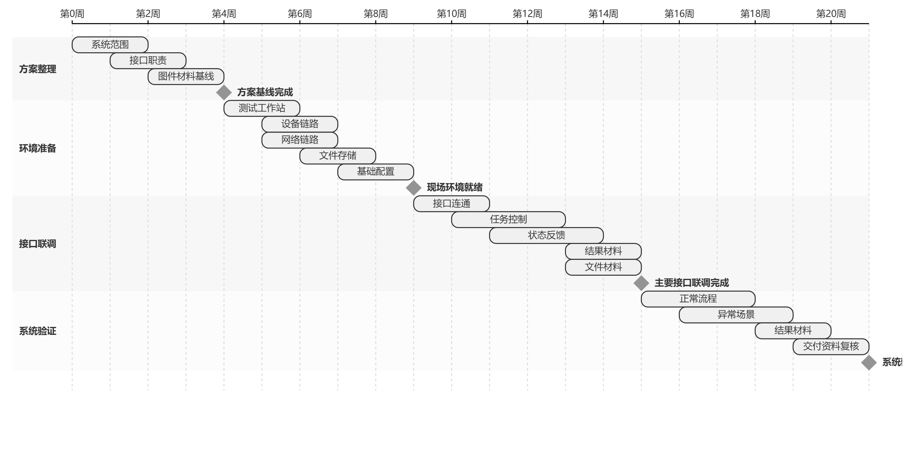

如图所示，项目实施按照方案整理、环境准备、接口联调和系统验证四个阶段推进。方案整理先形成系统范围和接口职责基线，环境准备完成测试工作站、设备链路、网络链路和文件存储条件，接口联调在环境具备后逐项验证任务、状态、结果和文件材料，系统验证在主要闭环稳定后完成正常流程、异常场景、结果材料和交付资料复核。
