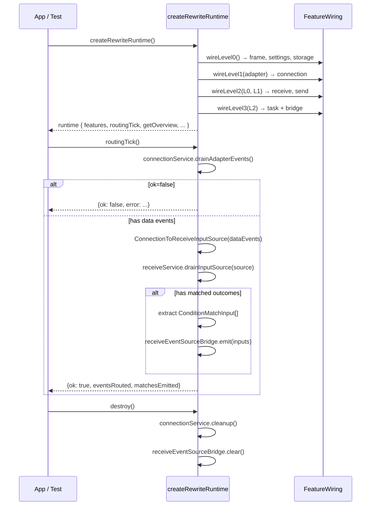

# Runtime wiring

## 0. 术语约定

| 术语 | 定义 | 防冲突结论 |
|------|------|-----------|
| wiring level | 按 feature 依赖关系划分的创建层级，同层 feature 可并行创建 | 仅用于 feature-wiring.ts 内部分层，不泄漏到外部 |
| bridge adapter | runtime 创建的跨 feature 桥接适配器，实现目标 feature 的 adapter port 接口，委托源 feature 的公开 API | 不与 feature 内部 adapter 混淆；runtime bridge 是 wiring-only |
| ReceiveEventSourceBridge | runtime 创建的 pub/sub 桥，实现 task 的 `ReceiveEventSource` 接口，将 receive 的 matched 结果转发给 task | 只在 runtime 内部使用 |
| ConnectionToReceiveInputSource | 无状态转换器，接收 ConnectionService 已处理的 data 事件，转为 `ReceiveInputEvent[]`，供 receive 消费 | 不持有 ConnectionTransportAdapter 引用，不竞争事件队列 |
| routingTick | 无状态函数，执行单次路由节拍：drain connection → feed receive → extract matches → notify task。由外部调用 | runtime 不持有调度状态，不使用 timer |

术语 grep 结果：`wireFeatures`、`bridge adapter`、`routingTick` 在现有代码中无冲突。

## 1. 决策与约束

### 需求摘要

- **做什么**：在 `runtime/` 层创建 feature service 实例、桥接适配器和路由函数，把 frame/connection/receive/send/task/settings + storage-local-baseline 串成可运行的数据通路。
- **为谁**：为后续 pages/widgets/runtime facade 消费；为集成测试和手动验证提供可运行的 runtime。
- **成功标准**：
  1. `createRewriteRuntime()` 返回的 runtime 包含所有 feature service 引用
  2. `routingTick()` 能将 connection data 事件经 receive 解析后触发 task 条件匹配
  3. task 的 send-step 能通过 send service + connection 写出
  4. 现有 overview snapshot 和 resetSettings 向后兼容
  5. build + lint 通过
- **明确不做**：
  - 不接 platform/preload/main 真实能力，只用 fake adapter
  - 不做 UI
  - 不引入 Pinia 或全局 store
  - 不接 SCOE/result/report/northbound/status/display
  - 不实现定时器调度、运行时 settings 变更推送、打包态 data path
  - 不实现重试/退避/断路器
  - runtime 不持有任何可变业务 state
  - runtime 不使用 setTimeout/setInterval

### 复杂度档位

走内部工具默认档位，无偏离。

### 关键决策

**D1: 无状态 routingTick 函数，不建 EventRouter 状态机**

runtime 保持 composition root 本色。路由逻辑是无状态函数 `routingTick(features): RoutingTickResult`，由外部（app、测试、或未来 platform callback）决定何时调用。

为什么不用 EventRouter 状态机：EventRouter 引入调度器、运行状态、start/stop 生命周期，使 runtime 变成 mini 事件总线，越过 composition root 边界。当真实 platform 提供推送能力时，EventRouter 的 pollIntervalMs、RoutingStats、tick 管理全部是 throwaway。

换回 EventRouter 会怎样：runtime 变为有状态调度层，与 architecture 定义的"只做装配、生命周期、事件路由、边界例外登记"的薄层定位冲突。

**D2: 桥接 adapter 不直接持有 ConnectionTransportAdapter**

ConnectionToReceiveInputSource 接收 ConnectionService.drainAdapterEvents() 返回的已处理事件，做纯格式转换。不持有 adapter 引用，不与 ConnectionService 竞争事件队列。

如果桥接 adapter 直接调 adapter.drainEvents()：ConnectionService 的 state 不会更新（counters、event history、lastError 丢失），非 data 事件被桥接 adapter 吃掉。

**D3: 3 层 wiring 而非 5 层**

实际依赖关系只有 3 个层级边界：
- L0（无互依赖）：frame, settings, storage-local-baseline
- L1（需 adapter）：connection
- L2（需 L0+L1）：receive, send（可并行）
- L3（需 L2）：task + ReceiveEventSourceBridge

每层内 feature 互相独立，可以并行创建。

**D4: 错误处理——失败即停，返回错误结果**

routingTick 中每步检查 outcome.ok。失败时在返回值中记录错误，跳过后续步骤。不做重试、退避或断路。

**D5: lifecycle 合并到 index.ts，不单独建模块**

D1 简化后 lifecycle 只剩 init（wireFeatures）和 destroy（cleanup + bridge.clear），不需要独立文件。直接在 index.ts 的 `createRewriteRuntime` 和新增的 `destroy` 方法中处理。

**D6: bridge adapter 集中在 runtime/bridges/ 子目录**

当前 4 个 bridge（connection→receive、send→connection、receive→task、frame→send），后续加 status/display/result 时会到 8-10 个。集中在 `runtime/bridges/` 避免全塞在 feature-wiring.ts 里。

### 前置依赖

无。当前 runtime/index.ts（141 行）功能正常但能力不足，直接扩展。

## 2. 名词与编排

### 2.1 名词层

#### 现状

| 位置 | 职责 |
|------|------|
| `runtime/index.ts` | 141 行。聚合 frame/settings/storage 只读端口，提供 `getOverviewSnapshot()` 和 `resetSettings()`。无事件路由，无生命周期管理，无跨 feature 编排 |
| `runtime/__tests__/rewrite-runtime.spec.ts` | 覆盖 overview snapshot 聚合、settings reset 透传、默认 reader 创建 |
| `app/rewriteRuntime.ts` | Vue provide/inject 包装，无变更 |
| `features/connection/services/connection-service.ts` | `ConnectionService` 接口：connect/disconnect/write/drainAdapterEvents/cleanup。`drainAdapterEvents()` 返回 `ConnectionOperationOutcome` 含 `events: TransportEventSnapshot[]` |
| `features/receive/services/receive-service.ts` | `ReceiveService.ingestBatch(batch)` + `drainInputSource(source: ReceiveInputSource)`。`ReceiveInputSource.drainEvents(): Promise<ReceiveInputEvent[]>` |
| `features/send/services/send-service.ts` | `SendService`。依赖 `SendFrameReader`、`SendTargetResolver`、`SendTransportWriter`、可选 `SendResultEmitter` |
| `features/task/services/task-service.ts` | `TaskService`。依赖 `SendServiceProvider`、`ReceiveEventSource` |

#### 变化

**新增目录和文件：**

1. `runtime/bridges/` — bridge adapter 子目录
   - `connection-to-receive.ts` — ConnectionToReceiveInputSource
   - `connection-backed-writer.ts` — ConnectionBackedSendWriter
   - `connection-backed-target-resolver.ts` — ConnectionBackedTargetResolver
   - `receive-event-source-bridge.ts` — ReceiveEventSourceBridge
2. `runtime/feature-wiring.ts` — 3 层级创建 + bridge 装配
3. `runtime/routing-tick.ts` — 无状态 routingTick 函数
4. `runtime/__tests__/feature-wiring.spec.ts`、`routing-tick.spec.ts` — 新增测试

**修改文件：**

1. `runtime/index.ts` — 重构为 facade，委托 wiring + routingTick，保留向后兼容接口，新增 destroy()
2. `runtime/__tests__/rewrite-runtime.spec.ts` — 适配新接口

#### 接口示例

**RewriteWiredFeatures（feature-wiring.ts 核心产出）：**

```ts
interface RewriteWiredFeatures {
  // L0
  readonly frameReader: FrameAssetReader;
  readonly settingsService: SettingsService;
  readonly storageReader: StorageLocalReader;
  // L1
  readonly connectionService: ConnectionService;
  // L2
  readonly receiveService: ReceiveService;
  readonly sendService: SendService;
  // L3
  readonly taskService: TaskService;
  readonly receiveEventSourceBridge: ReceiveEventSourceBridge;
}
```
// 来源：runtime/feature-wiring.ts

**ConnectionToReceiveInputSource（无状态转换器）：**

```ts
// 输入：ConnectionService 已处理的 data 事件（kind === 'data' 的 TransportEventSnapshot[]）
// 输出：ReceiveInputEvent[]（供 receiveService.drainInputSource 消费）
// 不持有 ConnectionTransportAdapter，不持有 ConnectionService
// drainEvents() 只做格式转换：data 事件的 bytes + connectionId → ReceiveInputBatch
```
// 来源：runtime/bridges/connection-to-receive.ts

**ConnectionBackedSendWriter（send→connection 桥接）：**

```ts
// 输入：writeBytes(connectionId, bytes)
// 输出：SendTransportWriteOutcome
// 内部：转换参数 → connectionService.write({connectionId, bytes}) → 转换返回值
// 返回映射：
//   ok=true + events 含 write-accepted → {ok: true, bytesWritten: event.byteLength}
//   ok=true 但 events 无 write-accepted → {ok: true, bytesWritten: 0}  // 防御性 fallback
//   ok=false → {ok: false, bytesWritten: 0, error: outcome.error}
```
// 来源：runtime/bridges/connection-backed-writer.ts

**ReceiveEventSourceBridge（receive→task 桥接）：**

```ts
// 输入：emit(inputs: ConditionMatchInput[])
// 输出：通知所有 subscribe 注册的 handler
// subscribe(handler) → 返回 unsubscribe 函数
// clear() → 清理所有订阅
```
// 来源：runtime/bridges/receive-event-source-bridge.ts

**routingTick（无状态路由函数）：**

```ts
interface RoutingTickResult {
  readonly ok: boolean;
  readonly error?: string;
  readonly eventsRouted: number;
  readonly matchesEmitted: number;
}

function routingTick(features: RewriteWiredFeatures): Promise<RoutingTickResult>;
```
// 来源：runtime/routing-tick.ts

**ConditionMatchInput 提取规则：**

```
遍历 receiveOutcome.outcomes 中 kind==='matched' 的每条
  → 遍历该 outcome.fields 中每个 ReceiveParsedFieldValue
  → 每个字段生成一个 {frameId: outcome.matchedFrame.frameId, fieldId: field.fieldId, value: field.value, sourceId: outcome.input?.sourceId}
```
一个 matched outcome 可能产生多个 ConditionMatchInput（每个解析出的字段一个）。bridge 发全部字段，不做筛选——task 的 condition-matcher 内部做过滤。

### 2.2 编排层

#### 主流程图



#### 现状

runtime/index.ts 的 `createRewriteRuntime` 只做一件事：创建 3 个 feature 的只读端口，聚合为 overview snapshot。无启动/销毁流程，无事件路由，无跨 feature 调用。拓扑是单函数线性初始化。

#### 变化

在 runtime/ 下新增 bridges/ 子目录 + 2 个模块 + 重构 1 个：

1. **bridges/**：4 个 bridge adapter 文件，各实现一个跨 feature 桥接。
2. **feature-wiring.ts**：3 层创建 + bridge 装配。拓扑从单函数线性初始化变为分层 DAG（L0→L1→L2→L3）。
3. **routing-tick.ts**：无状态路由函数。拓扑是线性 pipeline（drain → filter → convert → drain receive → extract → emit），每步有错误检查。
4. **index.ts**：从"直接聚合 reader"变为"委托 wiring + routingTick"。保持向后兼容的 overview/resetSettings 接口，新增 features 暴露、routingTick 方法、destroy 方法。

#### 跨层纪律

- **错误语义**：routingTick 中每步失败在返回值中记录 error，跳过后续步骤，不抛异常。feature service 本身的错误由各 feature 的 outcome/result 承载。
- **幂等性**：drainAdapterEvents 和 drainInputSource 是 drain 语义（取后清空），天然幂等。destroy() 可重复调用（再调用无副作用）。
- **并发/顺序**：当前阶段所有操作在主线程 await 串行执行。routingTick 不做并发保护——调用方负责不在上一 tick 未完成时发起下一 tick。
- **扩展点**：ConnectionTransportAdapter 注入点（fake → real 切换不改动 wiring 逻辑）。ReceiveEventSourceBridge 可被替换。未来 platform callback 可直接调用 routingTick。
- **可观测点**：RoutingTickResult 暴露 ok/error/eventsRouted/matchesEmitted。

### 2.3 挂载点清单

| 挂载位置 | 动作 | 说明 |
|---------|------|------|
| `runtime/index.ts` 的 `createRewriteRuntime` 返回类型 | 修改 | 扩展 RewriteRuntime 接口，新增 features、routingTick、destroy |
| `app/rewriteRuntime.ts` 的 `provideRewriteRuntime` | 修改 | 传递扩展后的 runtime 类型 |

本 feature 不引入路由注册、配置项、数据库 schema、定时任务或第三方注册。

### 2.4 推进策略

```
1. 桥接适配器 + 编排骨架：bridges/ 子目录 + feature-wiring.ts 实现 3 层创建
   退出信号：wireFeatures() 返回所有 service/reader 引用，单测覆盖 wiring 正确性和 bridge 转换

2. 路由函数：routing-tick.ts 实现无状态 routingTick
   退出信号：routingTick() 能将 connection data 事件经 receive 解析后触发 bridge emit，错误路径返回 error

3. facade 整合：重构 index.ts，委托 wiring + routingTick
   退出信号：现有 rewrite-runtime.spec.ts 全部通过 + build + lint 通过
```

### 2.5 结构健康度与微重构

##### 评估

- `runtime/index.ts` — 141 行，职责单一（聚合 overview），改动密度适中（保留现有接口 + 扩展）
- `runtime/__tests__/rewrite-runtime.spec.ts` — 213 行，fixture 为主，需适配新接口

##### 结论：不做

runtime/index.ts 行数和职责在健康范围内。本次改动在现有基础上扩展，不塞入不相关逻辑。

##### 超出范围的观察

无。

## 3. 验收契约

### 关键场景清单

**S1: wiring 正确性**
- 输入：调用 `wireFeatures({ connectionAdapter: fakeAdapter })`
- 期望：返回的 `RewriteWiredFeatures` 包含所有 8 个 service/reader/bridge 引用，且类型正确
- 验证：每个引用非 null/undefined，task 的 ReceiveEventSource 是 bridge 实例

**S2: connection→receive 数据通路**
- 输入：fake adapter 队列中有 data 事件（含 bytes + sourceId）
- 触发：调用 routingTick(features)
- 期望：receive service 的 state 包含对应的 matched outcome

**S3: receive→task 条件匹配转发**
- 输入：receive 产出 matched outcome（含 frameId + fieldId + value）
- 触发：routingTick 中 bridge.emit() 被调用
- 期望：注册在 ReceiveEventSourceBridge 上的 handler 收到对应的 `ConditionMatchInput[]`，每个 matched 字段生成一个 input

**S4: send→connection 写出**
- 输入：sendService.execute(request) 调用
- 期望：ConnectionService.write() 被调用，参数正确转换

**S5: 错误处理——connection drain 失败**
- 输入：connectionService.drainAdapterEvents() 返回 `ok: false`
- 期望：routingTick 返回 `{ok: false, error: '...'}`，receive drain 和 bridge emit 不执行

**S6: 生命周期——destroy**
- 输入：runtime.destroy()
- 期望：connectionService.cleanup() 被调用，bridge.clear() 被调用

**S7: 向后兼容——overview snapshot**
- 输入：createRewriteRuntime() 无参数
- 期望：getOverviewSnapshot() 返回与现有行为一致的结构

**S8: 向后兼容——settings reset**
- 输入：runtime.resetSettings('recording')
- 期望：返回 RewriteRuntimeCommandResult，行为与现有一致

**S9: send bridge 防御性 fallback**
- 输入：connectionService.write() 返回 ok=true 但 events 无 write-accepted
- 期望：SendTransportWriter 返回 `{ok: true, bytesWritten: 0}`

### 明确不做的反向核对项

- runtime/ 下 .ts 文件不应 import vue、pinia 或任何 UI 框架
- runtime/ 下不应 import 任何 feature 的子目录路径（如 `@/features/send/adapters/`）
- runtime/ 不应持有或修改任何 feature 的内部可变 state
- runtime/ 不应直接 import ConnectionTransportAdapter 的实现，只通过注入接收
- runtime/ 不应包含 SCOE、result、report、northbound 相关逻辑
- runtime/ 不应使用 setTimeout/setInterval
- 每个 runtime 模块不应超过 200 行

## 4. 与项目级架构文档的关系

### 关联文档

- `codestable/architecture/rewrite-thin-ui-runtime-wiring.md` — runtime 职责定义（§4, §8）
- `codestable/architecture/rewrite-feature-interaction-matrix.md` — 交互矩阵（§4.1-4.6）
- `codestable/architecture/rewrite-feature-boundaries.md` — feature 边界和 owner
- `codestable/architecture/rewrite-system-architecture.md` — 分层架构

### 需要提炼回 architecture 的内容

1. **名词**：`RewriteWiredFeatures`、`RoutingTickResult`、bridge adapter 模式提炼到 system-architecture 的 runtime 层描述
2. **动词骨架**：wiring 层级（L0→L1→L2→L3）和 routingTick pipeline（drain→filter→convert→process→emit）提炼到 runtime 职责描述
3. **跨层纪律**：bridge adapter 不持有底层 adapter 引用、routingTick 无状态、错误即停的约束，提炼到 thin-ui-runtime-wiring

### 架构总入口

`rewrite-system-architecture.md` 的 runtime 层描述需要更新，从"仅有 overview 聚合"改为"包含 wiring + bridges + routingTick"。
