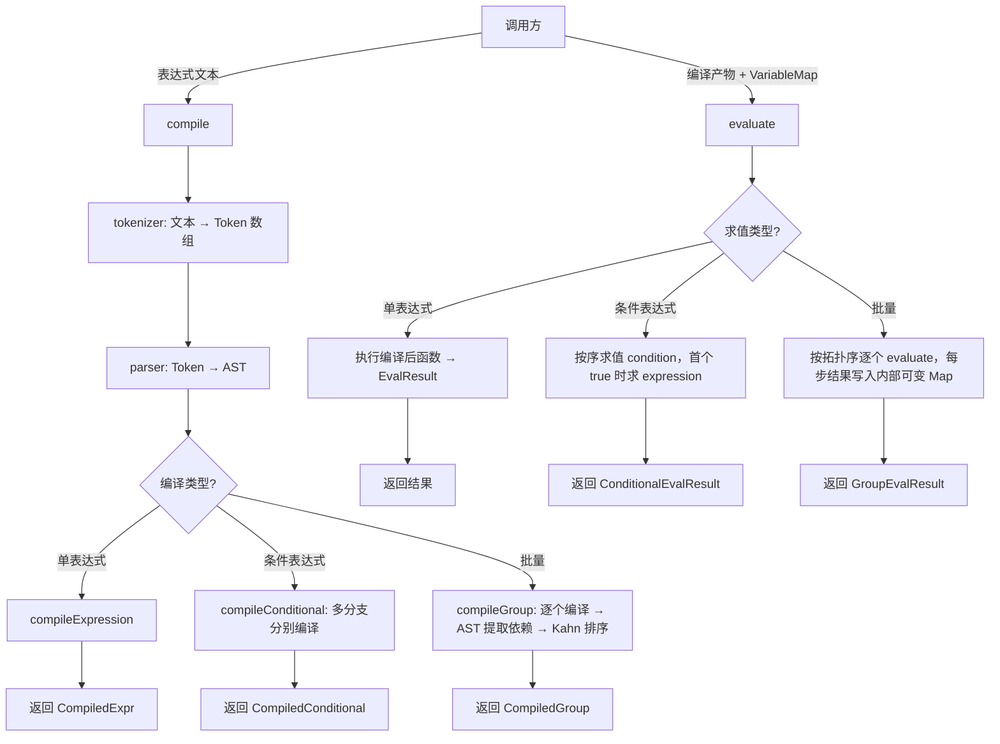

# expression-engine design

## 0. 术语约定

| 术语 | 定义 | 防冲突结论 |
|------|------|-----------|
| 表达式（expression） | 由运算符、字面量、变量引用、函数调用组成的文本，经编译后可求值 | 与旧系统 `expressionConfig.expressions[]` 语义一致，不冲突 |
| 编译（compile） | 将表达式文本解析为 AST 再转为可执行函数的过程 | 不与 webpack/vite 编译混淆，仅限表达式引擎内部 |
| 求值（evaluate） | 对已编译表达式传入变量映射，执行计算并返回结果 | — |
| 变量映射（VariableMap） | `ReadonlyMap<string, number \| string \| boolean>`，调用方构建，引擎只读 | 与旧 `VariableMapping`（含 sourceType/sourceId 绑定）不同，绑定逻辑由调用方承担 |
| 函数表（FunctionTable） | `ReadonlyMap<string, (...args: number[]) => number>`，默认含 Math.* 简名 | — |
| 条件表达式（ConditionalExpr） | 多分支 `{condition, expression}` 对，按序短路求值 | 与旧 `ConditionalExpression` 语义一致 |
| 表达式组（ExpressionGroup） | 多个命名表达式 + Kahn 拓扑排序，支持依赖链求值 | — |

## 1. 决策与约束

### 需求摘要

**做什么**：为 rewrite 项目提供统一的表达式求值能力，归口 `shared/`，纯 TypeScript，零框架依赖。

**为谁**：receive（帧字段后处理）、send（构帧前动态计算）、task（条件匹配与参数计算）三个 feature。

**成功标准**：
- 单表达式编译后求值 < 1μs
- 50 表达式批量求值 < 20μs
- 旧系统所有真实表达式样本均可解析和正确求值
- API 表面让调用方 3-5 行代码完成集成

**明确不做**：
- 不做位运算、三元运算符、赋值、正则、模板字符串
- 不做引擎内部缓存（编译结果由调用方持有和复用）
- 不做 Web Worker / 异步求值
- 不做 BigInt 支持（IEEE 754 double 满足当前所有真实表达式精度需求）
- 不做表达式→类型推断
- 不做 UI 编辑器或表达式配置管理
- 不做旧 `VariableMapping`（sourceType/sourceId）的绑定逻辑，绑定归调用方

### 复杂度档位

走内部工具库默认档位，无偏离。核心是纯函数计算库，无 I/O、无状态机、无 UI、无并发。

### 关键决策

**D1：手写 tokenizer + recursive descent parser**
- 换 `new Function`：无静态分析能力，无法做安全校验和依赖提取，与预编译目标矛盾
- 换外部 parser 库：实际语法极简（四则运算+比较+逻辑+括号），引入依赖不合理

**D2：编译阶段产 AST，AST 含依赖信息，Kahn 排序在编译阶段完成**
- 换运行时排序：每帧重复排序，浪费 CPU
- 换正则提取依赖（旧系统做法）：中文变量名和字符串字面量会干扰正则，AST 提取更可靠

**D3：条件表达式纳入引擎核心**
- 换调用方自行编排：多分支 condition+expression 是真实数据中最复杂的模式，引擎内置比散落在三个 feature 里更干净

**D4：`==` 严格语义（不自动类型转换）**
- 换宽松语义：`5 == '5'` 返回 true 会掩盖配置错误，严格语义更安全

**D5：变量/函数名冲突用语法消歧**
- 标识符后跟 `(` → 函数调用；否则 → 变量查找
- 编译时同名存在 → warning（不阻塞编译）

**D6：引擎不持有状态，不持有缓存**
- 编译结果是普通 JS 对象，由调用方持有和复用
- 求值是纯函数，输入相同输出相同

### 被拒方案

- **`new Function` 缓存**：旧系统做法，无法做 AST 级分析和安全校验
- **外部 parser 库（mathjs/formula-parser）**：语法量级不匹配，引入体积和依赖
- **手写递归下降解释器（每次遍历 AST 求值）**：性能不如编译为 JS 函数后利用 V8 JIT
- **引擎内置变量绑定（DataSourceType）**：违反纯函数约束，旧系统 store 依赖必须消灭

## 2. 名词与编排

### 2.1 名词层

**现状**：`rewrite/src/shared/` 下无表达式相关代码。现有 `condition-operators/compare.ts` 提供 `compareValues` 用于 WaitCondition 等结构化条件匹配，与表达式引擎是独立工具。

**变化**：新增 `rewrite/src/shared/expression/` 目录，含以下模块：

#### 核心类型（types.ts）

```typescript
// 变量映射 — 调用方构建，引擎只读
type VariableMap = ReadonlyMap<string, number | string | boolean>;

// 函数表 — 默认 Math.* 简名，调用方可扩展
type FunctionTable = ReadonlyMap<string, (...args: number[]) => number>;

// 编译结果
type CompileResult =
  | { readonly success: true; readonly compiled: CompiledExpr }
  | { readonly success: false; readonly error: string; readonly position?: number };

// 求值结果
type EvalResult =
  | { readonly success: true; readonly value: number | string | boolean }
  | { readonly success: false; readonly error: string };

// 条件表达式编译结果
type ConditionalCompileResult =
  | { readonly success: true; readonly compiled: CompiledConditional }
  | { readonly success: false; readonly error: string; readonly position?: number };

// 条件表达式求值结果
type ConditionalEvalResult =
  | { readonly success: true; readonly value: number | string | boolean; readonly matchedIndex: number }
  | { readonly success: false; readonly error: string };

// 批量编译结果（含拓扑排序）
type GroupCompileResult =
  | { readonly success: true; readonly group: CompiledGroup }
  | { readonly success: false; readonly errors: ReadonlyMap<string, string> };

// 批量求值结果
type GroupEvalResult = {
  readonly values: ReadonlyMap<string, number | string | boolean>;
  readonly errors: ReadonlyMap<string, string>;
};

// 不透明编译产物 — 调用方不访问内部结构
interface CompiledExpr { /* internal */ }
interface CompiledConditional { /* internal */ }
interface CompiledGroup { /* internal */ }
```

#### 编译 API（compile.ts）

```typescript
// 单表达式
compileExpression(text: string, functions?: FunctionTable): CompileResult

// 条件表达式（多分支）
compileConditional(
  branches: ReadonlyArray<{ readonly condition: string; readonly expression: string }>,
  fallback?: number,
  functions?: FunctionTable,
): ConditionalCompileResult

// 批量表达式（含 Kahn 拓扑排序）
compileGroup(
  expressions: ReadonlyMap<string, string>,
  functions?: FunctionTable,
): GroupCompileResult
```

示例：
```typescript
// 来源：brainstorm 讨论结论
const compiled = compileExpression('(var1 + var2) * 0.299792458 / 1000000');
// compiled.success === true

const condCompiled = compileConditional([
  { condition: '速率 == 0', expression: '7674.6869248' },
  { condition: '速率 == 1', expression: '3837.3434624' },
  { condition: '速率 == 2', expression: '1918.6717312' },
], 0);
// condCompiled.success === true

const groupCompiled = compileGroup(new Map([
  ['temp', 'var1 * 0.1'],
  ['pressure', 'var2 + offset'],
  ['altitude', '44330 * (1 - pow(pressure / 1013.25, 0.19))'],
]));
// groupCompiled.success === true，已按拓扑排序
```

#### 求值 API（evaluate.ts）

```typescript
// 单表达式求值
evaluate(compiled: CompiledExpr, variables: VariableMap): EvalResult

// 条件表达式求值
evaluateConditional(compiled: CompiledConditional, variables: VariableMap): ConditionalEvalResult

// 批量求值（按拓扑序，每步结果供后续使用）
evaluateGroup(group: CompiledGroup, variables: VariableMap): GroupEvalResult
```

示例：
```typescript
// 来源：receive 集成点分析
const vars = new Map([
  ['var1', 2500],
  ['var2', 100],
  ['offset', 10],
]);
const result = evaluate(compiled, vars);
// result: { success: true, value: 0.749481145 }

// 批量求值 — altitude 可引用 pressure 的求值结果
const groupResult = evaluateGroup(groupCompiled, vars);
// groupResult.values: Map { 'temp' => 250, 'pressure' => 110, 'altitude' => ... }
```

#### 默认函数表（functions.ts）

```typescript
const defaultMathFunctions: FunctionTable
// 含：abs, floor, ceil, round, min, max, sqrt, pow, sin, cos, tan, log, exp
```

#### 目录结构

```
rewrite/src/shared/expression/
├── types.ts           # 所有公开类型定义
├── compile.ts         # compileExpression / compileConditional / compileGroup
├── evaluate.ts        # evaluate / evaluateConditional / evaluateGroup
├── functions.ts       # defaultMathFunctions
├── tokenizer.ts       # 词法分析器（内部模块，不导出）
├── parser.ts          # 语法分析器 + AST（内部模块，不导出）
├── dependency.ts      # 依赖提取 + Kahn 拓扑排序（内部模块，不导出）
├── index.ts           # 统一导出
└── __tests__/
    ├── tokenizer.spec.ts
    ├── parser.spec.ts
    ├── compile.spec.ts
    ├── evaluate.spec.ts
    ├── conditional.spec.ts
    ├── group.spec.ts
    └── integration.spec.ts   # 真实配置文件表达式样本测试
```

### 2.2 编排层

#### 主流程图



**现状**：无表达式引擎。receive 用硬编码 `applyFactor`，task 用结构化 `WaitCondition` + `compareValues`，send 用静态字段值。

**变化**：新增共享表达式引擎，三个 feature 各自在合适的集成点调用。

#### 编排关键规则

1. **编译与求值严格分离**：编译低频（配置加载/变更时），求值高频（每帧/每次匹配）。调用方持有编译产物，反复调用 evaluate。

2. **compileGroup 的拓扑排序**：
   - 从每个表达式的 AST 提取变量引用
   - 如果变量名与其他表达式的 key 相同，建立依赖边
   - Kahn 算法排序，O(V+E)
   - 循环依赖 → `GroupCompileResult.success = false`，返回循环中涉及的表达式

3. **evaluateGroup 的顺序求值**：
   - 内部创建输入 Map 的可变副本
   - 按预编译的拓扑序逐个 evaluate
   - 成功的结果写入内部 Map，供后续表达式引用
   - 失败的表达式：该 key 不写入 values，记录到 errors；依赖它的后续表达式也失败

4. **evaluateConditional 的短路求值**：
   - 按数组顺序，先 evaluate condition
   - 首个 `success && value === true` 的条件 → evaluate 对应 expression → 返回
   - 所有条件都不满足 → 返回 fallback（默认 0）

#### 跨层纪律

**错误语义**：
- 编译错误：不可恢复，返回 `{ success: false, error, position? }`。调用方应阻止进入求值路径。
- 运行时错误（除零、变量缺失、类型不匹配）：返回 `{ success: false, error }`。不抛异常。
- 部分失败（evaluateGroup）：失败的 key 记入 errors，不阻断其他无依赖的表达式。

**幂等性**：所有函数都是纯函数，相同输入必定返回相同输出。

**并发/顺序**：引擎本身无状态，天然线程安全（JS 单线程下无竞争）。evaluateGroup 内部按拓扑序串行执行。

**扩展点**：FunctionTable 允许调用方注入自定义函数，无需修改引擎。

**可观测点**：编译错误含 position（字符偏移），方便 UI 标注。运行时错误含表达式 key 或错误类型描述。

### 2.3 挂载点清单

本 feature 是 `shared/` 下的纯工具库，不引入系统级挂入点。

- `rewrite/src/shared/index.ts`：新增 expression 模块的重导出 — 修改

"删掉 expression 重导出行"即可完全卸载。三个 feature 的集成点各自由自己的 feature 负责。

### 2.4 推进策略

```
1. 词法分析器 + 语法分析器：tokenizer + parser 跑通
   退出信号：真实表达式样本全部解析成功，错误表达式返回 position

2. 编译 + 单表达式求值：compile + evaluate 跑通
   退出信号：四则运算 + 比较 + 逻辑 + 函数调用 + 中文变量 单测全通过

3. 条件表达式：compileConditional + evaluateConditional 跑通
   退出信号：多分支条件 + fallback + 字符串比较 单测全通过

4. 批量求值：compileGroup + evaluateGroup 跑通（含 Kahn 排序）
   退出信号：依赖链 + 循环检测 + 部分失败 单测全通过

5. 导出 + 集成测试：index.ts 导出 + integration.spec.ts 用真实样本验证
   退出信号：lint 通过 + 真实配置文件表达式样本全通过

6. 三个 feature 集成点文档确认
   退出信号：receive/send/task 各自的集成方式在本文档第 3 节有对应验收场景
```

### 2.5 结构健康度与微重构

##### 评估

本次全部为新增文件，不修改已有 `shared/` 文件（除 `index.ts` 加一行重导出）。

- `rewrite/src/shared/index.ts` — ~15 行，仅重导出，改动为加 2 行（import + export），健康
- `rewrite/src/shared/condition-operators/` — 不修改，与表达式引擎独立共存

##### 结论：不做

本次不做微重构，原因：全部是新增文件，唯一改动的 `index.ts` 仅加一行重导出，无偏胖/职责混杂问题。

##### 超出范围的观察

（无）

## 3. 验收契约

### 关键场景清单

#### 编译（正常路径）

| # | 输入 | 期望可观察结果 |
|---|------|---------------|
| C1 | `var1 * 0.1` | `compileExpression` 返回 `success: true` |
| C2 | `(var1 + var2) * 299.792458 / 10000` | 编译成功 |
| C3 | `(距离 * 1000 - 帧数 * 帧距) / 采样时钟对应距离` | 中文变量名编译成功 |
| C4 | `13743895344000 / 299792458 * 速度` | 大数常数编译成功 |
| C5 | `速率 == 0` | 比较表达式编译成功 |
| C6 | `var1 > 0 && var2 < 100` | 逻辑组合编译成功 |
| C7 | `pow(x, 2) + sqrt(y)` | 函数调用编译成功 |
| C8 | `-5 + 速度` | 一元负号编译成功 |
| C9 | `(-速度)` | 括号内一元负号编译成功 |

#### 编译（条件表达式）

| # | 输入 | 期望可观察结果 |
|---|------|---------------|
| C10 | 5 分支 `{速率==0 → 7674.68, 速率==1 → 3837.34, ...}` | `compileConditional` 返回 `success: true` |
| C11 | `condition: 'true'` | 始终为真的条件编译成功 |
| C12 | `condition: "模式 == 'RS编码'"` | 字符串比较条件编译成功 |

#### 编译（错误路径）

| # | 输入 | 期望可观察结果 |
|---|------|---------------|
| C13 | `var1 +` | 返回 `success: false` + position 指向末尾 |
| C14 | `unknownFn(5)` 且 FunctionTable 中无 `unknownFn` | 返回 `success: false`，error 含"unknown function" |
| C15 | 批量中含循环依赖 A→B→A | `compileGroup` 返回 `success: false`，errors 含循环表达式 |

#### 求值（正常路径）

| # | 输入 | 期望可观察结果 |
|---|------|---------------|
| E1 | `(2500 + 100) * 0.299792458 / 1000000` | value ≈ 0.000778 |
| E2 | `速度 * 1000 / 帧距`，vars: {速度: 5, 帧距: 2} | value = 2500 |
| E3 | `abs(-10)` | value = 10 |
| E4 | `速率 == 0`，vars: {速率: 0} | value = true |
| E5 | `速率 > 0 && 速率 < 100`，vars: {速率: 50} | value = true |

#### 求值（条件表达式）

| # | 输入 | 期望可观察结果 |
|---|------|---------------|
| E6 | 速率=0，5 分支条件 | value = 7674.6869248，matchedIndex = 0 |
| E7 | 速率=2，5 分支条件 | value = 1918.6717312，matchedIndex = 2 |
| E8 | 速率=99，无匹配 | value = fallback（默认 0），matchedIndex = -1 |

#### 求值（批量）

| # | 输入 | 期望可观察结果 |
|---|------|---------------|
| E9 | `{temp: 'raw * 0.1', display: 'temp + offset'}` | display 可引用 temp 的结果 |
| E10 | A 失败，B 依赖 A，C 无依赖 | B 也失败，C 正常，values 含 C |

#### 求值（错误路径）

| # | 输入 | 期望可观察结果 |
|---|------|---------------|
| E11 | `a / b`，b = 0 | 返回 `success: false`，error 含 "division by zero" |
| E12 | `x + 1`，variables 中无 `x` | 返回 `success: false`，error 含 "undefined variable" |
| E13 | `x + 1`，variables 中 `x = null` | 返回 `success: false`，error 含类型错误 |

#### 类型与语义

| # | 输入 | 期望可观察结果 |
|---|------|---------------|
| T1 | `5 == '5'` | value = false（严格语义） |
| T2 | `模式 == 'RS编码'`，模式 = 'RS编码' | value = true |
| T3 | `true && false` | value = false |
| T4 | `abs`（变量名，非函数调用） + variables 含 abs=5 | value = 5（语法消歧：无括号→变量） |
| T5 | `abs(x)` + variables 含 abs=5 + FunctionTable 含 abs=Math.abs | 走函数调用路径，不读变量 abs |

#### 集成场景（receive）

| # | 场景 | 期望可观察结果 |
|---|------|---------------|
| I1 | receive field-parser 用表达式替代 `applyFactor` | 编译一次 + 每帧 evaluate，3-5 行代码完成 |

#### 集成场景（task）

| # | 场景 | 期望可观察结果 |
|---|------|---------------|
| I2 | task condition-matcher 用条件表达式 | `compileConditional` + `evaluateConditional` 可替代 WaitCondition |

#### 集成场景（send）

| # | 场景 | 期望可观察结果 |
|---|------|---------------|
| I3 | send buildFrame 前用批量表达式解析字段值 | `compileGroup` + `evaluateGroup`，变量含 receive 快照 |

#### 性能

| # | 场景 | 期望可观察结果 |
|---|------|---------------|
| P1 | 单表达式预编译后求值 | < 1μs |
| P2 | 50 表达式批量求值 | < 20μs |

### 明确不做的反向核对项

- 代码中不应出现 `eval()` 或 `new Function()` 的调用
- `expression/` 目录下不应 import 任何 Vue/Pinia/Electron 相关模块
- `expression/` 目录下不应 import 任何 feature 内部文件
- 类型定义中不应出现 `BigInt` 相关类型
- API 表面不应包含 `DataSourceType` 或任何 sourceType/sourceId 绑定逻辑
- 不应导出 AST 节点类型或 tokenizer/parser 内部实现

## 4. 与项目级架构文档的关系

### 需要提炼回 architecture 的内容

- **名词**：`CompiledExpr` / `CompiledGroup` / `VariableMap` / `FunctionTable` → architecture 的 shared/ 模块描述
- **跨层纪律**：表达式引擎纯函数约束、编译与求值分离、变量收集归调用方 → architecture 的已知约束

### 关联的已有架构文档

- `codestable/architecture/rewrite-target-structure.md` — shared/ 职责边界
- `codestable/compound/2026-05-07-runtime-next-phase-global-planning.md` 第十二节 — 表达式引擎决策

### 架构总入口更新

acceptance 阶段在 `rewrite-target-structure.md` 的 `shared/` 模块描述中补充 `expression/` 子模块的职责说明。
