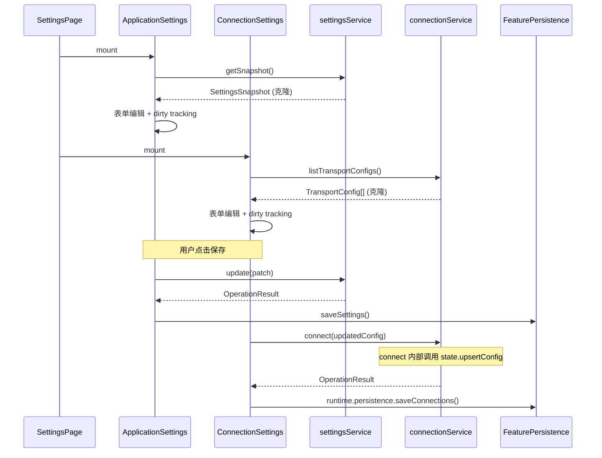

# Settings page design

## 0. 术语约定

| 术语 | 定义 | 防冲突结论 |
| --- | --- | --- |
| SettingsPage | 系统设置页面路由组件，`rewrite/src/pages/SettingsPage.vue` | 与 settings feature core 区分 |
| 分组子组件 | 按 feature 归属拆分的设置区域组件 | 每个子组件消费单一 feature API |
| SerialTransportConfig | connection feature 的串口传输配置类型 | 本次扩展 4 个可选字段，不改现有字段 |

## 1. 决策与约束

### 需求摘要

- **做什么**：实现系统设置页面 UI，同时扩展 SerialTransportConfig 补全串口详细参数。
- **为谁**：用户通过设置页查看和修改应用配置。
- **成功标准**：设置页展示 Application(7项) + Connection(串口默认参数) 两组完整可编辑配置；修改后持久化到文件；build + lint 通过。
- **明确不做**：
  - 不做 Display/Status/Advanced 分组的实际功能（预留占位）
  - 不把 connection/display/status 配置搬进 settings feature（违反 R7）
  - 不补 SCOE 持久化（等 command-ingress 自行解决）
  - 不做高速存储配置（等对话 D）
  - 不做设置导入/导出

### 复杂度档位

走默认档位。页面级 feature，UI + 少量类型扩展，无并发、无 platform I/O（文件对话框走已有 platform facade）。

### 关键决策

1. **设置页按 feature 拆子组件**：ApplicationSettings 消费 settingsService、ConnectionSettings 消费 connectionService。理由：超 20 字段必须拆分（SC1），各子组件隔离响应式追踪范围。
2. **页面直接消费各 feature API**，不经过 settings feature 中转。理由：R7 one owner per state。
3. **SerialTransportConfig 扩展 4 个可选字段**（dataBits/stopBits/parity/flowControl）。理由：A4 确认 connection 缺 7 个串口参数，其中 4 个是通信协议必需参数；bufferSize/timeout/autoOpen 暂不扩展（旧系统也几乎未使用）。
4. **各 feature 各自持久化**：settings 通过 `saveSettings()`，connection 通过 `saveConnections()`。不交叉。
5. **预留分组用禁用 QExpansionItem + tooltip 占位**。理由：SC1 合规。占位在 SettingsPage.vue 内联，不建独立文件。
6. **dirty tracking 由各子组件内部管理**（working copy + computed isDirty）。不抽独立 composable（字段少、逻辑简单），不依赖 shared/。理由：与现有页面模式一致（ConnectionPage 内联管理表单状态）。
7. **持久化由子组件保存 handler 显式调用** `runtime.persistence.saveXxx()`。当前无页面调用过此 API，本 feature 作为首次接入。

### 被拒方案

- 把所有配置都放进 settings snapshot → 违反 R7（one owner per state），且现有 rewrite-settings design 明确拒绝。
- 不拆子组件直接写一个大页面 → 超 300 行违规（SC1）。
- 扩展全部 7 个缺失串口字段 → bufferSize/timeout/autoOpen 旧系统几乎未使用，先扩展 4 个核心字段。

### 前置依赖

- settings feature core 已实现（rewrite-settings design approved + implemented）
- connection feature 已实现，SerialTransportConfig 类型已定义
- FeaturePersistence 已接入 settings 和 connection
- platform facade files.ts 已有 showOpenDialog/showSaveDialog

## 2. 名词与编排

### 2.1 名词层

#### 现状

**Settings feature core**（`rewrite/src/features/settings/`）：
- `SettingsSnapshot`: schemaVersion + recording(3) + storage(3) + general(1) = 7 个配置字段
- `SettingsService`: replace / update(patch) / reset(scope)
- 9 个 selector（selectSettingsSnapshot, selectRecordingSettings 等）

**Connection feature**（`rewrite/src/features/connection/`）：
- `SerialTransportConfig extends BaseTransportConfig`: portPath + baudRate（缺 dataBits/stopBits/parity/flowControl）
- `ConnectionService`: connect / disconnect / discoverResources 等
- 持久化已接入 FeaturePersistence.saveConnections

**设置页**：当前不存在。旧系统 `src/pages/settings/Index.vue` 有参考但不直接移植。

#### 变化

| 变化 | 位置 | 动作 | 动机 |
| --- | --- | --- | --- |
| SerialTransportConfig 加 4 个可选字段 | `features/connection/core/types.ts` | 扩展 | 补全串口通信必需参数 |
| connection 新字段默认值和规范化 | `features/connection/core/validation.ts`（含 normalizeTransportConfig） | 扩展 | connection 无独立 defaults.ts/normalize.ts，规范化和默认值都在 validation.ts |
| connection clone 支持新字段 | `features/connection/core/clone.ts` | 扩展 | 新字段的深拷贝 |
| SettingsPage.vue | `pages/SettingsPage.vue` | 新增 | 页面路由组件 |
| ApplicationSettings.vue | `pages/settings/ApplicationSettings.vue` | 新增 | 7 项 settings feature 配置 |
| ConnectionSettings.vue | `pages/settings/ConnectionSettings.vue` | 新增 | 串口默认参数配置 |
| 路由注册 | `app/router.ts`（或路由配置文件） | 修改 | 添加 /settings 路由 |
| HomePage 入口 | `pages/HomePage.vue` | 修改 | 添加设置页入口 |

**SerialTransportConfig 扩展示例**：

```typescript
// 现状：rewrite/src/features/connection/core/types.ts
interface SerialTransportConfig extends BaseTransportConfig {
  readonly kind: 'serial';
  readonly portPath: string;
  readonly baudRate: number;
}

// 变化后：
interface SerialTransportConfig extends BaseTransportConfig {
  readonly kind: 'serial';
  readonly portPath: string;
  readonly baudRate: number;
  readonly dataBits?: 5 | 6 | 7 | 8;          // 新增
  readonly stopBits?: 1 | 1.5 | 2;            // 新增
  readonly parity?: 'none' | 'even' | 'odd' | 'mark' | 'space';  // 新增
  readonly flowControl?: 'none' | 'hardware' | 'software';       // 新增
}
```

### 2.2 编排层

设置页生命周期是简单的线性读取→编辑→保存流程：



#### 现状

无设置页。各 feature service 已有完整的 CRUD API。

#### 变化

新增页面组件，消费已有 feature API。编排逻辑：
1. 各子组件独立 mount 时读取对应 feature 的只读快照
2. 编辑在子组件内部维护 reactive working copy，通过 computed 判断 isDirty
3. 保存时调用 feature service update（settings）或 connect（connection）+ 显式调用 `runtime.persistence.saveXxx()` 触发持久化
4. connection 无独立 updateConfig 方法，更新串口参数走 `connect(config)`（内部 upsertConfig）

### 2.3 挂载点清单

| 挂载位置 | 具体项 | 删了它 feature 是否消失 |
| --- | --- | --- |
| `pages/SettingsPage.vue` | 页面路由组件 | 是 — 删除后设置页不可达 |
| `pages/settings/*.vue` | ApplicationSettings + ConnectionSettings 子组件 | 是 — 页面内容消失 |
| 路由配置 | `/settings` 路由注册 | 是 — URL 不可达 |
| `features/connection/core/types.ts` | SerialTransportConfig 类型扩展 | 部分 — 新字段消失但 feature 仍在 |
| HomePage | 设置页入口按钮 | 部分 — 入口消失但 URL 仍可达 |

### 2.4 推进策略

1. **扩展 SerialTransportConfig 类型**
   - 修改 types.ts 加 4 个可选字段
   - 修改 validation.ts 中的 normalizeTransportConfig 加新字段默认值
   - 修改 clone.ts 支持新字段
   - 退出信号：TypeScript 编译通过，新字段有默认值（在 normalizeTransportConfig 中：dataBits=8, stopBits=1, parity='none', flowControl='none'）

2. **实现 SettingsPage 骨架 + ApplicationSettings**
   - 创建 SettingsPage.vue（Mode C 布局 + QExpansionItem 分组）
   - 创建 ApplicationSettings.vue（7 项配置的表单）
   - 注册路由 + HomePage 入口
   - 退出信号：页面可访问，7 项配置可编辑、可保存、可重置

3. **实现 ConnectionSettings**
   - 创建 ConnectionSettings.vue（串口默认参数表单）
   - 使用 QSelect 预设值（baudRate/dataBits/stopBits/parity/flowControl）
   - 退出信号：串口参数可编辑、可保存

4. **实现占位分组 + 验证**
   - 在 SettingsPage.vue 内联 3 个禁用 QExpansionItem 占位（不建独立文件）
   - build + lint + 测试通过
   - 退出信号：`pnpm build && pnpm lint` 通过

### 2.5 结构健康度与微重构

#### 评估

- `features/connection/core/types.ts` — 类型定义文件，本次加 4 行。健康。
- `features/settings/core/types.ts` — 不改动。健康。
- `features/settings/services/settings-service.ts` — 不改动。健康。
- SettingsPage.vue（新建） — 预计 <100 行（只做布局和组合）。健康。
- ApplicationSettings.vue（新建） — 预计 ~150 行（7 个表单字段）。健康。
- ConnectionSettings.vue（新建） — 预计 ~120 行（5 个表单字段）。健康。

#### 结论：不做

所有新建文件从零开始，无历史包袱。改动的 connection 类型文件增量极小。微重构无必要。

#### 超出范围的观察

无。

## 3. 验收契约

### 关键场景清单

#### ApplicationSettings 组（7 项配置）

| 场景 | 输入/触发 | 期望可观察结果 |
| --- | --- | --- |
| 页面加载 | 导航到 /settings | 显示 Application 分组展开，7 项配置显示当前值 |
| 修改 toggle | 切换 autoStartRecording | dirty 标记变为 true，保存按钮可用 |
| 修改 number | 输入 csvSaveIntervalMinutes = 10 | dirty 标记变为 true |
| 保存 | 点击保存 | settingsService.update 被调用，saveSettings 被调用，dirty 清除 |
| 重置 | 点击重置 | 弹出确认对话框，确认后 settingsService.reset('all')，值回到默认 |
| 单组重置 | 点击 recording 组重置 | 只重置 recording 组 |
| 校验失败 | 输入 csvSaveIntervalMinutes = -1 | 显示校验错误，保存按钮禁用 |

#### ConnectionSettings 组（串口默认参数）

| 场景 | 输入/触发 | 期望可观察结果 |
| --- | --- | --- |
| 加载默认参数 | 页面加载 | 显示当前 SerialTransportConfig 的串口参数 |
| 修改 baudRate | 选择 115200 | dirty 标记变为 true |
| 修改 parity | 选择 'even' | dirty 标记变为 true |
| 保存 | 点击保存 | connect(updatedConfig) 被调用，runtime.persistence.saveConnections() 被调用 |
| 新字段默认值 | 无配置时 | dataBits=8, stopBits=1, parity='none', flowControl='none' |

#### 占位分组

| 场景 | 输入/触发 | 期望可观察结果 |
| --- | --- | --- |
| Display 分组 | 看到 Display 分组 | 禁用状态，tooltip 显示"即将推出" |
| Status 分组 | 看到 Status 分组 | 同上 |
| Advanced 分组 | 看到 Advanced 分组 | 同上 |

#### 路由和入口

| 场景 | 输入/触发 | 期望可观察结果 |
| --- | --- | --- |
| 路由访问 | 浏览器输入 /settings | 显示设置页 |
| HomePage 入口 | 点击 HomePage 设置按钮 | 跳转到 /settings |

### 明确不做的反向核对项

- SettingsPage 中不应直接 import settings state 或 connection state（只通过 service）
- ApplicationSettings 不应包含 connection/display/status 的配置
- SerialTransportConfig 不应加入 bufferSize/timeout/autoOpen（本次不做）
- 不应出现 `window.electron` / `ipcRenderer` / `fs` 调用（文件对话框走 platform facade）
- 占位组件不应有可交互的表单元素

## 4. 与项目级架构文档的关系

### 名词

- SerialTransportConfig 扩展 — 归 connection feature → `rewrite-feature-boundaries.md` 中 connection 的类型定义
- SettingsPage — 归 pages 层 → `rewrite-target-structure.md` 中 pages/ 的路由页面

### 动词骨架

- 页面 → runtime.features.xxxService → service.update → persistence.save — 与现有页面模式一致

### 需要更新的架构文档

无。本次改动不改变架构边界或 feature 交互矩阵。

## A. Direct contract

1. `.sessions/2026-05-21-missing-pages/S002-settings-page-wave1.md` — Wave 1-3 完整调研和自检结果
2. `codestable/features/rewrite-settings/rewrite-settings-design.md` — settings feature core 设计（已 approved）
3. `codestable/quality/rewrite-quality-rules.md` — R2/R4/R7/R14 质量规则
4. `codestable/quality/rewrite-frontend-conventions.md` — 前端 UI 规范

## B. Boundary guards

- 本 feature 是 Lane B 单 feature，产出 settings page + connection 类型扩展
- 页面新代码落点：`rewrite/src/pages/SettingsPage.vue` + `rewrite/src/pages/settings/`
- 类型扩展落点：`rewrite/src/features/connection/core/`
- 不改 settings feature core（types/defaults/normalize/validation/service/selector）
- 不碰 display/status/command-ingress/storage 的类型或 service
- 不实现设置导入/导出、文件路径浏览（platform facade 已有能力可用但不扩展）
- 不做 HomePage 的大改（只加一个入口按钮）
