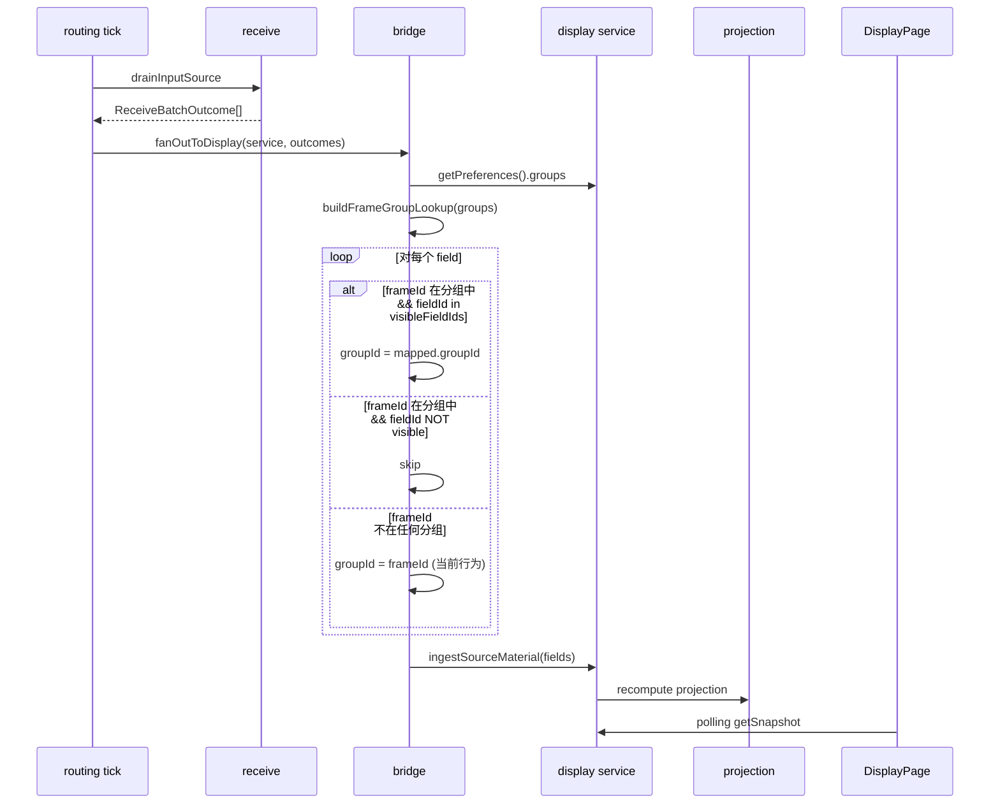

# Display group management design

## 0. 术语约定

| 术语 | 定义 | 防冲突结论 |
|------|------|-----------|
| 分组 (DisplayGroupConfig) | 用户定义的展示分组，含 id、label、frame→visibleFields 映射 | 旧系统 `DataGroup` 含 DataItem 列表，语义更重；新系统分组只管"帧→字段可见性"映射 |
| groupId | DisplayFieldMaterial 上的分组标识 | 当前等于 frameId（bridge 硬编码）；分组映射后变为 group.id |
| 帧条目 (DisplayGroupFrameEntry) | 一个帧在某分组内的配置：frameId + visibleFieldIds | 旧系统 `FrameFieldMapping` 是 M:N；新系统一帧只属于一个分组 |
| GroupOption | UI 下拉用的 { value, label } 对 | 新概念，DisplayPanel props 类型变更 |
| 未分组帧 | 不在任何 DisplayGroupConfig.frames 中的帧 | 保持 groupId=frameId 行为不变 |

## 1. 决策与约束

### 需求摘要

- **做什么**：用户可创建命名分组，将接收帧分配到分组，勾选每帧的可见字段；展示区域按分组过滤
- **为谁**：操作员按业务逻辑（电源参数、热控参数等）组织遥测展示
- **成功标准**：创建/删除/重命名分组、分配/移除接收帧、勾选可见字段后展示区域实时生效
- **明确不做**：
  - 不做 send 帧分组（只选接收帧）
  - 不做单字段级映射（一帧整体属于一个分组）
  - 不做 M:N 帧分组（一帧一分组）
  - 不做 DataItem 级配置（isVisible/isFavorite/expression — 由 frame definition 和 display preferences 已有归口承担）
  - 不做分组间字段共享或跨分组引用
  - 不改变 projection 层逻辑（过滤在 bridge 完成）

### 复杂度档位

走 Lane B 默认档位，无偏离。

### 关键决策

**D1: 分组过滤在 bridge 层，不在 projection 层。**

理由：bridge 输出的 `DisplayFieldMaterial` 已携带正确 groupId，projection 逻辑不变；ScatterSourceBinding 等 groupId 引用无需额外适配；bridge 已持有 DisplayService 引用可直接读 preferences。

替代方案（projection 层过滤）：需要改 projectTableRows 签名、remap 散落在 projection 和 scatter binding 两处，散布更广。

**D2: 归属 display feature，不新建独立 feature。**

理由：groupId 已在 display 类型体系中；分组配置是展示偏好的一部分，与 selectedGroupId、chart config 同层；不需要跨 feature 公共 API。

**D3: 扩展 DisplayPreferences，不新建独立配置存储。**

理由：分组配置和展示偏好天然耦合（selectedGroupId 引用 group.id）；复用已有 updatePreferences 路径；不需要新的 service 方法或 state container。

**D4: UI 用弹窗 rw-dialog-lg，不用独立页面。**

理由：分组数量少（<20），不需要独立路由；已有 ChartConfigDialog / ScatterConfigDialog 同模式可复用。

**D5: 默认不显示字段，显式勾选才显示。**

理由：用户明确选择。热更新成立（只存 frameId + visibleFieldIds，帧定义改字段后自动生效）。

**D6: DisplayPreferences 持久化作为本 feature 一部分实现。**

理由：display 当前无持久化，分组配置必须跨重启保留。只持久化 groups 配置（不含运行时偏好如 selectedGroupId），最小侵入。

### 前置依赖

无。

## 2. 名词与编排

### 2.1 名词层

#### 现状

| 值对象 | 位置 | 当前职责 |
|--------|------|---------|
| `DisplayFieldMaterial` | `display/core/types.ts:57` | 携带 groupId(=frameId)、dataItemId、fieldName、value、displayValue |
| `DisplayPreferences` | `display/core/types.ts:47` | table1/table2/charts/scatter/cadence 偏好，无 groups 字段 |
| `DisplayPreferencesPatch` | `display/core/types.ts:140` | 偏好 patch 类型 |
| `GroupOption`（DisplayPanel props） | `display/components/DisplayPanel.vue:18` | 实际是 `groups: readonly string[]`，label=value=groupId |

bridge 硬编码 `groupId: f.frameId`（`receive-display-bridge.ts:16`）。

#### 变化

| 动作 | 内容 | 动机 |
|------|------|------|
| 新增 | `DisplayGroupConfig { id, label, frames: DisplayGroupFrameEntry[] }` | 分组定义 |
| 新增 | `DisplayGroupFrameEntry { frameId, visibleFieldIds: readonly string[] }` | 帧在分组内的可见字段配置 |
| 新增 | `GroupOption { value: string, label: string }` | UI 下拉选项（分离 groupId 和展示名称） |
| 新增 | `buildFrameGroupLookup(groups): Map<frameId, { groupId, visibleFieldIds }>` | bridge 用的快速查找表 |
| 扩展 | `DisplayPreferences` 加 `groups: readonly DisplayGroupConfig[]` | 分组配置归入偏好 |
| 扩展 | `DisplayPreferencesPatch` 加 `groups?: readonly DisplayGroupConfig[]` | 支持通过 patch 更新分组 |
| 修改 | `applyDisplayPreferencesPatch`（normalize.ts:253-296）加 `groups` 字段传播 | 当前逐字段构造合并结果，新字段不显式传播会被丢弃 |
| 改变 | `DisplayPanel` props `groups: readonly string[]` → `readonly GroupOption[]` | 支持分组 label ≠ groupId |
| 改变 | bridge: 插入 group lookup + filter + remap | 按 visibleFieldIds 过滤并重映射 groupId |
| 改变 | `DisplayPage` groups 计算: 合并 configured + emergent | 配置分组有 label，未配置帧用 frameId |
| 新增 | `GroupConfigDialog.vue` | 分组管理弹窗 |
| 新增 | display preferences 持久化 | 分组配置跨重启保留 |
| 新增 | display/index.ts 导出新类型 | 公共 API 暴露 |

#### 接口示例

**DisplayGroupConfig** — 分组定义：

```typescript
// 来源：display/core/types.ts 新增
{
  id: 'group-power',
  label: '电源参数',
  frames: [
    { frameId: 'frame_01', visibleFieldIds: ['voltage', 'current'] },
    { frameId: 'frame_03', visibleFieldIds: ['battery_level'] },
  ]
}
```

**buildFrameGroupLookup** — 查找表构建：

```typescript
// 来源：display/core/group-resolution.ts 新增
const lookup = buildFrameGroupLookup([
  { id: 'g1', label: '电源', frames: [{ frameId: 'f1', visibleFieldIds: ['v', 'i'] }] }
]);
lookup.get('f1') // → { groupId: 'g1', visibleFieldIds: Set{'v', 'i'} }
lookup.get('unknown') // → undefined
```

**GroupConfigDialog** — 组件接口：

```typescript
// 来源：display/components/GroupConfigDialog.vue 新增
Props: {
  modelValue: boolean;
  groups: readonly DisplayGroupConfig[];
  receiveFrames: readonly FrameAssetSummary[];
  frameReader: FrameAssetReader;
}
Emits: {
  'update:modelValue': [value: boolean];
  'save': [groups: readonly DisplayGroupConfig[]];
}
```

### 2.2 编排层

#### 主流程图



#### 现状

线性 pipeline：`routing tick → receive drain → bridge (groupId=frameId) → ingestSourceMaterial → projection → UI polling`。bridge 是纯函数，无分支。

#### 变化

在 bridge 内插入三步分支逻辑（见主流程图 alt 块）。拓扑仍为线性 pipeline，新增一个分支路由点。projection 和 UI polling 不变。

#### 跨层纪律

- **错误语义**：bridge 过滤是纯计算，无失败路径。group lookup 构建 O(groups * frames) 极小，不报错
- **幂等性**：bridge 每次调用独立构建 lookup，无副作用
- **性能**：getPreferences() 返回深拷贝。高频 tick 下可后续优化为缓存，当前数据量 (<100 groups/frames) 无需优化
- **扩展点**：如果未来需要"默认全显示"行为，visibleFieldIds 语义可扩展为 `['*']` 通配

### 2.3 挂载点清单

| 挂载位置 | 动作 |
|---------|------|
| `DisplayPreferences.groups` 字段 | 新增 — 分组配置的持久化载体 |
| `DisplayPanel` 新增 `openGroupConfig` emit + 设置按钮 | 新增 — UI 触发入口 |
| `runtime/persistence.ts` 新增 `displayPreferences` 读写 | 新增 — 分组配置持久化挂入 |
| `display/index.ts` 导出 `DisplayGroupConfig`、`DisplayGroupFrameEntry`、`GroupOption`、`buildFrameGroupLookup` | 新增 — 公共 API 暴露 |

删除这些挂入点（移除 feature）：删掉 DisplayPreferences.groups 字段、GroupConfigDialog 组件、DisplayPanel 设置按钮、persistence 中 displayPreferences key → feature 完全消失。

### 2.4 推进策略

```
1. 名词层：新增类型 + 默认值 + normalization → 类型编译通过 + 已有测试不受影响
   退出信号：pnpm build 通过
2. 编排骨架：buildFrameGroupLookup 纯函数 + bridge 改造 → 分组过滤单测覆盖
   退出信号：新纯函数测试 + bridge 测试通过（空 groups / 有映射 / 无映射 / 部分可见）
3. 持久化：display preferences 持久化接入 → 重启后分组配置保留
   退出信号：保存+加载 round-trip 测试通过
4. 静态结构：GroupConfigDialog 组件 + DisplayPanel 按钮更新 → 浏览器可见弹窗布局
   退出信号：点击设置按钮弹出空弹窗
5. 交互逻辑：分组 CRUD + 帧分配 + 字段勾选 → 弹窗内完整操作
   退出信号：创建分组 → 添加接收帧 → 勾选字段 → 保存后展示区域按分组过滤
6. 联调收尾：build + lint + 全部测试
   退出信号：pnpm build && pnpm lint && pnpm test 全通过
```

### 2.5 结构健康度与微重构

##### 评估

| 文件 | 行数 | 职责 | 改动密度 |
|------|------|------|---------|
| `display/core/types.ts` | 170 | 纯类型定义 | +15 行（新增接口） |
| `display/core/normalize.ts` | 299 | 偏好校验/规范化 | +35 行（新增 normalizeGroupConfigs + patch-apply 传播 groups） |
| `display/core/defaults.ts` | ~30 | 默认值 | +1 行 |
| `receive-display-bridge.ts` | 31 | receive→display 转换 | 改约 15 行 |
| `display/services/display-service.ts` | 241 | 服务层 | 不改动（复用 updatePreferences） |
| `DisplayPanel.vue` | 157 | 展示面板组件 | +10 行（emit + 按钮） |
| `DisplayPage.vue` | 393 | 展示页面 | +40 行（dialog 接线 + groups 计算） |
| `runtime/persistence.ts` | 148 | 持久化 | +20 行 |

##### 结论：不做

所有要改的文件行数远低于 500 行阈值，职责清晰（types 是类型、normalize 是校验、bridge 是转换、persistence 是持久化），改动密度低（每文件 1-2 处独立改动）。新文件（group-resolution.ts、GroupConfigDialog.vue）自然分离，不会撑胖现有文件。

##### 超出范围的观察

无。

## 3. 验收契约

### 关键场景清单

| 场景 | 输入 / 触发 | 期望可观察结果 |
|------|------------|--------------|
| 创建分组 | 点击"新建分组"，输入名称"电源参数" | 分组列表出现"电源参数"，DisplayPreferences.groups 含新条目 |
| 删除空分组 | 选中无帧的分组，点击删除 | 分组从列表消失，确认无 dialog |
| 删除有帧分组 | 选中含 2 帧的分组，点击删除 | 弹出二次确认，确认后分组和帧映射移除，展示区域不再显示该分组 |
| 重命名分组 | 双击分组名称，改为"热控" | 分组 label 更新，展示下拉显示"热控" |
| 分配帧到分组 | 选中"电源参数"分组，添加接收帧 frame_01 | frame_01 出现在该分组帧列表，visibleFieldIds 为空（默认不显示） |
| 勾选可见字段 | frame_01 下勾选 voltage、current | visibleFieldIds 变为 ['voltage', 'current']，bridge 输出中 frame_01 的 voltage/current 字段 groupId 变为 group.id |
| 未分组帧 | frame_02 不在任何分组中 | bridge 输出 frame_02 所有字段 groupId=frameId（当前行为不变） |
| 字段不在可见列表 | frame_01 在分组中，temperature 未勾选 | bridge 不输出 frame_01 的 temperature 字段 |
| 展示过滤 | DisplayPanel 下拉选择"电源参数" | 只显示该分组下可见字段的数据行 |
| 持久化 | 创建分组并重启应用 | 重启后分组配置恢复，展示区域按分组过滤正常 |
| 只选接收帧 | 分配帧下拉列表 | 只出现 direction='receive' 的帧 |
| 帧定义热更新 | 修改 frame_01 的字段定义（新增字段、改字段名） | 分组配置不需要更新，新字段自动出现在可选列表中 |

### 明确不做的反向核对项

- 代码中不应出现对 send 帧的分组引用（GroupConfigDialog 只消费 `direction='receive'` 的帧）
- DisplayGroupConfig.frames 中不应出现同一 frameId 出现在多个分组中
- bridge 中不应出现对 projection 层的直接调用或对 projection 函数签名的修改
- 不应新建独立的 group service 或 group state container（复用 DisplayService.updatePreferences）
- 不应出现旧系统 DataGroup / DataItem / FrameFieldMapping 类型的引入

## 4. 与项目级架构文档的关系

本 feature 改动局限在 display feature 内部 + runtime/persistence 持久化扩展 + DisplayPage 接线，无系统级可见变化。具体：

- **名词**：`DisplayGroupConfig`、`DisplayGroupFrameEntry` 是 display 内部类型，通过 `display/index.ts` 导出但不影响其他 feature 的类型体系
- **动词骨架**：bridge 改造是 `receive → display` 数据路径的内部变更，不改变跨 feature 交互拓扑
- **跨层纪律**：无新增跨 feature 约束

acceptance 阶段核实后跳过归并。
