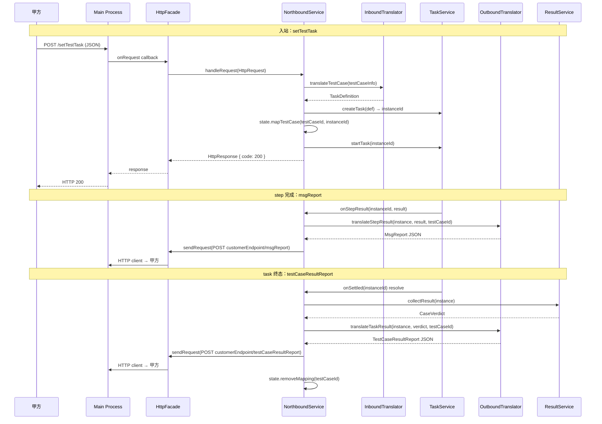

## 0. 术语约定

| 术语 | 定义 | 防冲突 |
|------|------|--------|
| northbound | 本 feature，甲方集成测试系统与我方之间的 HTTPS 闭环 | 与 command-ingress（SCOE TCP 入站）是不同 feature |
| inbound translator | 甲方请求 JSON → 内部类型的翻译器 | 不叫 ProtocolAdapter（那是 command-ingress 的概念） |
| outbound translator | 内部 result → 甲方响应 JSON 的翻译器 | 不叫 projector（那是架构文档的通用术语） |
| HttpFacade | platform 层的 HTTP 传输封装 | 与 TransportFacade（串口/TCP/UDP）同级 |
| customer types | 甲方接口的请求/响应类型定义 | 只存在于 northbound/core/types.ts，其他层用通用 HttpRequest/HttpResponse |

术语 grep 结果：`northbound` 在代码中无实现（仅文档引用）；`inbound` / `outbound` 未在其他 feature 中使用。无冲突。

## 1. 决策与约束

### 需求摘要

**做什么**：建 northbound feature，让甲方集成测试系统能通过 HTTPS 接口下发测试任务并接收结果上报。

**为谁**：甲方集成测试系统（唯一外部调用方）。

**成功标准**：甲方通过 setTestTask 下发 executionPlan → 我方创建并执行 task → 每个步骤完成时 msgReport 上报 → task 终态时 testCaseResultReport 上报 → heartbeat 和 getSubSysState 正确响应。

**明确不做**：
- testDataFileDelivery（甲方文件翻译完成通知）
- 详细 report（checkPoints 对比、statisticsItems）
- FTP 文件上传（getTestCaseAll 的 FTP 部分）
- 用例库管理
- 告警上报
- 升级 / 运维操作
- 多租户 / 多实例 HTTPS server
- 甲方 schema 冻结（先用内部映射，甲方确认后只改映射层）

### 复杂度档位

走 Lane B 默认档位，无偏离。

### 关键决策

**D1：northbound 独立 feature，不合并 command-ingress**
- 甲方 HTTPS 是 JSON server 模式，不走 TransportEventConsumer 链
- 两者入站机制、协议格式、客户端模型完全不同
- 合并会让 command-ingress 承担不相关的职责
- 来源：brainstorm + S001 决策

**D2：HTTPS server/client 封装在 platform facade，主进程不含业务语义**
- main process 只认 `{ method, url, headers, body }` → IPC 透传给 renderer
- platform facade 封装为通用 HttpRequest/HttpResponse
- northbound 是唯一知道甲方接口的地方
- 改动传播路径：甲方改接口 → 只动 northbound/core/types.ts + 两个 translator
- 来源：brainstorm 确认

**D3：类型只定义一次**
- 甲方接口类型全部在 `northbound/core/types.ts`
- 不在 translator、service、测试中重复定义
- platform / main / IPC 只看到 HttpRequest / HttpResponse

**D4：step 完成事件通过 task service 回调**
- 在 `CreateTaskServiceOptions` 加 `onStepResult` 可选回调
- task 迭代循环在 addStepResult 后、try/catch 内调用——回调异常只记日志不传播，不影响 task 执行
- northbound 注册回调后通过 `taskService.getInstance(instanceId)` 获取完整 TaskInstanceState（TaskService 继承 TaskReader，getInstance 已是公开 API），再调用 outbound translator
- 备选被拒：轮询 stepResults（延迟高、浪费） / 拦截 state.addStepResult（污染状态容器）

**D5：executionPlan 按 immediate=true / isEnd=true 处理**
- 收到 setTestTask 后立即按层序号顺序处理所有 testCase
- parallel=true 层：同时 createTask + startTask
- parallel=false 层：顺序执行，等前一个 onSettled 再启动下一个
- 来源：S001 甲方确认

**executionPlan 处理算法**：
```
for layer in executionPlan.layers (按 layerNo 排序):
  if layer.parallel:
    tasks = layer.testCaseInfoList.map(tc => {
      def = translateTestCaseToTaskDefinition(tc)
      inst = taskService.createTask(def)
      state.mapTestCase(tc.testCaseId, inst.instanceId)
      taskService.startTask(inst.instanceId)
      return { testCaseId: tc.testCaseId, instanceId: inst.instanceId }
    })
    // 并行等全部终态
    await Promise.all(tasks.map(t => taskService.onSettled(t.instanceId)))
  else:
    for tc in layer.testCaseInfoList:
      def = translateTestCaseToTaskDefinition(tc)
      inst = taskService.createTask(def)
      state.mapTestCase(tc.testCaseId, inst.instanceId)
      taskService.startTask(inst.instanceId)
      await taskService.onSettled(inst.instanceId) // 顺序等
```

**中途失败处理**：单个 task 创建/启动失败时，已创建的 task 继续运行不回滚（MVP 阶段），错误记录在响应中返回给甲方。不清理已创建 task——它们仍会正常执行并上报结果。

**D6：taskId ↔ instanceId 映射在 northbound state 内部维护**
- Map<testCaseId, instanceId>
- 不放 runtime / 不放 task service
- northbound 自己的生命周期管理

### 前置依赖

无。task service 的 onSettled 和 result service 已实现。step event hook 是本 feature 的改动（加可选回调到 task service options），不依赖其他未完成工作。

## 2. 名词与编排

### 2.1 名词层

#### 甲方接口类型（新增：northbound/core/types.ts）

**现状**：无。全新文件。

**变化**：定义甲方 MVP 6 接口的请求/响应类型。

```typescript
// --- 入站请求 ---
type CustomerRequest =
  | { readonly kind: 'setTestTask'; readonly body: SetTestTaskRequest }
  | { readonly kind: 'controlTestTask'; readonly body: ControlTestTaskRequest }
  | { readonly kind: 'heartbeat'; readonly body: HeartbeatRequest }
  | { readonly kind: 'getSubSysState'; readonly body: GetSubSysStateRequest };

// setTestTask 请求（来源：甲方文档 04-任务管理.md）
interface SetTestTaskRequest {
  readonly executionPlan: {
    readonly layers: readonly {
      readonly layerNo: number;
      readonly parallel: boolean;
      readonly testCaseInfoList: readonly TestCaseInfo[];
    }[];
  };
  // 其他字段按甲方文档补充，MVP 阶段按需
}

interface TestCaseInfo {
  readonly testCaseId: string;
  readonly testCaseName: string;
  readonly testCaseParams?: Readonly<Record<string, unknown>>;
  readonly steps: readonly TestCaseStep[];
  readonly timeout?: number;
}

type TestCaseStep =
  | { readonly kind: 'send'; readonly frameId: string; readonly targetId: string; readonly fieldValues?: Readonly<Record<string, unknown>> }
  | { readonly kind: 'wait-condition'; readonly conditions: readonly WaitConditionDef[]; readonly timeoutMs?: number };

interface ControlTestTaskRequest {
  readonly testCaseIdList: readonly string[];
  readonly controlType: 'abort' | 'pause' | 'continue' | 'stop';
}
// controlType 映射：
// abort   → taskService.stopTask(instanceId)
// pause   → taskService.pauseTask(instanceId)
// continue → taskService.resumeTask(instanceId)
// stop    → taskService.stopTask(instanceId)

interface HeartbeatRequest { /* MVP: 最简结构，只返回 { code: 200 } */ }
interface GetSubSysStateRequest { /* MVP: 最简结构 */ }
// getSubSysState 数据来源：
// connectionStatus → connectionSnapshot()（来自 connection feature 的 public selector）
// runningTestCases → state.getSnapshot().activeTestCases

// --- 出站响应 ---
interface TestCaseResultReport {
  readonly testCaseId: string;
  readonly result: 'success' | 'fail' | 'tbd';
  readonly startTime: string;
  readonly endTime: string;
  readonly stepInfoList?: readonly StepInfo[];
}

interface MsgReport {
  readonly testCaseId: string;
  readonly stepInfo: StepInfo;
}

interface StepInfo {
  readonly stepNo: number;
  readonly stepName?: string;
  readonly stepResult: 'success' | 'fail' | 'running';
  readonly stepStartTime: string;
  readonly stepEndTime?: string;
}

// --- 通用响应 ---
interface CustomerResponse {
  readonly code: number;
  readonly msg: string;
  readonly data?: unknown;
}
```

**来源**：甲方文档 `04-任务管理.md`、`05-结果上报.md`、`09-实时上报.md`，映射表见 S001 §核心映射。

#### Inbound Translator（新增：northbound/core/inbound-translator.ts）

**现状**：无。全新文件。

**变化**：纯函数，将 TestCaseInfo 翻译为 TaskDefinition。参考 command-ingress 的 ScoeCommandFrameMapping → TaskDefinition 模式。

```typescript
// 来源：参考 command-ingress/services/command-ingress-service.ts 的翻译逻辑
function translateTestCaseToTaskDefinition(
  testCase: TestCaseInfo,
  options: { readonly now: () => string },
): TaskDefinition;
// TestCaseInfo.steps → TaskStepDefinition[]
// send step → SendStepConfig { frameId, targetId, fieldValues }
// wait-condition step → WaitConditionConfig { conditions, timeoutMs }
// schedule = { kind: 'immediate' }（immediate=true 已确认）
```

#### Outbound Translator（新增：northbound/core/outbound-translator.ts）

**现状**：无。全新文件。

**变化**：纯函数，将内部 result/step 翻译为甲方 JSON。

```typescript
function translateTaskResult(
  instance: TaskInstanceState,
  verdict: CaseVerdict,
  testCaseId: string,
): TestCaseResultReport;
// verdict 映射：passed→success, failed→fail, stopped→tbd

function translateStepResult(
  instance: TaskInstanceState,
  stepResult: TaskStepResult,
  testCaseId: string,
): MsgReport;
// 从 instance.definitionRef.steps[stepResult.stepIndex] 取 stepName
// 从 stepResult.kind 推断 stepResult 状态
```

#### Northbound Service（新增：northbound/services/northbound-service.ts）

**现状**：无。全新文件。

**变化**：主编排器，持有 inbound/outbound translator、http facade 引用、task/result service 引用。

```typescript
interface NorthboundServiceOptions {
  readonly taskService: TaskService;
  readonly resultService: ResultService;
  readonly httpFacade: HttpFacade;
  readonly connectionSnapshot: () => ConnectionStateSnapshot; // 来自 connection feature selector
}

interface NorthboundService {
  start(config: NorthboundConfig): Promise<void>;
  stop(): Promise<void>;
  isActive(): boolean;
  getSessionStatus(): NorthboundSessionSnapshot;
}

interface NorthboundConfig {
  readonly serverHost: string;
  readonly serverPort: number;
  readonly customerEndpoint: string; // 出站 POST 目标地址
}
```

#### Northbound State（新增：northbound/state/northbound-state.ts）

**现状**：无。全新文件。

**变化**：内存状态容器，维护 testCaseId ↔ instanceId 映射和会话状态。

```typescript
interface NorthboundStateContainer {
  // testCaseId → instanceId 双向映射
  mapTestCase(testCaseId: string, instanceId: string): void;
  getInstanceId(testCaseId: string): string | undefined;
  getTestCaseId(instanceId: string): string | undefined;
  removeMapping(testCaseId: string): void;
  // 会话快照
  getSnapshot(): NorthboundSessionSnapshot;
  clear(): void;
}

interface NorthboundSessionSnapshot {
  readonly activeTestCases: ReadonlyMap<string, { readonly instanceId: string; readonly status: string }>;
  readonly serverRunning: boolean;
}
```

#### HttpFacade（新增：platform/http.ts）

**现状**：platform 仅有 TransportFacade（串口/TCP/UDP）和 FileFacade。

**变化**：新增同级 facade，封装 HTTP server/client。

```typescript
// 来源：参考 platform/transport.ts 的 Facade 模式
interface HttpFacade {
  startServer(config: HttpServerConfig): Promise<string>; // → serverId
  stopServer(serverId: string): Promise<void>;
  onRequest(serverId: string, handler: (req: HttpRequest) => Promise<HttpResponse>): () => void; // → unsubscribe
  sendRequest(config: HttpClientConfig): Promise<HttpResponse>;
}

interface HttpServerConfig {
  readonly host: string;
  readonly port: number;
  readonly tls?: { readonly cert: string; readonly key: string };
}

interface HttpClientConfig {
  readonly url: string;
  readonly method: string;
  readonly headers?: Readonly<Record<string, string>>;
  readonly body?: string;
  readonly tls?: { readonly cert: string; readonly key: string; readonly ca?: string };
}

interface HttpRequest {
  readonly method: string;
  readonly url: string;
  readonly headers: Readonly<Record<string, string>>;
  readonly body: string;
  readonly remoteAddress?: string;
}

interface HttpResponse {
  readonly statusCode: number;
  readonly headers?: Readonly<Record<string, string>>;
  readonly body: string;
}
```

#### Task Service 扩展（修改：task/services/task-service.ts）

**现状**：`CreateTaskServiceOptions` 有 sendService、receiveEventSource、timerService 等依赖注入。无 step 完成回调。

**变化**：加可选回调 `onStepResult`。

```typescript
// 来源：task/services/task-service.ts:57 CreateTaskServiceOptions
interface CreateTaskServiceOptions {
  // ... 现有字段不变
  readonly onStepResult?: (instanceId: string, result: TaskStepResult) => void;
}
```

在 `task-iteration-loops.ts` 的 3 处 `addStepResult` 调用后，调用 `ctx.onStepResult?.(instanceId, result)`。

### 2.2 编排层

#### 主流程



#### 现状 → 变化

**现状**：
- runtime/routing-tick.ts 硬编码 connection → receive 流程（line 41-54）
- feature-wiring.ts 按依赖层次装配所有 feature（L0→L4，line 75-155）
- command-ingress 通过 TransportEventConsumer 接入 routingTick
- task service 无 step 完成回调
- result service 是被动 API（collectResult 需要外部主动调用）
- platform 只有 TransportFacade + FileFacade

**变化**：

| 编排点 | 变化 |
|--------|------|
| HTTP 入站路径 | 新增：northbound 不走 routingTick，通过 HttpFacade.onRequest 独立入站。与 command-ingress 的 consumer chain 并行存在 |
| feature-wiring | 新增：RewriteWiredFeatures 加 `northboundService`，在 L4 层创建（依赖 task + result + httpFacade） |
| task service 创建 | 修改：wireFeatures 中 createTaskService options 加 `onStepResult` 回调，指向 northbound 的 step handler |
| onSettled 监听 | 新增：northbound 在 startTask 后对每个 instanceId 调用 onSettled，resolve 时触发结果收集+上报 |
| platform facade 注册 | 新增：platform/index.ts 加 `getHttpFacade()`，与 getTransportFacade 同模式 |
| main process | 新增：http-handlers.ts 注册 HTTPS server IPC handlers |
| preload | 新增：暴露 HttpBridge |

#### 跨层纪律

**错误语义**：
- 入站请求解析失败 → 返回 CustomerResponse `{ code: 400, msg: "..." }`
- task 创建/启动失败 → 返回 `{ code: 500, msg: "..." }`，已创建的 task 不回滚，继续执行并上报结果
- 出站 POST 失败 → 记录日志，不重试（MVP 阶段）
- 不暴露内部错误详情给甲方
- **回调异常隔离**：task 迭代循环中 onStepResult 回调用 try/catch 包裹，异常只记日志不传播，task 执行不受影响

**幂等性**：
- setTestTask：同 testCaseId 重复下发，幂等忽略（已映射则不重复创建）
- controlTestTask：stop 已停止的 task → 返回成功（task service 已处理）
- heartbeat / getSubSysState：天然幂等（只读）

**并发**：
- 多个 onStepResult 回调可能并发触发（task 多实例并行）
- outbound translator 是纯函数，无状态竞争
- HttpFacade.sendRequest 需要支持并发调用
- state 容器的 mapTestCase/removeMapping 需要考虑并发安全（MVP 用单线程假设，后续按需加锁）

**扩展点**：
- InboundTranslator 可扩展新请求类型（新增 CustomerRequest union 分支）
- OutboundTranslator 可扩展新上报类型
- HttpFacade 可替换底层库（Fastify/Express/原生 Node），上层无感知。MVP 用 Node 原生 `http`/`https` 模块——零额外依赖，后续按需换框架

### 2.3 挂载点清单

| 挂载位置 | 动作 |
|---------|------|
| `platform/index.ts` | 新增 `getHttpFacade()` 懒加载函数 |
| `src-electron/main/index.ts` | 新增 HTTP IPC handlers 注册 |
| `src-electron/preload/index.ts` | 新增 HttpBridge contextBridge 暴露 |
| `runtime/feature-wiring.ts` | 修改 `RewriteWiredFeatures` 接口和 `wireFeatures` 函数，注册 northbound |

4 条。删掉这 4 处注册 + northbound 目录，feature 在系统视角消失。

### 2.4 推进策略

```
1. Platform HTTP facade：main process HTTP handler + preload bridge + platform/http.ts
   退出信号：HttpFacade 单测通过（mock IPC），startServer/onRequest/sendRequest 跑通

2. Task service step 回调：CreateTaskServiceOptions 加 onStepResult，iteration loops 调用
   退出信号：现有 1178 tests 全通过 + 新增 step callback 触发验证

3. Northbound 名词层 + 编排骨架：types + translator 纯函数 + state 容器 + service 空壳
   退出信号：translator 单测覆盖正常+边界，service 可创建和销毁

4. 入站接线：service.handleRequest 接通 inbound translator → task service → 状态映射
   退出信号：setTestTask JSON → TaskDefinition 创建 → task 启动，单测覆盖

5. 出站接线：onSettled → result 收集 → outbound translator → HttpFacade.sendRequest
   退出信号：task 终态 → testCaseResultReport POST 被调用

6. step 事件接线：onStepResult 回调 → outbound translator → msgReport POST
   退出信号：step 完成 → msgReport POST 被调用

7. heartbeat + getSubSysState：简单 handler，读 connection/系统状态
   退出信号：请求 → 正确响应 JSON

8. 测试覆盖 + 集成验证：补齐边界和错误路径
   退出信号：pnpm build + pnpm lint + 全部测试通过
```

### 2.5 结构健康度与微重构

##### 评估

- `runtime/feature-wiring.ts`（~155 行）— 加 northboundService 注册，改动 2-3 处（RewriteWiredFeatures 接口加字段 + wireFeatures 加创建逻辑）。文件职责清晰（装配），当前行数健康。
- `task/services/task-service.ts`（~320 行）— 改动 1 处：CreateTaskServiceOptions 加可选字段。文件职责清晰，改动量小。
- `task/services/task-iteration-loops.ts`（~350 行）— 改动 3 处：addStepResult 后加回调调用。文件职责清晰，改动独立。
- `platform/index.ts`（~72 行）— 加一个 getHttpFacade 函数，与 getTransportFacade 同模式。行数健康。
- `src-electron/main/index.ts` — 加 HTTP handler 注册行。改动量小。
- `src-electron/preload/index.ts` — 加 HttpBridge 暴露。改动量小。

##### 结论：不做

所有被改动文件行数健康（<500）、职责清晰、改动密度低（每个文件 1-3 处且逻辑一致）。本次不做微重构。

##### 超出范围的观察

- `runtime/routing-tick.ts` 当前仍硬编码 connection → receive 流程，command-ingress brainstorm 中的 consumer chain 改造未落地。这不阻塞 northbound（northbound 走独立入站路径），但后续应统一处理 routingTick 的扩展性问题。

## 3. 验收契约

### 关键场景清单

**入站 — setTestTask**

| # | 触发 | 期望可观察结果 |
|---|------|---------------|
| S1 | 甲方 POST setTestTask（1 层 1 个 testCase，parallel=true） | 创建 1 个 task 实例并启动，返回 `{ code: 200 }` |
| S2 | 甲方 POST setTestTask（2 层：层 1 有 2 testCase parallel，层 2 有 1 testCase） | 层 1 同时创建启动 2 个 task，等层 1 全部 onSettled 后层 2 创建启动 1 个 task |
| S3 | 甲方 POST setTestTask（testCaseId 已存在） | 幂等忽略，返回 `{ code: 200 }`，不重复创建 task |
| S4 | 甲方 POST setTestTask（body 格式错误） | 返回 `{ code: 400, msg: "..." }`，不创建 task |

**入站 — controlTestTask**

| # | 触发 | 期望可观察结果 |
|---|------|---------------|
| S5 | 甲方 POST controlTestTask（controlType=stop） | 对应 task 被 stopTask，返回 `{ code: 200 }` |
| S6 | 甲方 POST controlTestTask（testCaseId 不存在） | 返回 `{ code: 404, msg: "..." }` |

**入站 — heartbeat / getSubSysState**

| # | 触发 | 期望可观察结果 |
|---|------|---------------|
| S7 | 甲方 POST heartbeat | 返回 `{ code: 200 }` |
| S8 | 甲方 POST getSubSysState | 返回 `{ code: 200, data: { connectionStatus, runningTestCases } }` |

**出站 — msgReport**

| # | 触发 | 期望可观察结果 |
|---|------|---------------|
| S9 | task step 完成（send step 发送成功） | msgReport POST 被调用，stepResult='success'，stepName 从 definition 取 |
| S10 | task step 完成（wait-condition 超时） | msgReport POST 被调用，stepResult='fail' |

**出站 — testCaseResultReport**

| # | 触发 | 期望可观察结果 |
|---|------|---------------|
| S11 | task completed 且全部 step pass | testCaseResultReport POST 被调用，result='success' |
| S12 | task completed 且有 step fail | testCaseResultReport POST 被调用，result='fail' |
| S13 | task stopped | testCaseResultReport POST 被调用，result='tbd' |

**出站 — 错误路径**

| # | 触发 | 期望可观察结果 |
|---|------|---------------|
| S14 | HttpFacade.sendRequest 出站 POST 失败 | 日志记录错误，不重试，不崩溃 |
| S15 | HttpFacade server 启动失败（端口占用） | start() 返回失败，isActive()=false |
| S16 | executionPlan 处理中途某个 task 创建失败 | 已创建的 task 继续运行，响应返回错误码，已创建的 task 仍上报结果 |
| S17 | onStepResult 回调内部抛异常 | 异常被 try/catch 吞掉并记录日志，task 执行继续，不影响后续 step |
| S18 | 甲方重发 setTestTask（新 testCaseId，旧 task 仍在运行） | 新 task 正常创建，旧 task 不受影响（映射独立，新旧共存） |

### 明确不做的反向核对项

- 代码中不应出现对 FTP 相关 API 的调用
- 输出 JSON 不应包含 checkPoints / statisticsItems 字段
- main process 中不应 import 或引用任何 northbound/core/types.ts 的甲方类型
- platform/http.ts 中不应出现 setTestTask / testCaseResultReport 等甲方业务名称
- northbound 不应注册 TransportEventConsumer（不走 consumer chain）

## 4. 与项目级架构文档的关系

**需要更新的架构文档**：

| 文档 | 更新内容 |
|------|---------|
| `rewrite-target-structure.md` | feature 列表增加 `northbound/`，更新职责描述 |
| `rewrite-feature-boundaries.md` | 增加 northbound owner 职责、输入输出方向 |
| `rewrite-feature-interaction-matrix.md` | 增加 northbound 行和列（与 task/result/platform 的交互） |
| `rewrite-system-architecture.md` | 增加 northbound 模块和 HTTPS 传输路径 |

**提炼回 architecture 的内容**：
- HttpFacade 作为平台能力的定位（与 TransportFacade/FileFacade 同级）
- task service 的 onStepResult 扩展点（跨 feature 可复用的事件回调模式）
- northbound 入站路径独立于 routingTick consumer chain 的架构决策
