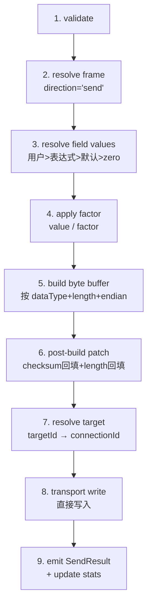

# Send-real design

本设计是 send feature 的"真实实现"设计。初始骨架（`rewrite-send-design.md`，2026-05-06）定义了 owner 边界、核心类型、service 合约和跨 feature 契约；本轮补齐构帧管线的核心能力：表达式求值、factor 逆换算、checksum/length 回填和 transport-level 队列。

Brainstorm 详情见 `send-real-brainstorm.md`。本设计只写结论和变化，不重复分析过程。

**旧设计 open questions 闭环**：旧 design（`rewrite-send-design.md`）§5.2 "expression runtime role in send" 已由本设计 D4 解决（send 内部执行 compileConditional + evaluateConditional）；§5.3 "checksum 策略列表" 已由本设计 step 6 + crc32 补充解决。

## 0. 术语

| 术语 | 含义 |
|---|---|
| 构帧 | 从 frame 定义 + 字段值 → 完整字节 buffer 的过程 |
| 值解析 | 按优先级确定每个字段最终值的过程（用户输入 > 表达式 > 默认 > zero fill） |
| factor 逆换算 | 发送方向：`rawValue = physicalValue / factor`。当前发送帧 factor 全为 1，实际无转换 |
| checksum 回填 | 先 build 完整 buffer，再按范围计算 checksum，回填到 checksum 字段位置 |
| VariableProvider | send 注入的 adapter，提供表达式求值所需的外部变量（遥测值、全局参数等） |
| transport-level queue | 按 targetId 分组的 FIFO 队列，保证同一 target 顺序写入 |

## 1. 决策与约束

### 1.1 本轮做什么

send-real 补齐构帧管线从"骨架"到"可完整构帧发送"的全部能力：

1. 完整消费 frame-real 字段（factor、expressionConfig、defaultValue、configurable、validOption、autoChecksum、includeLengthField）
2. 字段值解析（用户输入 / 表达式求值 / 默认值 / zero fill 四级优先级）
3. 表达式求值集成（通过 `shared/expression` 的 compileConditional + evaluateConditional）
4. Factor 逆换算（`raw = physical / factor`）
5. Post-build patch：checksum 回填 + length 回填（统一缓冲区修改步骤）
6. Direction 过滤（resolveFrame 时检查 direction='send'）
7. VariableProvider adapter port（注入外部变量源）
8. CRC32 算法补充

### 1.2 不做什么

| 排除项 | 理由 |
|---|---|
| SCOE 成功条件 | 归 task→SCOE，send 只返回 SendResult |
| northbound 回执 | 归 northbound feature |
| 报告交付 | 归 report feature |
| 定时/触发/序列调度 | 归 task runtime |
| UI 页面/表单 | 归 pages/widgets |
| 真实连接管理 | 归 connection feature |
| custom checksum | 无实际帧数据需要，frame-real 类型已预留 |
| 重试/超时策略 | transport write 失败返回错误，重试由 task 层决定 |
| 表达式编译缓存 | 每次 execute 求值即可，可后续优化 |
| FIFO 队列 | 当前唯一调用方 task runtime 串行执行 step 并 await Promise\<SendResult\>，无并发写入场景。队列在并发调用方出现时作为独立补充 |

### 1.3 前置与依赖

**send-real impl 前置**（frame-real 需补齐）：

| 项目 | 说明 | 阻塞范围 |
|---|---|---|
| `FrameOptionsDefinition.lengthFieldId` | frame-real types 需新增 `lengthFieldId?: string`，用于 auto length 回填时定位 length 字段 | 仅阻塞 step 7（auto length field）。P1-P7 其余步骤不受影响。若 frame-real 未按时补齐，step 7 拆为独立 follow-up task |

**依赖后续 feature 的项目**：

| 项目 | 依赖谁 | send 侧准备 | 阻塞什么 |
|---|---|---|---|
| TCP/UDP 真实发送 | connection-complete（RealNetworkAdapter） | adapter port 已定义 | 真实网络发送 |
| Task send-step 集成 | task feature | Promise\<SendResult\> 已决策 | 任务编排中的发送步骤 |
| SCOE 命令发送 | task + SCOE | SCOE → task → send 已决策 | SCOE 协议帧发送 |
| VariableProvider 真实实现 | receive selector + 全局参数 | adapter port 将定义 | 表达式中引用遥测值 |

以上不阻塞 design/impl——用 fake adapter 可完成全部静态验证。

### 1.4 复杂度档位

走默认档位。无高并发、无对外 SDK、无一次性工具等偏离信号。

## 2. 现状 → 变化

### 2.1 名词层

#### FrameFieldDefinition 消费扩展

**现状**：`frameToBuildInput()`（send-service.ts:85-105）只消费 dataType、length、bigEndian、isASCII、offset 五个字段。

**变化**：扩展为消费 frame-real 全部构帧相关字段。新增字段来自 `ReadonlyFrameAsset` 的 `fields[]`：

| 新消费字段 | 来源类型 | 用途 |
|---|---|---|
| `factor` | `number?` | 逆换算 `value / factor`，非 bytes 类型才应用 |
| `expressionConfig` | `ExpressionDefinition?` | 表达式驱动字段值 |
| `defaultValue` | `string?` | 用户未填值时的 fallback |
| `configurable` | `boolean?` | 检查用户值合法性（可选，默认 false） |
| `inputType` | `FrameInputType` | 输入类型（input/select/radio/expression） |
| `validOption` | `FrameChecksumDefinition?` | checksum 范围（startFieldIndex/endFieldIndex + checksumMethod） |

Frame 级 options 新消费：

| 新消费字段 | 来源类型 | 用途 |
|---|---|---|
| `autoChecksum` | `boolean` | 是否自动计算 checksum |
| `includeLengthField` | `boolean` | 是否包含自动长度字段 |
| `lengthFieldId` | `string?` | length 字段的字段 ID 引用（frame-real 需新增） |

注：`checksumMethod` 只存在于字段级 `validOption.checksumMethod`，无帧级默认。每个 checksum 字段必须在自己的 `validOption` 中声明算法。

#### SendFieldEncodingDef 扩展

**现状**（core/types.ts）：

```typescript
interface SendFieldEncodingDef {
  id: string; dataType: string; length: number;
  bigEndian: boolean; isASCII: boolean; offset: number;
}
```

**变化**：扩展为包含构帧全部所需信息：

```typescript
interface SendFieldEncodingDef {
  id: string; dataType: string; length: number;
  bigEndian: boolean; isASCII: boolean; offset: number;
  // 新增
  factor: number;                    // 默认 1
  defaultValue?: string;
  configurable?: boolean;              // 可选，默认 false
  expressionConfig?: ExpressionDefinition;
  validOption?: { isChecksum: boolean; startFieldIndex: number; endFieldIndex: number; checksumMethod?: ChecksumMethod };
}
```

#### SendRequest 扩展

**现状**：`fieldValues: Record<string, SendFieldValue>` 假设值已解析。

**变化**：拆分为用户输入 + 变量上下文：

```typescript
interface SendRequest {
  frameId: string;
  targetId: string;
  userFieldValues?: Record<string, SendFieldValue>;  // 用户填的 configurable 字段（number/字符串/boolean）
  context: SendContext;                                // 必选
}

// SendFieldValue 保持 string | number | boolean，
// 支持 bytes 字段的 hex 字符串（如 "FF 01"）和 ASCII 字段的文本输入。
```

**迁移说明**（相对于旧 `SendRequest`）：
- `fieldValues` → `userFieldValues`：语义更明确，只放用户输入的值
- `options` 移除：`checksumKind` 由帧定义 `validOption.checksumMethod` 决定，不在请求层覆盖；`autoChecksum` 由 `frame.options.autoChecksum` 决定
- `variables` 不进 SendRequest：外部变量通过 `resolveFieldValues(fields, userFieldValues, variableProvider, variables?)` 参数级传递。SendService 内部通过注入的 `variableProvider` 获取变量，调用方无需在请求中传递
- `context` 必选：记录来源信息（source + taskId + stepIndex）

#### 新增 VariableProvider adapter port

**现状**：无外部变量获取机制。

**变化**：新增 adapter port，由外部注入变量源：

```typescript
interface SendVariableProvider {
  getVariables(): VariableMap;
}
```

每次 `execute()` 调用时通过 adapter 获取最新变量值。adapter 实现由 runtime/page/task 在创建 send service 时注入。send/core 零耦合。

#### Checksum 扩展

**现状**（core/checksum.ts）：`checksumSum8`、`checksumXor8`、`checksumCrc16Modbus`、`calculateChecksum(bytes, kind)` 四个函数。输入是完整字节数组，无范围指定。

**变化**：

1. 新增 `checksumCrc32(bytes)` 纯函数
2. 扩展 `calculateChecksum` 支持 `options?: { startIdx: number; endIdx: number }` 范围参数（按 buffer 索引截取子数组后计算）
3. 新增 checksum 回填步骤：build buffer 后，找到 isChecksum 字段，按 validOption 范围计算，将结果回填到该字段在 buffer 中对应的字节位置

### 2.2 编排层

#### 构帧管线（6 步 → 10 步）

**现状**：

```
validate → resolve frame → build frame → resolve target → transport write → emit result
```

**变化**：



任何步骤失败都提前返回对应 kind 的 SendResult。

#### 步骤 3：resolve field values（新增核心步骤）

对每个字段按优先级确定最终值。configurable 标记控制用户值层级是否生效：

```
对 frame.fields 中每个 field：
  if field.configurable && request.userFieldValues[field.id] exists → 使用用户值
  else if field.expressionConfig exists → 纳入表达式批量求值
  else if field.defaultValue exists → 解析默认值
  else → zero fill + 记录 warning
```

非 configurable 字段的用户输入被静默忽略，不产生 warning/error。configurable 是 UI 层概念（控制是否展示输入框），不是 send 服务层的校验规则。

表达式字段逐字段处理（使用 `compileConditional` + `evaluateConditional`）：

`ExpressionDefinition` 的结构是 `{ expressions: ConditionalExpressionDefinition[]; variables: ExpressionVariableDefinition[] }`，含多条件分支。实际帧数据有多分支条件（如 `速度>0` / `速度<=0`，`速率==0` 到 `速率==4`），不能在编译时静态选择分支——条件匹配依赖运行时变量值。

直接使用 `shared/expression` 的 `compileConditional` + `evaluateConditional`，无需手动展平分支：

1. 合并变量源：`request.variables` ∪ `variableProvider.getVariables()` ∪ 解析后的 `expressionConfig.variables[]`（按 sourceType 解析）
2. 按字段顺序逐个处理有 `expressionConfig` 的字段（含跨字段依赖时按依赖拓扑排序）
3. 对每个字段：`compileConditional(field.expressionConfig.expressions)` → `evaluateConditional(compiled, mergedVariables + 已解析字段值)` → 取 `result.value`
4. 求值成功：字段值加入 fieldValues，同时加入变量池供后续字段引用
5. 求值失败：zero fill + 记录 error 到 buildIssues

#### 步骤 4：apply factor（新增）

对非 bytes 类型且 factor ≠ 1 的字段：`rawValue = resolvedValue / factor`。

当前实际帧数据中发送帧 factor 全为 1，此步骤是 no-op，但代码必须实现以支持未来 factor ≠ 1 的发送帧。

#### 步骤 6：post-build patch（合并 checksum + length 回填）

build buffer 之后的统一缓冲区修改步骤。Checksum 和 length 都是"build 后、transport 前的缓冲区回写"，模式相同，合并为一个步骤。

**Checksum 回填**（触发条件：`frame.options.autoChecksum === true`）：
1. 遍历 fields，找到 `validOption.isChecksum === true` 的字段
2. 按该字段的 `validOption.startFieldIndex` 和 `validOption.endFieldIndex` 确定 buffer 范围
3. 按 `validOption.checksumMethod`（字段级唯一来源）选择算法
4. 对 buffer 对应范围计算 checksum
5. 将 checksum 结果编码写入该字段在 buffer 中的位置
6. checksum 值超出字段字节宽度时返回 build-error

**Length 回填**（触发条件：`frame.options.includeLengthField === true`）：
1. 通过 `frame.options.lengthFieldId` 找到 length 字段
2. 将 buffer 总长度值按该字段的 dataType + length + endianness 编码写入其 buffer 位置
3. 若 `lengthFieldId` 未配置或指向不存在的字段，跳过 + buildIssues 记录 warning

**前置**：frame-real `FrameOptionsDefinition` 需新增 `lengthFieldId?: string`（仅阻塞 length 回填部分，checksum 回填不受影响）。

#### 步骤 8：transport write

**现状**：直接调用 `transportWriter.writeBytes(connectionId, bytes)`。

**变化**：保持直接写入。FIFO 队列移出本期——当前唯一调用方 task runtime 是串行执行 step 并 await Promise\<SendResult\>，无并发写入场景。队列作为后续独立补充，在并发调用方出现时再加。

**变化**：在 write 前加入轻量 FIFO 队列：

- 内部 `Map<targetId, PendingWrite[]>`
- 同一 target 串行写入，不同 target 可并行
- 当前写入完成后自动处理队列中的下一个
- 队列深度和溢出策略等 runtime 证据（checklist c16 deferred）

#### 步骤 2：resolve frame 扩展

新增 direction 检查：获取 frame 后验证 `frame.direction === 'send'`，不匹配则返回 build-error。

#### UI 面向字段预览 API

代码在 pipeline 函数基础上额外实现了两层预览 API（均从 `send/index.ts` re-export）：

1. **`evaluateFieldPreview(field: SendFieldEncodingDef, userFieldValues, variableProvider, variables?)`** — 底层函数，对单个字段执行 resolveFieldValues + applyFactor，返回 `{ value: SendFieldValue, issues: SendBuildIssue[] }`。消费 SendFieldEncodingDef，适合内部测试和 pipeline 复用。

2. **`evaluateFieldPreviewForUI(frame: ReadonlyFrameAsset, fieldId: string, userFieldValues, variableProvider, variables?)`** — UI 包装函数，内部完成 frame → frameToBuildInput → 按 fieldId 查找字段 → evaluateFieldPreview 的转换链路。UI composable（useFramePreview）通过此函数消费，不直接接触 SendFieldEncodingDef。

UI 消费方只需使用 `evaluateFieldPreviewForUI`。

### 2.3 挂载点

| 挂载点 | 位置 | 删除后 feature 是否消失 |
|---|---|---|
| send service 创建 | runtime/bootstrap 注入 frameReader + targetResolver + transportWriter + variableProvider | 是 |
| send public API 导出 | `features/send/index.ts` | 是 |
| send selector 消费 | pages/widgets 通过 selector 读取统计和结果 | 是（UI 失去发送数据） |
| task send-step 调用 | task runtime 调用 `sendService.execute(request)` | 是（task 无法发帧） |
| connection adapter 注入 | runtime/bootstrap 提供 adapter 实现 | 是（无法写入 transport） |

### 2.4 推进策略

按 paradigm 维度切片：

| 步骤 | 内容 | 退出信号 |
|---|---|---|
| P1 | 扩展 core types：SendFieldEncodingDef、SendRequest、新增 VariableProvider port | vitest 类型编译通过 |
| P2 | 新增 core 纯函数：resolveFieldValues、evaluateFieldExpressions（compileConditional）、applyFactor | vitest 全绿，覆盖 SC2-SC8、SC14 |
| P3 | 扩展 checksum：crc32、范围参数、回填逻辑 | vitest 全绿 |
| P4 | 新增 post-build patch：合并 checksum 回填 + length 回填 | vitest 全绿，覆盖 SC9-SC10、SC15-SC17 |
| P5 | 重写 frameToBuildInput + 重排 service pipeline（9 步） | vitest 全绿，集成测试通过 |
| P6 | 更新 fixtures + fake adapters | fixture 覆盖新场景 |
| P7 | 端到端验证：fake adapter 完整 pipeline 测试 | 集成测试全绿 |

### 2.5 结构健康度

| 将改动的文件 | 当前行数 | 健康度评估 | 结论 |
|---|---|---|---|
| `core/types.ts` | 145 | 健康，新增字段即可 | 不做微重构 |
| `core/encode.ts` | 157 | 健康，buildFrame 逻辑清晰 | 不做微重构 |
| `core/checksum.ts` | ~80 | 健康，纯函数 | 不做微重构，新增 crc32 + 范围参数 |
| `services/send-service.ts` | 252 | 偏胖，pipeline 逻辑集中 | **需拆分** |

**send-service.ts 微重构方案**：

将 `frameToBuildInput()` 和新增的 `resolveFieldValues()`、`evaluateExpressions()`、`applyFactor()` 提取到 `core/frame-resolver.ts`（新文件）。send-service.ts 只保留 pipeline 编排和 adapter 调用。

验证方式：提取前后运行 `pnpm -C rewrite test -- features/send`，确保测试全绿。

**超出范围的观察**：`send-service.ts` 的 execute 方法（252 行中约占 120 行）随着 pipeline 步骤增加可能继续膨胀。如果 P5 后超过 150 行，建议后续走 `cs-refactor` 进一步拆分为独立 step 函数。不阻塞本期。

## 3. 验收契约

每条格式：输入 / 触发 → 期望可观察结果。

### 关键场景

| ID | 场景 | 输入 / 触发 | 期望可观察结果 |
|---|---|---|---|
| SC1 | 基本构帧发送 | SendRequest{frameId, targetId, userFieldValues 全部填} | buffer 编码正确，SendResult.kind='sent'，stats 更新 |
| SC2 | 表达式字段求值 | 帧有 expressionConfig 字段，variables 包含所需变量 | 表达式求值结果填入正确字段，buffer 编码正确 |
| SC3 | 表达式条件分支 | 字段有多分支条件表达式（如 `速度>0` / `速度<=0`），variables 含速度值 | 匹配正确分支，返回对应值 |
| SC4 | 表达式求值失败 | 表达式语法错误或变量缺失 | 该字段 zero fill + buildIssues 记录 error，不阻断其他字段 |
| SC5 | Factor 逆换算 | 字段 factor=0.1，用户输入 25.5 | rawValue = 25.5 / 0.1 = 255，编码正确 |
| SC6 | Factor=1 无转换 | 字段 factor=1，用户输入 100 | rawValue = 100，无转换 |
| SC7 | defaultValue fallback | 字段无用户输入、无表达式、有 defaultValue='50' | 使用 50 作为字段值 |
| SC8 | Zero fill warning | 字段无用户输入、无表达式、无 defaultValue | 使用 0 填充 + buildIssues 记录 warning |
| SC9 | Auto checksum | autoChecksum=true，有 isChecksum 字段 + validOption 范围 | buffer 中 checksum 字段位置写入正确的校验和值 |
| SC10 | Auto length | includeLengthField=true + lengthFieldId 指向有效字段 | buffer 中 length 字段位置写入帧总长度 |
| SC11 | Direction 过滤 | frameId 指向 direction='receive' 的帧 | SendResult.kind='build-error' |
| SC12 | Target 不可用 | targetId 对应的 target 不可用 | SendResult.kind='target-unavailable' |
| SC13 | Transport 写入失败 | transportWriter 抛出错误 | SendResult.kind='transport-error' |
| SC14 | Configurable 优先级 | 非 configurable 字段有用户输入 + 有表达式 | 用户输入被忽略，走表达式求值，无 warning |
| SC15 | CRC32 checksum | checksumMethod='crc32' | buffer 中 checksum 字段写入 CRC32 计算结果 |
| SC16 | Checksum 溢出 | checksum 计算结果超出字段字节宽度 | build-error，checksum 值不截断 |
| SC17 | Length field 缺失 | includeLengthField=true 但 lengthFieldId 未配置 | 跳过回填 + buildIssues 记录 warning，发送正常执行 |

### 明确不做反向核对

- 不验证 expression 编译缓存效果
- 不验证 queue 深度溢出行为（c16 deferred）
- 不验证 custom checksum 算法
- 不验证重试/超时策略
- 不验证真实串口/TCP/UDP 写入（需 runtime/hardware validation）
- 不验证 task send-step 编排（需 task feature）
- 不验证 VariableProvider 真实实现（需 receive selector + 全局参数）

### 不可变约束核对

| 约束 | 核对项 |
|---|---|
| core 无 Vue/Pinia/Electron 依赖 | grep import 确认 core/ 下无 vue/pinia/electron |
| 无跨 feature 内部 import | grep import 确认不 import frame/connection/receive 内部模块 |
| 无 SCOE 硬编码 | grep 'scoe\|SCOE' 确认 core + service 无硬编码 |
| 统计不写回 frame 定义 | 确认 update stats 只写 send 自己的 state |
| selector 不可变 | 确认 selector 返回值经过深拷贝 |
| send 不碰 transport 直接 | 确认所有 transport 操作通过 adapter port |

## 4. 跨 feature 接口注册

### 4.1 send 新增对外接口

| 接口 | 方向 | 消费方 | 说明 |
|---|---|---|---|
| `SendVariableProvider` port | 注入 | runtime/bootstrap 提供 | 获取表达式求值所需外部变量 |

### 4.2 send 消费的上游接口（无变化）

| 接口 | 来源 | 消费方式 |
|---|---|---|
| `FrameAssetReader.getFrame()` | frame | resolve frame snapshot |
| `ReadonlyFrameAsset` + `FrameFieldDefinition` | frame | 消费帧定义和字段配置 |
| `SendTargetResolver.resolveTarget()` | connection adapter | targetId → TransportTargetSnapshot |
| `SendTransportWriter.writeBytes()` | connection adapter | 写入字节到 transport |
| `compileConditional + evaluateConditional` | shared/expression | 表达式条件编译和求值 |

### 4.3 消费 send 的下游接口（无变化）

| 接口 | 消费方 | 说明 |
|---|---|---|
| `SendResult` | task、status、result、storage | 通过 service 返回值或 event |
| Send selectors | pages、widgets | 统计和结果的只读 snapshot |
