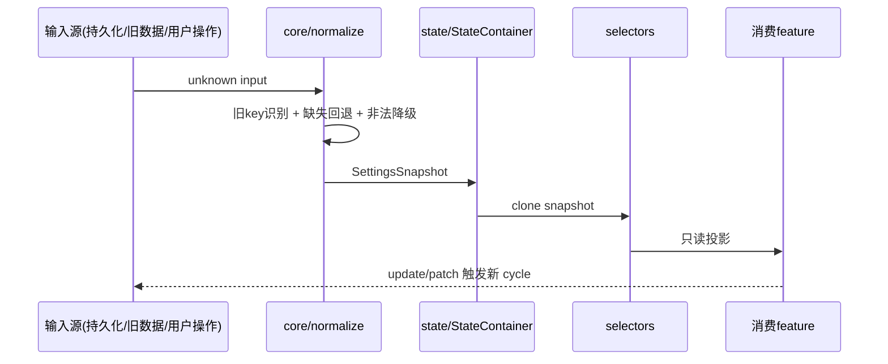

# Rewrite settings feature design

## 0. 术语约定

| 术语 | 定义 | 防冲突结论 |
| --- | --- | --- |
| SettingsSnapshot | settings feature 的不可变配置快照，`schemaVersion` + 配置分组 | 与 frame `FrameSnapshot`、connection `ConnectionSnapshot` 同模式 |
| Config owner | 拥有配置项持久化、默认值、normalize 规则的 feature | settings 是全局配置的 owner；feature-specific 配置归各自 feature |
| Runtime owner | 拥有配置运行语义（定时器、映射、校验）的 feature | settings 不是任何配置的 runtime owner |
| Selector | `selectXxx(source: SettingsSource): ReadonlyXxx` 形式的纯函数投影 | 与其他五个 feature 的 selector 模式一致 |
| Normalize | `normalizeSettingsInput(unknown): SettingsNormalizationResult` | 旧 key 兼容、缺失字段回退、非法值降级 |

## 1. 决策与约束

### 需求摘要

- **做什么**：补全 settings core 层配置项，使 7 个下游 feature（frame/connection/receive/send/storage/status/display）能通过只读 selector 消费配置。
- **为谁**：下游 feature 的 service/runtime 层，以及设置页 UI。
- **成功标准**：settings public API 完整导出所有已确认配置项的 selector，core 零 Vue/Pinia/Electron 依赖，测试覆盖所有配置项的 normalize/validate/reset。
- **明确不做**：不实现 adapter/composable/component（归 STG-IMPL-006/011/012）；不实现 status indicator、display/chart、connection 默认参数的业务语义（归对应 feature）；不冻结字段 schema 或 platform API。

### 复杂度档位

走内部模块默认档位，无偏离。Settings 是纯 TypeScript 配置管理模块，无外部依赖、无并发、无 UI、无 platform I/O。

### 关键决策

1. **settings 只拥有配置事实**，不拥有运行事实。配置如何生效归消费 feature 或 runtime。理由：frame/connection/receive/send/task 五个 core feature 已按此模式审查通过，settings 必须一致。
2. **配置分组按消费域划分**：`recording`（storage 消费）、`storage`（storage 消费）、后续按需扩展。不按旧系统 store 名分组。理由：旧 store 把运行事实和配置混存。
3. **旧系统配置项经 normalize 兼容但不污染新模型**。`normalizeSettingsInput` 识别旧 key 并降级为 warning，新 snapshot 只包含新 schema 字段。理由：旧 key 不可预测，直接继承等于把旧 debt 带进新系统。
4. **settings 不知道消费 feature 的存在**。selector 签名只接收 `SettingsSource`，不 import 任何 feature。理由：单向依赖是系统架构硬规则。

### 被拒方案

- 把所有旧 localStorage key 合并进一个大 settings store → 旧 key 语义不清、运行/配置混存，违反静态配置/运行事实分离原则。
- settings 提供全局 service locator → 耦合面过广，测试困难，违反 feature isolation。
- settings 直接访问 platform 进行持久化 → core 层必须零 platform 依赖。

### 前置依赖

无。Recording 三项已有实现且质量达标，作为本次扩展的基础。

### 明确不做

- 不实现 adapter/composable/component 层。
- 不设计 connection/status/display/chart 的业务语义。
- 不冻结 settings 字段 schema、存储文件格式或 platform API schema。
- 不实现设置导入/导出、选择目录等占位能力。
- 不把 northbound/result/report/TestReport schema 与 settings 关联。

## 2. 名词与编排

### 2.1 名词层

#### 现状

`rewrite/src/features/settings/core/` 已实现：

| 文件 | 职责 | 关键导出 |
| --- | --- | --- |
| `types.ts` | 类型定义 | `SettingsSnapshot`, `SettingsRecordingConfig`, `SettingsPatch`, `SettingsValidationIssue`, `SettingsValidationResult`, `SettingsNormalizationResult` |
| `defaults.ts` | 默认值 | `DEFAULT_SETTINGS`, `createDefaultSettingsSnapshot()` |
| `clone.ts` | 克隆 | `cloneSettingsSnapshot()`, `cloneRecordingConfig()` |
| `normalize.ts` | 规范化 | `normalizeSettingsInput()`, `applySettingsPatch()` — 含旧 key 兼容、缺失字段回退、非法值降级 |
| `validation.ts` | 校验 | `validateSettingsSnapshot()`, `createSettingsIssue()`, `toSettingsValidationResult()` |

当前 `SettingsSnapshot` 结构：

```typescript
// rewrite/src/features/settings/core/types.ts
interface SettingsSnapshot {
  readonly schemaVersion: 1;
  readonly recording: SettingsRecordingConfig;  // 3 items
}
```

`state/`、`selectors/`、`services/`、`fixtures/` 均已按统一模式实现（StateContainer 不泄露、selector 返回克隆、public API 清洁）。测试 11 个用例覆盖 core/state/service/selector。

#### 变化

在现有 `SettingsSnapshot` 上新增配置分组，不改动已有 recording 实现：

| 变化 | 动作 | 动机 |
| --- | --- | --- |
| 新增 `SettingsStorageConfig` 类型 | 新增 | storage feature 需要 maxHistoryHours、enableAutoSave、enableHistoryStorage 三个配置项 |
| 新增 `SettingsGeneralConfig` 类型 | 新增 | 全局性能配置：updateInterval（数据刷新间隔毫秒） |
| `SettingsSnapshot` 增加 `storage` + `general` 分组 | 扩展 | 与 recording 同模式，独立分组 |
| `DEFAULT_SETTINGS` 增加默认值 | 扩展 | storage: {maxHistoryHours:24, enableAutoSave:true, enableHistoryStorage:true}, general: {updateInterval:1000} |
| `clone.ts` 增加 `cloneStorageConfig` + `cloneGeneralConfig` | 新增 | 保持 clone 模式一致性 |
| `normalize.ts` 增加 storage + general 分组处理 | 扩展 | 含旧 key 识别、缺失字段回退、非法值降级 |
| `validation.ts` 增加 storage + general 校验 | 扩展 | maxHistoryHours>0, updateInterval>0, 布尔类型校验 |
| 新增 selectors：`selectStorageSettings`、`selectGeneralSettings` 等 | 新增/扩展 | 下游 feature 消费入口 |
| `SettingsReader`/`SettingsService` 增加 storage + general 相关方法 | 扩展 | `getStorageSettings()`, `getUpdateInterval()` 等 |
| `SettingsPatch` 增加 `storage` + `general` 分组 | 扩展 | 支持增量更新 |
| `SettingsResetScope` 增加 `'storage'`、`'general'` | 扩展 | 支持局部 reset |

接口示例（新增 `SettingsStorageConfig`）：

```typescript
// 来源：rewrite/src/features/settings/core/types.ts (变化后)
interface SettingsStorageConfig {
  readonly maxHistoryHours: number;       // 历史数据保留时长
  readonly enableAutoSave: boolean;       // 自动保存开关
  readonly enableHistoryStorage: boolean; // 历史数据存储开关
}

interface SettingsGeneralConfig {
  readonly updateInterval: number;        // 数据刷新间隔（毫秒）
}

interface SettingsSnapshot {
  readonly schemaVersion: 1;
  readonly recording: SettingsRecordingConfig;
  readonly storage: SettingsStorageConfig;    // 新增
  readonly general: SettingsGeneralConfig;    // 新增
}
```

#### 延迟项（不在本次实现）

以下配置项的归属需等对应 feature design 确认后才能进入 settings snapshot：

- status indicator config → 等 status feature design
- table1/table2/scatter/chart config → 等 display feature design
- connection 默认参数 → 等 connection design 确认

### 2.2 编排层

settings 生命周期是简单的线性 pipeline，无分支/并行/状态机：



#### 现状

已有完整 pipeline：`normalizeSettingsInput` → `StateContainer` → selector → consumer。Service 层封装 replace/update/reset 三个写入操作。

#### 变化

pipeline 结构不变，只在 normalize 和 selector 中增加 storage 分组的处理节点。

#### 跨层纪律

- **错误语义**：normalize 失败不抛异常，降级为默认值并记录 warning issue；consumer 通过 `SettingsNormalizationResult.issues` 获知降级情况。
- **幂等性**：`normalizeSettingsInput` 对相同输入始终产出相同 snapshot。
- **不可变性**：所有对外返回值通过 clone 隔离，consumer 持有的引用不影响内部 state。
- **扩展点**：新增配置分组只需在 types/defaults/clone/normalize/validation 各增加对应处理，不改变 pipeline 拓扑。

### 2.3 挂载点清单

| 挂载位置 | 具体项 | 动作 |
| --- | --- | --- |
| `rewrite/src/features/settings/core/types.ts` | `SettingsSnapshot` 类型定义 | 修改（增加 storage 分组） |
| `rewrite/src/features/settings/index.ts` | public API 导出面 | 修改（增加 storage selector/service 方法） |
| `rewrite/src/features/settings/fixtures/settings-fixtures.ts` | fixture 输入/输出样本 | 修改（增加 storage fixture） |

**说明**：settings 是纯数据模块，无路由注册、无事件订阅、无第三方集成。挂载点只有类型定义、public API 和 fixture 三处。删除这三处即完全卸载 settings（消费 feature 的 import 会编译失败，符合预期）。

### 2.4 推进策略

1. **扩展 core types/defaults**：新增 `SettingsStorageConfig` 类型、默认值、clone 函数
   - 退出信号：TypeScript 编译通过，`createDefaultSettingsSnapshot()` 返回含 storage 的完整 snapshot
2. **扩展 normalize/validation**：增加 storage 分组的规范化（旧 key 识别、缺失回退、非法降级）和校验规则
   - 退出信号：`normalizeSettingsInput` 对空输入/部分输入/非法输入/旧 key 输入均产出正确 snapshot + issues
3. **扩展 selectors/service**：增加 `selectStorageSettings` 等 selector 和 `getStorageSettings()` 等 service 方法
   - 退出信号：selector 返回克隆副本，service update/reset 支持 storage 范围
4. **更新 fixtures 和测试**：增加 storage 相关 fixture 样本，补全 normalize/validate/selector 测试
   - 退出信号：所有新增测试通过，`pnpm build` + `pnpm lint` 通过

### 2.5 结构健康度与微重构

##### 评估

- `core/types.ts` — 52 行，职责单一（类型定义），本次扩展约增加 15 行。健康。
- `core/normalize.ts` — 246 行，职责单一（规范化），本次扩展约增加 40 行。扩完后约 286 行，仍低于 500 行阈值。健康。
- `core/validation.ts` — 80 行，职责单一（校验），本次扩展约增加 20 行。健康。
- `core/clone.ts` — 20 行，本次增加 1 个函数。健康。
- `core/defaults.ts` — 16 行，本次增加 storage 默认值。健康。
- `selectors/settings-selectors.ts` — 35 行，本次增加 2-3 个 selector。健康。
- `services/settings-service.ts` — 125 行，本次增加 3-4 个方法，扩完约 150 行。健康。
- `fixtures/settings-fixtures.ts` — 66 行，本次增加 storage fixture 样本。健康。
- `__tests__/settings-core-service-state-selector.spec.ts` — 200 行，本次增加 storage 测试。扩完约 300 行，低于 500 行阈值。健康。

##### 结论：不做

所有文件职责单一、行数合理、改动密度低（每个文件最多增加 1-2 处同类逻辑）。微重构收益不抵风险。

##### 超出范围的观察

无。

## 3. 验收契约

### 关键场景清单

#### Recording 配置（已有，需验证不回归）

| 场景 | 输入/触发 | 期望可观察结果 |
| --- | --- | --- |
| 默认值 | `createDefaultSettingsSnapshot()` | recording: { autoStartRecording: true, csvDefaultOutputPath: '', csvSaveIntervalMinutes: 5 } |
| 旧 key 兼容 | `{ 'settings.autoStartRecording': false }` | snapshot.recording.autoStartRecording === false, issues 含 unknownFieldIgnored |
| 非法值降级 | `{ recording: { csvSaveIntervalMinutes: -1 } }` | snapshot.recording.csvSaveIntervalMinutes === 5, issues 含降级 warning |
| 隔离性 | 获取 snapshot 后外部修改 | service 再次获取的 snapshot 不受影响 |
| 局部 reset | `service.reset('recording')` | 只重置 recording 分组，其他分组不变 |

#### Storage 配置（新增）

| 场景 | 输入/触发 | 期望可观察结果 |
| --- | --- | --- |
| 默认值 | `createDefaultSettingsSnapshot()` | storage: { maxHistoryHours: 24, enableAutoSave: true, enableHistoryStorage: true } |
| normalize 空输入 | `normalizeSettingsInput(undefined)` | 返回完整默认 snapshot，无 issues |
| normalize 部分输入 | `{ storage: { maxHistoryHours: 48 } }` | snapshot.storage.maxHistoryHours === 48, 其余为默认值 |
| normalize 旧 key | `{ maxHistoryHours: 12, enableAutoSave: false }` | 旧 key 被识别并映射到 storage 分组 |
| validate 非法值 | `{ storage: { maxHistoryHours: -1 } }` | 降级为默认 24, issues 含降级 warning |
| validate 非法类型 | `{ storage: { enableAutoSave: 'yes' } }` | 降级为默认 true, issues 含降级 warning |
| selector 隔离 | `selectStorageSettings(source)` 返回后外部修改 | 再次调用返回不受影响的克隆 |
| service update | `service.update({ storage: { maxHistoryHours: 72 } })` | snapshot.storage.maxHistoryHours === 72, recording 不变 |
| service reset storage | `service.reset('storage')` | 只重置 storage 分组，recording 不变 |
| service reset all | `service.reset('all')` | 所有分组回到默认值 |

#### General 配置（新增）

| 场景 | 输入/触发 | 期望可观察结果 |
| --- | --- | --- |
| 默认值 | `createDefaultSettingsSnapshot()` | general: { updateInterval: 1000 } |
| normalize 部分输入 | `{ general: { updateInterval: 500 } }` | snapshot.general.updateInterval === 500 |
| validate 非法值（负数） | `{ general: { updateInterval: -1 } }` | 降级为默认 1000, issues 含降级 warning |
| validate 非法值（零） | `{ general: { updateInterval: 0 } }` | 降级为默认 1000, issues 含降级 warning |
| validate 非法类型 | `{ general: { updateInterval: 'fast' } }` | 降级为默认 1000, issues 含降级 warning |
| service update | `service.update({ general: { updateInterval: 200 } })` | snapshot.general.updateInterval === 200, 其他分组不变 |
| service reset general | `service.reset('general')` | 只重置 general 分组 |

#### Public API 清洁性

| 场景 | 输入/触发 | 期望可观察结果 |
| --- | --- | --- |
| StateContainer 不泄露 | `import * as api from 'features/settings'` | `api` 不含 `createSettingsState`, `SettingsStateContainer`, `normalizeSettingsInput` |
| Consumer 只能通过 selector 读取 | Consumer 获取 snapshot | 返回值为克隆副本，非内部引用 |

### 明确不做的反向核对项

- `rewrite/src/features/settings/core/` 中不应出现 `import ... from 'vue'` / `'pinia'` / `'electron'`
- settings public API 不应导出 `StateContainer` 或 `normalizeSettingsInput`
- settings 不应 import 任何其他 feature 的 internal module
- settings 不应包含连接、录制、状态灯、图表的运行语义函数
- `SettingsSnapshot` 不应包含 `connectionStatus` / `recordingState` / `indicatorActiveColor` 等运行事实字段

## 4. 与项目级架构文档的关系

### 名词

- `SettingsSnapshot` / `SettingsStorageConfig` / `SettingsRecordingConfig` — 系统级可见的配置类型 → `rewrite-feature-boundaries.md` 和 `rewrite-feature-interaction-matrix.md` 中 settings 的输出定义
- Selector 模式 — 与其他五个 feature 一致 → `rewrite-quality-rules.md` 的跨 feature 统一模式

### 动词骨架

- settings load → normalize → state → selector → consumer read — 线性 pipeline → `rewrite-target-structure.md` 中 settings 的内部数据流

### 跨层纪律

- 静态配置 / 运行事实 / 统计 read model 分离 → `rewrite-quality-rules.md`
- Consumer 只能读、不能写 settings → `rewrite-feature-boundaries.md`

### 需要更新的架构文档

- `rewrite-feature-interaction-matrix.md`：settings 作为 producer 增加了 storage 分组的 selector 输出
- `rewrite-feature-boundaries.md` §4.8：settings 的输入输出描述需包含 storage 配置项

## A. Direct contract

本设计只依据以下正式工件判断范围和完成度：

1. `AGENTS.md`
2. `codestable/compound/2026-04-28-rewrite-execution-charter.md`
3. `codestable/compound/2026-04-28-rewrite-scope-default-preserve.md`
4. `codestable/architecture/rewrite-target-structure.md`
5. `codestable/architecture/rewrite-system-architecture.md`
6. `codestable/architecture/rewrite-feature-boundaries.md`
7. `codestable/architecture/rewrite-feature-interaction-matrix.md`
8. `codestable/architecture/rewrite-shared-tooling-audit-plan.md`
9. `codestable/architecture/rewrite-pre-design-gate-and-sequencing.md`
10. `codestable/architecture/rewrite-platform-api-surface-reduction.md`
11. `codestable/architecture/rewrite-shared-tooling-app-shell-ownership.md`
12. `codestable/features/rewrite-frame/rewrite-frame-design.md`
13. `codestable/features/rewrite-frame/rewrite-frame-checklist.yaml`
14. `codestable/quality/rewrite-quality-rules.md`
15. `codestable/quality/rewrite-review-checklist.md`

## B. Boundary guards

- 本轮是 Lane B 单 feature design，只产出 design/checklist，不进入实现，不迁移旧代码，不写接口 schema。
- settings 新代码落点是 `rewrite/src/features/settings`。
- settings 只拥有用户可配置的静态配置、偏好配置、默认值、持久化设置事实、配置快照和设置页可见配置语义。
- settings 不拥有 connection、receive、send、task、SCOE、status、result、report、northbound 的运行事实、统计事实、任务推进、协议语义或交付语义。
- settings 不拥有 frame 静态资产，也不推翻 `rewrite-frame` 已确认的 frame asset owner。
- settings 不直接访问 Node、Electron、`fs`、`path`、`ipcRenderer`、`window.electron`、串口、socket 或平台原生对象。
- file/path/dialog 只能作为 platform/app shell/storage 依赖，本轮不定义最终 platform API schema。
- app/window/system 选项必须区分 app shell/platform owner 与 settings 可见配置 owner。
- 不设计 receive/send/task/SCOE/report/northbound 内部细节。
- 不冻结 northbound、result、report、TestReport schema。
- 不把旧 localStorage key、旧 `configDefaults`、旧 store shape 或组件内 `useLocalStorage` 直接当作新核心模型。
- 不提前把 settings helper 抽到 `shared`，除非后续实现证明它满足纯工具条件。
- 不读取或引用前端自动生成 types 文件作为证据。

## C. Owner / not owner

| 分类 | settings owner | settings not owner |
| --- | --- | --- |
| 配置事实 | 用户可编辑或系统默认的静态设置、偏好设置、默认值回退、旧持久化 key 的兼容读取候选、设置页可见配置快照。 | 连接实例、接收结果、发送结果、任务状态、SCOE 状态、内部结果事实、报告对象、northbound 事务。 |
| 持久化语义 | 设置项加载、保存、重置、默认值合并、缺失字段回退、非法旧值降级、设置快照版本兼容策略。 | 文件系统路径实现、打包态 data path、CSV/history schema、frame JSON、报告文件命名和交付协议。 |
| 默认值 | settings 自己的默认值，以及经相关 feature design 确认为用户偏好的 feature-specific 默认值入口。 | connection 参数合法性、status 指示灯业务映射、chart 数据采样含义、recording 定时器行为。 |
| 外部读取 | 给明确消费者提供只读 snapshot、只读 selector 或 feature-specific defaults view。 | 允许外部直接写 settings internal state，或把 settings 当作跨 feature service locator。 |
| 设置页 UI | 设置页表单草稿、确认、重置提示、占位功能提示和用户操作反馈。 | app shell/window 控件位置、native dialog 实现、platform window/menu/autolaunch 能力本身。 |

settings 的核心职责是保存和提供"配置事实"。配置如何生效、是否能应用、运行中是否成功、状态如何解释，必须归对应 feature。

## D. State ownership

| 状态类别 | 写入 owner | 读取方 | reset / lifecycle / persistence | 本轮设计约束 |
| --- | --- | --- | --- | --- |
| 静态 settings/defaults | settings | runtime、pages、storage、connection、status、display/widgets、app shell 的明确 public reader | 低频更新；持久化；reset 只按明确设置范围执行；缺失字段回退到 settings default | 包含用户偏好和可持久化配置事实，不包含运行结果或平台资源对象。 |
| 运行事实 | connection、storage/recording、receive、send、task、SCOE、status、result/report 等对应 feature | runtime、pages、status/result/report 等消费者 | 由对应 feature 生命周期控制；可受 settings 输入影响，但不写回 settings | settings 不记录"是否已连接""是否正在保存""状态灯当前颜色""发送是否成功"。 |
| 统计 read model | status、receive/display、storage/history、result 等对应 owner | pages/widgets/report/northbound 等只读消费者 | 由运行事件或显式结果增量维护；reset 时机由 owner feature 定义 | 统计和实时展示不得写回 settings 配置对象或旧持久化 key。 |
| UI snapshot | settings 页面、feature composable、page/widget shell | 页面和组件 | 短生命周期；默认不持久化；若持久化必须先升级为 settings/defaults 或 owner feature 配置 | 表单草稿、对话框开关、tab、临时错误提示不等于配置事实。 |
| 持久化 adapter 状态 | settings service/adapters 或 storage/platform adapter | settings service/runtime | 可用 fake adapter 做 fixture；真实 file/path/localStorage 走 runtime/manual | adapter 只做读写和兼容转换，不承担配置项业务语义。 |

## E. Legacy observable behavior ledger

| 旧可观测行为 | owner feature | 处理策略 | evidence source | validation level |
| --- | --- | --- | --- | --- |
| 侧边栏和路由提供 `/settings` 设置页面入口。 | pages + settings | preserve | `src/router/routes.ts`、`src/components/layout/SidePanel.vue` | manual |
| 设置页展示"系统设置"，包含数据记录设置、CSV 导出设置、状态指示灯、系统操作四个可见区域。 | settings page | preserve | `src/pages/settings/Index.vue` | manual |
| `autoStartRecording` 默认 `true` 并持久化，设置页可 toggle。 | settings for config; storage/display for recording runtime | preserve | `src/stores/settingsStore.ts`、`src/pages/settings/Index.vue` | fixture, manual |
| 应用启动时读取 `autoStartRecording`，若未在记录中则触发开始记录。 | runtime + storage/display; settings provides snapshot | preserve as boundary; runtime behavior deferred | `src/layouts/useAppLifecycle.ts` | fixture, runtime |
| `csvSaveInterval` 默认 `5` 分钟并持久化，设置页允许输入小数。 | settings for config; storage/display for timer runtime | preserve | `src/stores/settingsStore.ts`、`src/pages/settings/Index.vue` | fixture, manual |
| data display 初始化时把 `csvSaveInterval` 乘以 60,000 作为保存定时器间隔。 | storage/display runtime; settings provides raw config | preserve as consumer boundary | `src/stores/frames/dataDisplayStore.ts` | fixture, runtime |
| `csvDefaultOutputPath` 默认空字符串并持久化，设置页允许手动输入。 | settings for config; storage/app shell/platform for path application | preserve | `src/stores/settingsStore.ts`、`src/pages/settings/Index.vue` | fixture, manual |
| CSV 导出弹窗在选择预设路径时读取 `csvDefaultOutputPath`，为空时显示默认 `data/exports/csv`。 | storage for export behavior; settings provides path preference | preserve | `src/components/storage/CSVExportDialog.vue` | fixture, manual, runtime |
| "选择文件夹"按钮当前只提示待实现，并要求手动输入路径。 | settings page + app shell/platform future dependency | candidate drop for incomplete placeholder; preserve current gap in checklist | `src/pages/settings/Index.vue` | manual |
| "导出设置""导入设置"按钮当前只提示待实现。 | settings page; storage/platform future dependency | candidate drop or deferred pending user decision | `src/pages/settings/Index.vue` | manual |
| "重置所有设置"旧实现只重置 `autoStartRecording`、`csvDefaultOutputPath`、`csvSaveInterval`，不重置 status/display/chart/connection 配置。 | settings page | preserve actual subset behavior; candidate drop misleading label semantics | `src/pages/settings/Index.vue` | fixture, manual |
| 设置页可开启/关闭状态指示灯，并打开状态指示灯配置对话框。 | settings for persisted preference surface; status for indicator semantics/read model | preserve | `src/pages/settings/Index.vue`、`src/stores/statusIndicators.ts` | fixture, manual |
| status indicator 配置持久化，包含启用开关和 indicator 列表。 | settings owns persistence/default snapshot; status owns validation, mapping and active read model | preserve | `src/stores/statusIndicators.ts`、`src/components/common/StatusIndicatorConfigDialog.vue` | fixture, manual |
| 状态指示灯顶栏可见，实际亮灭和颜色基于 receive 当前值计算。 | status; receive provides source snapshot | preserve as consumer boundary; not owned by settings | `src/components/common/StatusIndicators.vue`、`src/stores/statusIndicators.ts`、`src/components/layout/HeaderBar.vue` | fixture, runtime, hardware |
| table1/table2 显示模式、选中分组、图表选中项持久化。 | settings for persisted display preference snapshot; receive/display for data view semantics | preserve | `src/stores/frames/dataDisplayStore.ts`、`src/components/frames/receive/DataDisplay/DataDisplayContainer.vue` | fixture, manual |
| table1/table2 星座图配置持久化，包含 I/Q 数据源、采样点数、刷新间隔等偏好。 | settings for persisted preference; receive/display/widgets for chart runtime semantics | preserve | `src/stores/frames/dataDisplayStore.ts`、`src/components/frames/receive/DataDisplay/ScatterPlotConfigDialog.vue` | fixture, manual, runtime |
| 实时图表性能配置通过 `chart-performance-config` 持久化，但两个入口默认值不同。 | settings for compatibility/migration guard; widgets/display for chart semantics | deferred; preserve key compatibility candidate | `src/components/frames/receive/DataDisplay/DataDisplayContainer.vue`、`src/components/common/UniversalChartSettingsDialog.vue` | fixture, manual |
| 历史分析多图配置通过 `historyAnalysis_chartSettings` 持久化。 | settings for persisted preference snapshot; storage/history/display for analysis semantics | preserve | `src/stores/historyAnalysis.ts`、`src/pages/HistoryAnalysisPage.vue` | fixture, manual |
| 串口默认参数和每端口参数通过 `default-serial-options`、`serial-options-map`、`last-used-port` 持久化。 | connection owns parameter semantics and runtime; settings may provide persistence/default support only if connection design opts in | preserve as connection-owned setting | `src/stores/serialStore.ts`、`src/composables/serial/useSerialConfig.ts`、`src/components/connect/SerialOptionsForm.vue` | fixture, runtime, hardware |
| 网络连接新增默认值在连接编辑对话框中定义，网络连接列表由连接页面/store 维护。 | connection | preserve as connection-owned config; settings does not own runtime connection list | `src/components/connect/NetworkConnectionEditDialog.vue`、`src/stores/netWorkStore.ts` | fixture, runtime, hardware |
| 连接 target 聚合、发送 target validation 和 `serial:` / `network:` 路由来自 connection/send 运行链路。 | connection + send | not touched by settings | `src/stores/connectionTargetsStore.ts`、`src/composables/frames/sendFrame/useUnifiedSender.ts` | runtime, hardware |
| app header 窗口最小化、最大化、关闭按钮可见。 | app shell + platform/window | preserve; settings not owner | `src/components/layout/HeaderBar.vue`、`src/components/layout/WindowControls.vue`、`src/composables/window/useWindowControls.ts` | manual, runtime |
| menu/autoLaunch API 在旧 platform wrapper 中存在，但未见 settings 页面显式用户配置。 | app shell/platform; settings only if later confirmed visible preference | deferred | `src/api/common/systemApi.ts`、`src-electron/preload/api/autolaunch.ts` | manual, runtime |
| `DATA_PATH_MAP` 定义旧数据文件默认路径映射。 | storage/platform; settings may consume only visible path preferences | not touched by settings core | `src/config/configDefaults.ts`、`src/api/common/dataStorageApi.ts` | fixture, runtime |

## F. Cross-feature boundaries

| Feature / layer | 如何读取 settings | 明确禁止 |
| --- | --- | --- |
| connection | 通过 settings 只读 defaults snapshot 或 connection 自己的 config service 读取低频默认参数；连接状态和 target route 由 connection 写入。 | import settings internal state；让 settings 打开串口/TCP/UDP；把 northbound deviceId 与连接 target 混同。 |
| receive | 通常不直接读取 settings；如 display/receive design 确认需要低频显示或解析配置，应通过显式输入传入。 | receive core 从 settings/store 回读决定解析、任务触发或统计含义。 |
| send | 通常不直接读取 settings；如 send design 确认存在默认发送偏好，只读取只读 snapshot。 | send 为 settings 写运行结果、发送统计或 target 可用性。 |
| storage/history/CSV | 读取 CSV 默认路径、保存间隔、自动记录偏好、历史保留时长、自动保存等设置输入；storage 拥有文件、history、CSV 和 recording runtime。 | settings 直接读写文件、定义 history/CSV schema、声明打包态 data path 完成。 |
| status | 读取 indicator config snapshot；status 拥有 active/current color read model、数据源解释、刷新节奏和 mapping 规则。 | settings 读取 receive 内部 state 计算状态灯；status import settings internal mutable state。 |
| display/chart/widgets | 读取 chart/display 偏好快照或由 page/runtime 传入 props；widgets 不直接读 settings internal store。 | 组件内随意定义新 localStorage key 且绕过 settings/design 登记。 |
| app shell/window/system | 设置页可发起用户操作；app shell/platform 执行窗口、native dialog 或系统能力。 | settings 直接访问 `window.electron`、Electron、Node、`fs/path` 或裸 IPC。 |
| frame | 本轮无直接依赖；frame 已拥有 frame 静态资产和 defaults/migration 边界。 | settings 维护 frame definitions 或 frame import/export JSON 语义。 |
| northbound/result/report | 本轮无直接 settings API。 | 用 settings 字段冻结 northbound/report schema、HTTP/FTP 或 TestReport 语义。 |

## G. Blocked / deferred

- 新 settings 字段 schema、持久化文件格式和最终 key 命名未冻结。
- 设置导入/导出、选择输出目录在旧系统中是占位提示；是否转为真实能力需要后续用户决策或 storage/app shell design。
- status indicator config 的最终 owner split 需要在 status design 中复核：settings 可拥有持久化 snapshot，status 必须拥有映射语义和运行 read model。
- chart/display/history 的最终 owner split 需要 receive/display/storage/status 相关 design 复核；settings 不拥有运行数据或统计。
- connection 默认参数是否由 settings 提供统一持久化入口，需要 connection design 确认；settings 不拥有连接运行事实。
- app/system 选项如 autoLaunch/menu 是否成为用户可见设置仍 deferred。
- platform file/path/dialog API、packaged data path、真实串口/TCP/UDP、HTTP/FTP、SCOE、northbound、客户闭环均为后续 runtime/hardware/customer validation。
