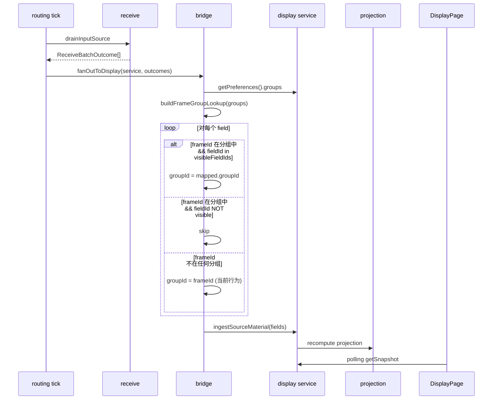

# Display group management design

## 0. 术语约定

| 术语 | 定义 | 防冲突结论 |
|------|------|-----------|
| 分组 (DisplayGroupConfig) | 用户定义的展示分组，含 id、label、frame→visibleFields 映射 | 旧系统 `DataGroup` 含 DataItem 列表，语义更重；新系统分组只管"帧→字段可见性"映射 |
| groupId | DisplayFieldMaterial 上的分组标识 | 当前等于 frameId（bridge 硬编码）；分组映射后变为 group.id |
| 帧条目 (DisplayGroupFrameEntry) | 一个帧在某分组内的配置：frameId + visibleFieldIds | 旧系统 `FrameFieldMapping` 是 M:N；新系统一帧只属于一个分组 |
| GroupOption | UI 下拉用的 { value, label } 对 | 新概念，DisplayPanel props 类型变更 |
| 未分组帧 | 不在任何 DisplayGroupConfig.frames 中的帧 | 保持 groupId=frameId 行为不变 |

## 1. 决策与约束

### 需求摘要

- **做什么**：用户可创建命名分组，将接收帧分配到分组，勾选每帧的可见字段；展示区域按分组过滤
- **为谁**：操作员按业务逻辑（电源参数、热控参数等）组织遥测展示
- **成功标准**：创建/删除/重命名分组、分配/移除接收帧、勾选可见字段后展示区域实时生效
- **明确不做**：
  - 不做 send 帧分组（只选接收帧）
  - 不做单字段级映射（一帧整体属于一个分组）
  - 不做 M:N 帧分组（一帧一分组）
  - 不做 DataItem 级配置（isVisible/isFavorite/expression — 由 frame definition 和 display preferences 已有归口承担）
  - 不做分组间字段共享或跨分组引用
  - 不改变 projection 层逻辑（过滤在 bridge 完成）

### 复杂度档位

走 Lane B 默认档位，无偏离。

### 关键决策

**D1: 分组过滤在 bridge 层，不在 projection 层。**

理由：bridge 输出的 `DisplayFieldMaterial` 已携带正确 groupId，projection 逻辑不变；ScatterSourceBinding 等 groupId 引用无需额外适配；bridge 已持有 DisplayService 引用可直接读 preferences。

替代方案（projection 层过滤）：需要改 projectTableRows 签名、remap 散落在 projection 和 scatter binding 两处，散布更广。

**D2: 归属 display feature，不新建独立 feature。**

理由：groupId 已在 display 类型体系中；分组配置是展示偏好的一部分，与 selectedGroupId、chart config 同层；不需要跨 feature 公共 API。

**D3: 扩展 DisplayPreferences，不新建独立配置存储。**

理由：分组配置和展示偏好天然耦合（selectedGroupId 引用 group.id）；复用已有 updatePreferences 路径；不需要新的 service 方法或 state container。

**D4: UI 用弹窗 rw-dialog-lg，不用独立页面。**

理由：分组数量少（<20），不需要独立路由；已有 ChartConfigDialog / ScatterConfigDialog 同模式可复用。

**D5: 默认不显示字段，显式勾选才显示。**

理由：用户明确选择。热更新成立（只存 frameId + visibleFieldIds，帧定义改字段后自动生效）。

**D6: DisplayPreferences 持久化作为本 feature 一部分实现。**

理由：display 当前无持久化，分组配置必须跨重启保留。只持久化 groups 配置（不含运行时偏好如 selectedGroupId），最小侵入。

### 前置依赖

无。

## 2. 名词与编排

### 2.1 名词层

#### 现状

| 值对象 | 位置 | 当前职责 |
|--------|------|---------|
| `DisplayFieldMaterial` | `display/core/types.ts:57` | 携带 groupId(=frameId)、dataItemId、fieldName、value、displayValue |
| `DisplayPreferences` | `display/core/types.ts:47` | table1/table2/charts/scatter/cadence 偏好，无 groups 字段 |
| `DisplayPreferencesPatch` | `display/core/types.ts:140` | 偏好 patch 类型 |
| `GroupOption`（DisplayPanel props） | `display/components/DisplayPanel.vue:18` | 实际是 `groups: readonly string[]`，label=value=groupId |

bridge 硬编码 `groupId: f.frameId`（`receive-display-bridge.ts:16`）。

#### 变化

| 动作 | 内容 | 动机 |
|------|------|------|
| 新增 | `DisplayGroupConfig { id, label, frames: DisplayGroupFrameEntry[] }` | 分组定义 |
| 新增 | `DisplayGroupFrameEntry { frameId, visibleFieldIds: readonly string[] }` | 帧在分组内的可见字段配置 |
| 新增 | `GroupOption { value: string, label: string }` | UI 下拉选项（分离 groupId 和展示名称） |
| 新增 | `buildFrameGroupLookup(groups): Map<frameId, { groupId, visibleFieldIds }>` | bridge 用的快速查找表 |
| 扩展 | `DisplayPreferences` 加 `groups: readonly DisplayGroupConfig[]` | 分组配置归入偏好 |
| 扩展 | `DisplayPreferencesPatch` 加 `groups?: readonly DisplayGroupConfig[]` | 支持通过 patch 更新分组 |
| 修改 | `applyDisplayPreferencesPatch`（normalize.ts:253-296）加 `groups` 字段传播 | 当前逐字段构造合并结果，新字段不显式传播会被丢弃 |
| 改变 | `DisplayPanel` props `groups: readonly string[]` → `readonly GroupOption[]` | 支持分组 label ≠ groupId |
| 改变 | bridge: 插入 group lookup + filter + remap | 按 visibleFieldIds 过滤并重映射 groupId |
| 改变 | `DisplayPage` groups 计算: 合并 configured + emergent | 配置分组有 label，未配置帧用 frameId |
| 新增 | `GroupConfigDialog.vue` | 分组管理弹窗 |
| 新增 | display preferences 持久化 | 分组配置跨重启保留 |
| 新增 | display/index.ts 导出新类型 | 公共 API 暴露 |

#### 接口示例

**DisplayGroupConfig** — 分组定义：

```typescript
// 来源：display/core/types.ts 新增
{
  id: 'group-power',
  label: '电源参数',
  frames: [
    { frameId: 'frame_01', visibleFieldIds: ['voltage', 'current'] },
    { frameId: 'frame_03', visibleFieldIds: ['battery_level'] },
  ]
}
```

**buildFrameGroupLookup** — 查找表构建：

```typescript
// 来源：display/core/group-resolution.ts 新增
const lookup = buildFrameGroupLookup([
  { id: 'g1', label: '电源', frames: [{ frameId: 'f1', visibleFieldIds: ['v', 'i'] }] }
]);
lookup.get('f1') // → { groupId: 'g1', visibleFieldIds: Set{'v', 'i'} }
lookup.get('unknown') // → undefined
```

**GroupConfigDialog** — 组件接口：

```typescript
// 来源：display/components/GroupConfigDialog.vue 新增
Props: {
  modelValue: boolean;
  groups: readonly DisplayGroupConfig[];
  receiveFrames: readonly FrameAssetSummary[];
  frameReader: FrameAssetReader;
}
Emits: {
  'update:modelValue': [value: boolean];
  'save': [groups: readonly DisplayGroupConfig[]];
}
```

### 2.2 编排层

#### 主流程图



#### 现状

线性 pipeline：`routing tick → receive drain → bridge (groupId=frameId) → ingestSourceMaterial → projection → UI polling`。bridge 是纯函数，无分支。

#### 变化

在 bridge 内插入三步分支逻辑（见主流程图 alt 块）。拓扑仍为线性 pipeline，新增一个分支路由点。projection 和 UI polling 不变。

#### 跨层纪律

- **错误语义**：bridge 过滤是纯计算，无失败路径。group lookup 构建 O(groups * frames) 极小，不报错
- **幂等性**：bridge 每次调用独立构建 lookup，无副作用
- **性能**：getPreferences() 返回深拷贝。高频 tick 下可后续优化为缓存，当前数据量 (<100 groups/frames) 无需优化
- **扩展点**：如果未来需要"默认全显示"行为，visibleFieldIds 语义可扩展为 `['*']` 通配

### 2.3 挂载点清单

| 挂载位置 | 动作 |
|---------|------|
| `DisplayPreferences.groups` 字段 | 新增 — 分组配置的持久化载体 |
| `DisplayPanel` 新增 `openGroupConfig` emit + 设置按钮 | 新增 — UI 触发入口 |
| `runtime/persistence.ts` 新增 `displayPreferences` 读写 | 新增 — 分组配置持久化挂入 |
| `display/index.ts` 导出 `DisplayGroupConfig`、`DisplayGroupFrameEntry`、`GroupOption`、`buildFrameGroupLookup` | 新增 — 公共 API 暴露 |

删除这些挂入点（移除 feature）：删掉 DisplayPreferences.groups 字段、GroupConfigDialog 组件、DisplayPanel 设置按钮、persistence 中 displayPreferences key → feature 完全消失。

### 2.4 推进策略

```
1. 名词层：新增类型 + 默认值 + normalization → 类型编译通过 + 已有测试不受影响
   退出信号：pnpm build 通过
2. 编排骨架：buildFrameGroupLookup 纯函数 + bridge 改造 → 分组过滤单测覆盖
   退出信号：新纯函数测试 + bridge 测试通过（空 groups / 有映射 / 无映射 / 部分可见）
3. 持久化：display preferences 持久化接入 → 重启后分组配置保留
   退出信号：保存+加载 round-trip 测试通过
4. 静态结构：GroupConfigDialog 组件 + DisplayPanel 按钮更新 → 浏览器可见弹窗布局
   退出信号：点击设置按钮弹出空弹窗
5. 交互逻辑：分组 CRUD + 帧分配 + 字段勾选 → 弹窗内完整操作
   退出信号：创建分组 → 添加接收帧 → 勾选字段 → 保存后展示区域按分组过滤
6. 联调收尾：build + lint + 全部测试
   退出信号：pnpm build && pnpm lint && pnpm test 全通过
```

### 2.5 结构健康度与微重构

##### 评估

| 文件 | 行数 | 职责 | 改动密度 |
|------|------|------|---------|
| `display/core/types.ts` | 170 | 纯类型定义 | +15 行（新增接口） |
| `display/core/normalize.ts` | 299 | 偏好校验/规范化 | +35 行（新增 normalizeGroupConfigs + patch-apply 传播 groups） |
| `display/core/defaults.ts` | ~30 | 默认值 | +1 行 |
| `receive-display-bridge.ts` | 31 | receive→display 转换 | 改约 15 行 |
| `display/services/display-service.ts` | 241 | 服务层 | 不改动（复用 updatePreferences） |
| `DisplayPanel.vue` | 157 | 展示面板组件 | +10 行（emit + 按钮） |
| `DisplayPage.vue` | 393 | 展示页面 | +40 行（dialog 接线 + groups 计算） |
| `runtime/persistence.ts` | 148 | 持久化 | +20 行 |

##### 结论：不做

所有要改的文件行数远低于 500 行阈值，职责清晰（types 是类型、normalize 是校验、bridge 是转换、persistence 是持久化），改动密度低（每文件 1-2 处独立改动）。新文件（group-resolution.ts、GroupConfigDialog.vue）自然分离，不会撑胖现有文件。

##### 超出范围的观察

无。

## 3. 验收契约

### 关键场景清单

| 场景 | 输入 / 触发 | 期望可观察结果 |
|------|------------|--------------|
| 创建分组 | 点击"新建分组"，输入名称"电源参数" | 分组列表出现"电源参数"，DisplayPreferences.groups 含新条目 |
| 删除空分组 | 选中无帧的分组，点击删除 | 分组从列表消失，确认无 dialog |
| 删除有帧分组 | 选中含 2 帧的分组，点击删除 | 弹出二次确认，确认后分组和帧映射移除，展示区域不再显示该分组 |
| 重命名分组 | 双击分组名称，改为"热控" | 分组 label 更新，展示下拉显示"热控" |
| 分配帧到分组 | 选中"电源参数"分组，添加接收帧 frame_01 | frame_01 出现在该分组帧列表，visibleFieldIds 为空（默认不显示） |
| 勾选可见字段 | frame_01 下勾选 voltage、current | visibleFieldIds 变为 ['voltage', 'current']，bridge 输出中 frame_01 的 voltage/current 字段 groupId 变为 group.id |
| 未分组帧 | frame_02 不在任何分组中 | bridge 输出 frame_02 所有字段 groupId=frameId（当前行为不变） |
| 字段不在可见列表 | frame_01 在分组中，temperature 未勾选 | bridge 不输出 frame_01 的 temperature 字段 |
| 展示过滤 | DisplayPanel 下拉选择"电源参数" | 只显示该分组下可见字段的数据行 |
| 持久化 | 创建分组并重启应用 | 重启后分组配置恢复，展示区域按分组过滤正常 |
| 只选接收帧 | 分配帧下拉列表 | 只出现 direction='receive' 的帧 |
| 帧定义热更新 | 修改 frame_01 的字段定义（新增字段、改字段名） | 分组配置不需要更新，新字段自动出现在可选列表中 |

### 明确不做的反向核对项

- 代码中不应出现对 send 帧的分组引用（GroupConfigDialog 只消费 `direction='receive'` 的帧）
- DisplayGroupConfig.frames 中不应出现同一 frameId 出现在多个分组中
- bridge 中不应出现对 projection 层的直接调用或对 projection 函数签名的修改
- 不应新建独立的 group service 或 group state container（复用 DisplayService.updatePreferences）
- 不应出现旧系统 DataGroup / DataItem / FrameFieldMapping 类型的引入

## 4. 与项目级架构文档的关系

本 feature 改动局限在 display feature 内部 + runtime/persistence 持久化扩展 + DisplayPage 接线，无系统级可见变化。具体：

- **名词**：`DisplayGroupConfig`、`DisplayGroupFrameEntry` 是 display 内部类型，通过 `display/index.ts` 导出但不影响其他 feature 的类型体系
- **动词骨架**：bridge 改造是 `receive → display` 数据路径的内部变更，不改变跨 feature 交互拓扑
- **跨层纪律**：无新增跨 feature 约束

acceptance 阶段核实后跳过归并。

---

## 5. v2 修订（2026-06-12）

> 状态：**待认可**（用户确认后纳入 approved 主干，作为本轮实施直接合同）
> 来源：S005/S002 运行时调试 + 6 agent 反模式扫描

### 5.1 触发原因

S001-S005 实施完成后，运行时验证发现两个 bug：

1. **图表不出数据**（双重根因）：
   - **复合 key 不一致**：bridge 输出的 sourceFields key 是 `groupId:frameId:fieldId`（未选分组时为 `frameId:frameId:fieldId`）；而 ChartConfigDialog 在未选分组时构造的 fieldId 是 `frameId:fieldId`。两者格式不一致 → chartBuffer 累积失败。
   - **冷启动 UI 引导缺失**：`selectedItems` 默认为空数组，用户不配置就永远看不到图。
2. **图例显示 UUID**：composable 通过 `service.getSourceFields()` 拿 fieldName，sourceFields 为空时降级到 `key.split(':').pop()` 显示 fieldId 末段（可能是 UUID）。

**深层根因**：fieldName、frameName 是帧定义的**静态属性**，被错误地耦合到运行时数据流（sourceFields）。6 个 agent 扫描确认此反模式遍布 display composable/bridge/projection 和 history 页面（`useHistoryData.ts:118`、`CSVExportDialog.vue:59`）。设计文档原本**未提及** fieldName 解析路径，是设计 gap。

### 5.2 新增决策

**D7: 静态元数据从配置层 lookup，禁止从运行时数据流解析。**

fieldName、frameName、frameId、dataType、unit 等是帧定义的静态属性，必须从 `frameReader.listFieldReferences()` 解析。运行时数据流（sourceFields）只提供动态值（value、displayValue、updatedAt），不承担静态标识解析。

违反此约束的反模式（实施时统一清理）：
- composable 从 `getSourceFields()` 读 fieldName
- 字符串分割 `fieldId.split(':')[1]`（display + history 多处）
- bridge/projection 透传 material.fieldName 而不校验

**D8: chart preference selectedItems 改结构化对象。**

```typescript
export interface ChartSelectedItem {
  readonly groupId: string;
  readonly frameId: string;
  readonly fieldId: string;
}

export interface ChartInstancePreference {
  selectedItems: readonly ChartSelectedItem[];  // 原 string[]
}
```

理由：原 `groupId:dataItemId` 字符串嵌套拼接（dataItemId 本身是 `frameId:fieldId`）导致三层嵌套，格式不一致是 bug 根源之一。结构化对象消除歧义。persistence migration 见 5.3。

**D9: 图表冷启动用空状态占位，selectedItems 默认仍空。**

理由：默认选中前 N 个字段可能选错（不符合用户业务意图）。空状态占位"点击设置选择字段"让用户知道下一步做什么，不改变默认行为。

**D10: 无数据流时 UI 降级策略——占位，不报错，不显示 UUID。**

receive 管线未跑或帧未匹配时，图表/表格数据为空是正常状态，UI 不应崩溃或显示随机 ID。表格已有空状态。图表需补同样语义。

### 5.3 persistence migration

**schemaVersion 升级**：`DisplayPreferences` schemaVersion 从 1 → 2。加载时检测版本，1 → 2 触发 migration。

旧 shape（已持久化的 selectedItems 是 `string[]`，格式可能 2 段或 3 段）：

```typescript
// 3 段（已选分组时）
{ schemaVersion: 1, charts: [{ selectedItems: ['g1:f1:voltage', 'g1:f1:current'] }] }
// 2 段（未选分组时，bridge 把 groupId=frameId）
{ schemaVersion: 1, charts: [{ selectedItems: ['f1:voltage', 'f1:current'] }] }
```

新 shape：

```typescript
{ schemaVersion: 2, charts: [{ selectedItems: [
  { groupId: 'g1', frameId: 'f1', fieldId: 'voltage' },
  { groupId: 'g1', frameId: 'f1', fieldId: 'current' }
] }] }
```

migration 在 `runtime/persistence.ts` 加载时执行：

1. 检测 `schemaVersion`，缺失或 = 1 触发 migration
2. 检测 `selectedItems[0]` 是否为 string
3. 是 → 按 `:` 拆分：
   - **3 段**（`groupId:frameId:fieldId`）→ 直接构造 `ChartSelectedItem`
   - **2 段**（`frameId:fieldId`，未选分组）→ `groupId = frameId`（与 bridge 当前行为一致）
   - **少于 2 段或多于 3 段** → 丢弃该条目并 `console.warn`
4. 否 → 直接通过
5. 写回时把 `schemaVersion` 标记为 2

**回滚策略**：migration 在内存中完成，写回前若发生异常保留原始数据并 `console.error`。不提供反向 migration（旧代码读到结构化对象会忽略 selectedItems，不会崩溃）。

### 5.4 名词层扩展

| 动作 | 内容 | 动机 |
|------|------|------|
| 新增 | `ChartSelectedItem { groupId, frameId, fieldId }` | 结构化字段引用 |
| 改变 | `ChartInstancePreference.selectedItems`: `readonly string[]` → `readonly ChartSelectedItem[]` | D8 |
| 改变 | `DisplayPreferences.schemaVersion`: `1` → `2` | 5.3 migration |
| 改变 | `useDisplayRefresh` 签名：注入 `frameReader` | D7 |
| 改变 | `DisplayFieldMaterial.fieldName` 标注为"运行时冗余字段"（保留兼容但 UI 不应信任） | D7 |
| 约束 | `DisplayService.getSourceFields()` / `useDisplayRefresh.refreshCharts()` 返回值必须为 `readonly` + 深拷贝（Selector 不可变约束，CLAUDE.md） | D7 |

**不提取 shared 工具**：原计划 `shared/utils/field-key.ts` 不满足"2+ feature 才提取 shared"规则（formatFieldKey/lookupFieldName 只有一处消费）。改为：
- display 用结构化对象 `ChartSelectedItem`，内部不需要字符串解析工具
- persistence migration 的字符串解析是一次性逻辑，内部实现即可
- history 的字符串分割（`useHistoryData.ts:118` / `CSVExportDialog.vue:59`）由 history feature 自行修复，不强行提取 shared

### 5.5 编排层变更

#### use-display-refresh.refreshCharts 重写

```typescript
// 旧：依赖 sourceFields 解析 fieldName（无数据流时降级 UUID）
// 新：注入 frameReader，selectedItems 是结构化对象
function refreshCharts(
  selectedItems: readonly ChartSelectedItem[],
  sourceFields: readonly DisplayFieldMaterial[],
  frameReader: FrameAssetReader,
): readonly ChartInstanceProjection[] {  // 返回 readonly + 深拷贝
  // 1. 静态：从 frameReader.listFieldReferences() 构建 fieldId → fieldName/frameName Map
  // 2. 动态：从 sourceFields 按 groupId+frameId+fieldId 匹配取 value
  // 3. 渲染：fieldName 永远从静态 Map 拿，不依赖 sourceFields 是否有数据
}
```

#### chartBuffer Map key 生成

```typescript
// ChartSelectedItem → string key（用于 chartBuffer Map）
function chartItemKey(item: ChartSelectedItem): string {
  return `${item.groupId}:${item.frameId}:${item.fieldId}`;
}
// 永远用此格式，未选分组时 groupId=frameId，key 仍唯一稳定
```

#### buffer 清空时机

- **selectedItems 变更**（用户改字段选择）：清空整个 chartBuffer（已有逻辑，signature 检测）
- **groups 配置变更**（用户增删分组或改帧分配）：清空整个 chartBuffer（key 可能失效）
- **frameReader 刷新**（帧定义热更新）：清空整个 chartBuffer（fieldName/frameName 可能变更）

#### DisplayPage chart1/chart2 + panel1Rows/panel2Rows computed 重写

**chart 侧**：不再需要 enrich（方案 A），因为 composable 已用 frameReader 静态解析。chart preference selectedItems 直接传结构化对象给 DisplayPanel。

**table 侧**：同样通过 composable，**不在 page 层 enrich**。composable 新增 `getTable1Rows()` / `getTable2Rows()` 方法（返回 `readonly TableRowProjection[]` + 深拷贝），内部用 frameReader 静态 lookup fieldName 填充。DisplayPage 的 `panel1Rows` / `panel2Rows` computed 直接消费 composable 输出，叠加 placeholder 后传出。

**禁止 page 层 enrich**：禁止在 DisplayPage 内构造 `fieldNameLookup` computed 或 `enrichRows` 函数从 frameReader 解析 fieldName。理由：
- R19 要求静态元数据从 frameReader lookup，但 lookup **位置归 composable**，不归 page
- page 层 enrich 引入响应式依赖问题（fieldNameLookup 依赖 receiveFrames，frameReader 刷新时不重建）
- chart 已在 composable 处理，table 走同一通道保持一致，避免两套 enrich 逻辑
- 数据流清晰：bridge → service buffer → projection（不含 fieldName）→ composable（enrich）→ UI，单向不覆盖

### 5.6 验收契约新增场景

| 场景 | 输入 / 触发 | 期望可观察结果 |
|------|------------|--------------|
| 图表空状态（冷启动） | selectedItems 为空 | 图表区显示"点击设置选择字段"占位 |
| 无数据流时图例 | selectedItems 有值，sourceFields 为空 | 图例显示 frameReader 中的 fieldName，points 为空（不显示 UUID） |
| 旧 persistence migration（3 段） | 启动加载 `'g1:f1:voltage'` 格式 | 自动转为 `{groupId:'g1', frameId:'f1', fieldId:'voltage'}` |
| 旧 persistence migration（2 段） | 启动加载 `'f1:voltage'` 格式 | 自动转为 `{groupId:'f1', frameId:'f1', fieldId:'voltage'}`（groupId=frameId） |
| migration 畸形条目 | `'foo'` 或 `'a:b:c:d'` | 丢弃并 console.warn，不阻断其他条目 |
| 字段名解析（已修复） | selectedItems 含已知 fieldId | 图例显示 frameReader 中的 fieldName |
| 帧定义热更新 | 字段改名/删除后 selectedItems 失效 | 启动 validate 丢弃失效条目并 warn，UI 不崩 |
| 分组删除后 selectedItems 失效 | selectedItems 含已删 groupId | validate 时回退 groupId=frameId 或丢弃并 warn |
| 增减图表数量 | updateChartCount(3) | 保留前 2 个已有配置，新增的 selectedItems 为空 |
| history 同步修复 | useHistoryData.ts 解析 fieldId | history 自行用 split 解析（不提取 shared），不依赖运行时 fieldName |

### 5.7 影响范围（修改挂载点清单）

| 挂载位置 | 动作 | 严重度 |
|---------|------|--------|
| `display/core/types.ts` | 新增 ChartSelectedItem + 改 selectedItems 类型 + schemaVersion=2 | blocker |
| `display/core/normalize.ts` | selectedItems normalize 改用结构化对象 + 帧定义/分组 validate 函数 | blocker |
| `display/composables/use-display-refresh.ts` | 签名注入 frameReader + refreshCharts 重写 + buffer 清空时机 + **新增 getTable1Rows()/getTable2Rows() 方法（内部 frameReader lookup fieldName，返回 readonly 深拷贝）** | blocker |
| `runtime/bridges/receive-display-bridge.ts` | 不再透传 fieldName 依赖（保留 material.fieldName 作为运行时冗余，UI 不信任） | major |
| `display/core/projection.ts` | toRow 不信任 material.fieldName（fieldName optional），加注释 | major |
| `display/services/display-service.ts` | getSourceFields 语义说明（运行时冗余）+ 返回 readonly 深拷贝 | major |
| `display/components/ChartConfigDialog.vue` | 字段勾选构造 ChartSelectedItem | blocker |
| `display/components/DisplayPanel.vue` | 图表区空状态占位 + **fieldName optional 处理（空状态 slot 不依赖 fieldName）** | blocker |
| `widgets/WaveformChart.vue` | series 空状态占位 | blocker |
| `pages/DisplayPage.vue` | chart1/chart2 + panel1Rows/panel2Rows computed 重写，直接消费 composable 输出；**删除 fieldNameLookup + enrichRows**（page 层不做 enrich）；注入 frameReader 给 composable | blocker |
| `runtime/persistence.ts` | migration 函数（schemaVersion 1→2） | blocker |
| `pages/history/useHistoryData.ts` | history 自行修复字符串分割（不提取 shared） | minor |
| `pages/history/CSVExportDialog.vue` | history 自行修复字符串分割（不提取 shared） | minor |

### 5.8 v2 明确不做

- 不改 `DisplayFieldMaterial` shape（fieldName 保留作为运行时冗余，未来可移除但本轮不动）
- 不改 receive outcome 形状（matchedOutcome.fields 仍带 fieldName，display 层不再依赖即可）
- 不为图表默认选字段（D9 决策冷启动用占位）
- 不提取 `shared/utils/field-key.ts`（不满足 2+ feature 提取条件）
- 不修 northbound `parId → frameId` 映射（独立 blocker，本轮不在范围）

### 5.9 实施顺序

依赖关系决定顺序，每步退出信号明确：

```
1. types + normalize（ChartSelectedItem / schemaVersion=2 / validate 函数）
   退出信号：pnpm -C rewrite build 通过（类型编译通过）
2. ChartConfigDialog（构造 ChartSelectedItem）+ DisplayPanel/WaveformChart（空状态占位）
   退出信号：弹窗内勾选字段保存为结构化对象；图表空状态可见
3. composable（use-display-refresh 注入 frameReader + refreshCharts 重写 + buffer 清空时机）
   退出信号：composable 单测通过；无 sourceFields 时 fieldName 仍从 frameReader 拿到
4. DisplayPage（chart1/chart2 computed 重写 + 注入 frameReader）
   退出信号：手动验证图表渲染（表格有数据 → 图表配置后图表有点）
5. persistence migration（schemaVersion 1→2，2 段/3 段解析）
   退出信号：persistence-recovery 测试通过；启动加载旧数据不崩
6. history 同步修复（useHistoryData + CSVExportDialog）
   退出信号：history 单测通过；不再字符串分割
7. bridge/projection/service 注释 + 语义清理（major 级）
   退出信号：lint 通过；注释明确 material.fieldName 为运行时冗余
8. 全量 lint + test 验证
   退出信号：pnpm -C rewrite lint 零新增 error；pnpm -C rewrite test 零新增失败
```

### 5.10 边界场景处理

**帧定义热更新后 selectedItems 失效**：

帧定义改了字段（重命名/删除），chart preference 的 selectedItems 中 fieldId 失效。

策略：在 `normalize.ts` 加 `validateChartSelectedItems(prefs, frameReader)`：
- 加载 preference 时调用
- 对每个 `ChartSelectedItem`，用 `frameReader.listFieldReferences({ frameId })` 查 fieldId 是否存在
- 不存在 → 丢弃该条目并 `console.warn('[display] chart selected item dropped: frame/field not found', item)`
- 不阻断其他有效条目

**分组删除后 groupId 失效**：

用户删了分组，但 chart preference selectedItems 仍含旧 groupId。

策略：在同一个 validate 函数中：
- 检查 `item.groupId` 是否在当前 `prefs.groups` 中（或等于 frameId，表示未分组）
- 不在且不等于 frameId → 回退 `groupId = frameId`（保守，保留字段引用）
- 同时 warn 提示用户重新配置

**updateChartCount 迁移**：

增减图表数量时（`service.updateChartCount(n)`）：
- n > 现有：新增的 chart instance selectedItems 为空数组（默认）
- n < 现有：保留前 n 个的配置，多余的丢弃
- 已在 normalize 现有逻辑中，v2 验证结构化对象兼容即可

**多图表实例指向相同字段**：

两个 chart instance 都选了同一字段。chartBuffer 用 `${groupId}:${frameId}:${fieldId}` 作为 key，会被两个实例共享累积。

策略：**有意共享**——同一字段在不同图表中显示的是同一时间序列，共享 buffer 节省内存。实例的 series 投影独立（按 instance.id 分组输出），但底层 points 数据共享。如未来需要独立序列，再引入 instance 限定 key。
