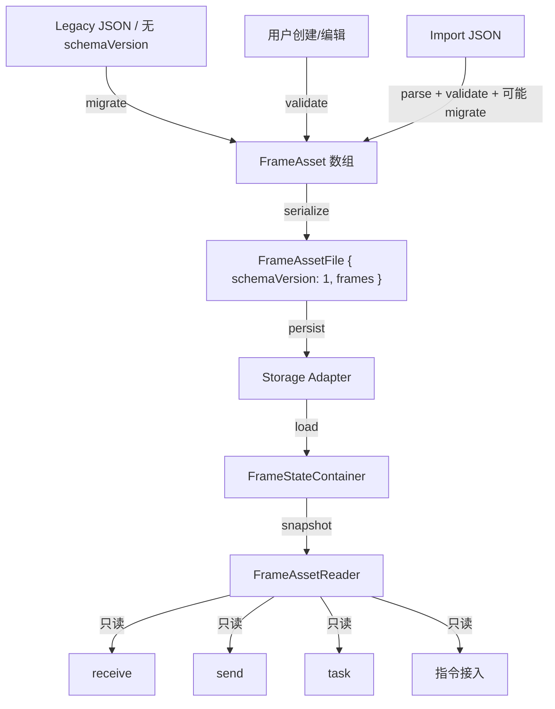

# frame-real feature design

## 0. Direct contract & boundary guards

### Direct contract

1. `codestable/compound/2026-05-07-runtime-next-phase-global-planning.md` — 第十四节 frame-real 行 + 关键路径 + 14.6 旧代码参考
2. `codestable/features/rewrite-frame/rewrite-frame-design.md` — 旧 frame 整体设计（04-30），上下文参考非合同
3. `codestable/architecture/rewrite-target-structure.md` — 目录结构与职责基线

### Boundary guards

- frame-real 只覆盖 JSON schema 定稿 + frameReader 实现 + 旧格式迁移 + selector 不可变修复
- 不设计 receive/send/task/SCOE/report/northbound/指令接入内部细节
- 不实现 UI 页面、导入导出对话框、runtime 启动装配
- 不冻结 platform API schema
- 旧 JSON 只作迁移输入/fixture/oracle，不污染新核心模型
- 帧定义全局唯一，任何模块不得维护独立帧列表

### Complexity level

走默认档位。无偏离信号。

### 明确不做

- Frame 编辑器/列表页面（Wave 7 ui-pages roadmap）
- Frame 导入导出对话框 UI（runtime + manual validation）
- Runtime 启动装配帧加载顺序（bootstrap feature）
- 真实串口/TCP/UDP 硬件验证
- SCOE/指令接入命令流程
- 打包态 data path、HTTP/FTP、northbound

## 1. Architecture decision alignment

以下 6 项架构决策在旧 design（04-30）之后发生。逐一检查覆盖状态：

### 1.1 表达式引擎已实现为 shared/ 纯函数

**现状**：`shared/expression/` 已完整实现（Kahn 拓扑排序 + 预编译 + 条件表达式 + 分组表达式）。

**旧 design 覆盖**：§4.8 提到"表达式定义校验归 frame"但未说明 API 对接方式。

**修正**：
- `ExpressionDefinition.expressions` 的 `ConditionalExpressionDefinition[]` 直接映射 `compileConditional(branches)` 输入格式 → 无需类型变更
- `ExpressionDefinition.variables` 定义变量来源映射，调用方根据 `sourceType` 收集值构建 `VariableMap`
- Frame core 增加编译级语法检查：调用 `shared/expression` 的 `compileExpression`/`compileConditional` 验证表达式文本合法性
- `ExpressionSourceType` 保持 `'current_field' | 'frame_field' | 'global_stat'`；旧 `'SCOE_DATA'` 归入指令接入 runtime 提供

### 1.2 条件匹配已在 shared/condition-operators/

**现状**：`compareValues(actual, threshold, operator)` 已实现 9 个运算符，task 已消费。

**旧 design 覆盖**：未引用。

**修正**：确认 frame 不需要自己的条件系统。Frame 的 `ExpressionDefinition.condition` 字符串是表达式语言条件（由 `shared/expression` 编译执行），不是比较运算符条件（由 `shared/condition-operators` 处理）。两者不冲突，无需 frame 侧变更。

### 1.3 Selector 不可变约束

**现状**：架构审计发现 `frame-selectors.ts` 存在浅拷贝（`{ ...r }` spread）。display/storage selector 也有同类问题。

**旧 design 覆盖**：§4.4 提到"只读 snapshot/selector"但未强制深拷贝。

**修正**：frame-real 必须修复所有 selector 浅拷贝。所有返回值使用 `structuredClone()` 深拷贝 + `ReadonlyDeep<>` 类型标注。作为独立验收项。

### 1.4 帧定义全局唯一

**现状**：现有代码只有一套 `FrameAsset` 类型。

**旧 design 覆盖**：§4.7 明确各 feature 只能通过只读 selector 读取。

**修正**：无需修正。强化声明：任何模块不得维护独立帧列表或独立帧实例管理。

### 1.5 旧 SCOE 独立帧列表不得复制

**现状**：旧 SCOE 有独立 `scoeFrameInstancesStore.ts`，硬编码在 `receiveFramesStore.ts:922-1000`。

**旧 design 覆盖**：§4.7 提到 SCOE 只能读取 generic frame asset snapshot。

**修正**：硬禁止。frame-real 的 public API 不提供"创建帧实例副本"能力。指令接入如需执行帧快照，由其 runtime context 内部管理，不通过 frame feature。

### 1.6 不使用 new Function

**现状**：`shared/expression` 使用 tokenizer + parser + AST 求值，完全避免 new Function。

**旧 design 覆盖**：§4.2 legacy ledger 标记为"candidate drop"。

**修正**：确认。Frame 的表达式定义校验不涉及代码执行。旧 `new Function` 已由 `shared/expression` 完全替代。

## 2. Design

### 2.1 Noun layer

#### 现状

Frame feature 已有骨架代码（`rewrite/src/features/frame/`）：

**类型定义**（`core/types.ts`）：
- `FrameAsset` — 帧资产主类型（id, name, direction, fields[], options, ...）
- `FrameFieldDefinition` — 字段定义（id, name, dataType, length, expressionConfig?, ...）**缺少 factor 字段**
- `ExpressionDefinition` — 表达式定义（expressions[], variables[]）
- `ExpressionVariableDefinition` — 变量来源映射（identifier, sourceType, sourceId?, frameId?, fieldId?）
- `FrameOptionsDefinition` — 帧选项（autoChecksum, bigEndian, includeLengthField）
- `FrameChecksumDefinition` — 校验配置（isChecksum, startFieldIndex, endFieldIndex, checksumMethod?）**startFieldIndex/endFieldIndex 为 string 类型，需改为 number**
- `ReadonlyFrameAsset` — `ReadonlyDeep<FrameAsset>` 只读类型
- 所有常量枚举已定义（FRAME_DIRECTIONS, FRAME_DATA_TYPES, ...）
- `identifierRules: unknown[]` — **未类型化，是最大缺口**
- `checksumMethod` 为裸 `string?` — **无枚举约束**

**验证**（`core/validation-*.ts`）：帧级/字段级/表达式定义验证已实现，返回 `ValidationResult { valid, issues[] }`。

**状态**（`state/frame-state.ts`）：`FrameStateContainer` 不可变快照模式。

**服务**（`services/frame-asset-service.ts`）：`FrameAssetService`（CRUD + legacy migration + select）、`FrameAssetReader`（只读查询）。

**选择器**（`selectors/frame-selectors.ts`）：findFrameAssets, getFrameAsset, listFrameAssetSummaries 等。**存在浅拷贝问题**。

**旧格式迁移**（`core/legacy.ts`, `core/legacy-normalizers.ts`）：基础框架已存在，`LegacyFrameMigrationResult` 类型已定义。

#### 变化

**FR-NOUN-001：标识规则类型化**

将 `identifierRules: unknown[]` 改为明确类型：

```typescript
interface IdentifierRule {
  startIndex: number
  endIndex: number
  operator: 'eq' | 'neq' | 'gt' | 'lt' | 'range' | 'mask' | 'any'
  value: string
  logicOperator: 'and' | 'or'
}
```

`FrameAsset.identifierRules` 从 `unknown[]` 改为 `IdentifierRule[]`。

消费关系：receive 帧匹配器消费 `identifierRules` 做帧识别；send 帧构造器可能用作默认帧头填充。

迁移注意：旧 JSON 中 `startIndex`/`endIndex` 同时存在数字和字符串两种格式（`"endIndex": "3"` vs `"endIndex": 3`），migration 归一化时必须转为 `number`。

**FR-NOUN-001b：factor 字段保留**

旧系统 `factor?: number` 用于值换算（raw * factor = 物理值），1918 处使用。决策：保留。

在 `FrameFieldDefinition` 中增加：
```typescript
factor?: number  // 值换算系数，receive 做解码换算，send 做编码逆换算
```

运行时语义：
- 无表达式时：receive 解码后 `物理值 = 原始值 * factor`；send 编码前 `原始值 = 物理值 / factor`
- 有表达式时：表达式优先，factor 不参与（表达式可以自行引用 factor 值做更复杂换算）
- factor 缺失或为 1 时等价于无换算

迁移：旧 JSON 中 factor 既有数字（`"factor": 1`）也有字符串（`"factor": "0.01"`），归一化时统一转为 `number`。

**FR-NOUN-001c：validOption 字段类型修正**

`FrameChecksumDefinition` 的 `startFieldIndex`/`endFieldIndex` 从 `string` 改为 `number`：
```typescript
interface FrameChecksumDefinition {
  isChecksum: boolean
  startFieldIndex: number   // 原 string，改为 number
  endFieldIndex: number     // 原 string，改为 number
  checksumMethod?: ChecksumMethod
}
```

迁移：旧 JSON 中这些字段为字符串（如 `"startFieldIndex": "0"`），归一化时 `parseInt` 转换。

**FR-NOUN-001d：checksumMethod 枚举**

```typescript
type ChecksumMethod = 'sum8' | 'xor8' | 'crc16' | 'crc32' | 'custom'
```

Wave 1-3 支持的值域：`sum8`、`xor8`、`crc16`、`crc32`、`custom`。`custom` 保留给用户自定义算法，具体实现由 send 构帧层处理。后续可扩展，不冻结全部可能值。

**FR-NOUN-002：ExpressionDefinition 对齐验证**

确认现有类型与 `shared/expression` API 的对齐状态：

| frame 类型 | shared/expression 输入 | 对齐 |
|-----------|----------------------|------|
| `ConditionalExpressionDefinition { condition, expression }` | `compileConditional(branches: { condition, expression }[])` | 直接映射 |
| `ExpressionVariableDefinition.identifier` | `VariableMap` 的 key | 调用方按 identifier 收集值 |
| `ExpressionVariableDefinition.sourceType` | 调用方决定从哪读值 | frame 只记录来源元数据 |

无需类型变更。validation-expression.ts 增加：
- 调用 `compileExpression(expressionString)` 做语法检查（不执行）
- 调用 `compileExpression(conditionString)` 做条件语法检查
- 验证变量 `identifier` 在表达式中被引用

**FR-NOUN-003：Frame JSON Schema**

定稿帧定义的 JSON 序列化格式：

```typescript
interface FrameAssetFile {
  schemaVersion: 1
  frames: FrameAsset[]
}
```

序列化规则：
- 导出：`FrameAsset[]` → `FrameAssetFile` → JSON string
- 导入：JSON string → parse → `schemaVersion` 检查 → `FrameAsset[]`
- `schemaVersion` 缺失视为旧格式，走 legacy migration path
- 单帧导出仍包裹在 `{ schemaVersion: 1, frames: [oneFrame] }` 中

字段决策：
- 新增 `schemaVersion` — 版本标识
- 移除 `lastId` — 旧系统遗留
- 移除 `timestamp` — `createdAt`/`updatedAt` 已覆盖
- 保留 `frameType`, `protocol` — 分类用途，值域不冻结
- `FrameAssetFile` 定义在 service 层，不进入 `core/types.ts`

Schema 演进原则：
- 新 reader 必须能读旧 `schemaVersion` 的文件，必要时做 inline migration
- 新增字段必须可选（`?`），旧 reader 遇到未知字段必须忽略不报错
- `schemaVersion` 只在破坏性变更（字段重命名、类型变更、结构重组）时递增
- 新增可选字段不递增 `schemaVersion`

**FR-NOUN-004：FrameReader L0 接口确认**

`FrameAssetReader` 已定义，确认作为 L0 依赖：

```typescript
interface FrameAssetReader {
  getSnapshot(): FrameAssetSnapshot
  listFrames(query?: FrameAssetQuery): FrameAssetSummary[]
  findFrames(query?: FrameAssetQuery): ReadonlyFrameAsset[]
  getFrame(frameId: string): ReadonlyFrameAsset | undefined
  getSelectedFrame(): ReadonlyFrameAsset | undefined
  listFrameReferences(query?: FrameFieldReferenceQuery): FrameReferenceOption[]
  listFieldReferences(query?: FrameFieldReferenceQuery): FrameFieldReference[]
}
```

确认：所有返回值深拷贝/ReadonlyDeep（修复 §1.3）。消费者（receive/send/task/指令接入）通过构造函数注入。

**FR-NOUN-005：Selector 不可变修复**

修复 `frame-selectors.ts` 所有浅拷贝：
- 使用 `structuredClone()` 确保深拷贝
- 返回类型保持 `ReadonlyFrameAsset`（`ReadonlyDeep<FrameAsset>`）
- 增加 selector 级单测：修改返回值不影响 state

### 2.2 Orchestration layer

#### 帧定义生命周期主流程



#### 现状

Service CRUD 已实现。Legacy migration 框架已存在。State container 已实现。FrameReader 接口已定义。

#### 变化

**FR-ORCH-001：Legacy Migration 完善**

补齐旧格式迁移完整覆盖：

```
旧 JSON（无 schemaVersion）→ parse → 识别旧格式 → 归一化 → 校验 → FrameAsset[]
```

迁移步骤：
1. JSON parse（语法检查）
2. schemaVersion 检查（缺失 → legacy path）
3. 旧格式识别：检查 `direction`、`fields`、`identifierRules` 特征字段
4. 字段归一化：
   - 缺失字段补默认值（`factor: undefined`, `isFavorite: false`, `description: ''`）
   - `lastId` 丢弃、`timestamp` 丢弃
   - `factor` 字符串→数字转换（`"0.01"` → `0.01`）
   - `identifierRules` 每条归一化：`startIndex`/`endIndex` 字符串→数字、`operator` 枚举校验
   - `validOption.startFieldIndex`/`endFieldIndex` 字符串→数字
   - `validOption.checksumMethod` 枚举校验（不在枚举内 → warning，保留原值）
   - `expressionConfig` 归一化
5. 校验（validation-frame + validation-field + validation-expression）
6. 输出 `LegacyFrameMigrationResult { recognized, frames, issues }`

**FR-ORCH-002：Import/Export 序列化**

导入流程：
```
文件 → platform facade 读文本 → JSON parse → schemaVersion check
  → 新格式: 直接校验 → FrameAsset[]
  → 旧格式: legacy migrate → FrameAsset[]
→ service.replaceFrames()
```

导出流程：
```
service.findFrames() → FrameAssetFile { schemaVersion: 1, frames } → JSON.stringify → platform facade 写文件
```

文件选择对话框和真实文件读写由 platform/app shell 承担。frame 只负责 JSON 语义。

**FR-ORCH-003：FrameReader 生产路径**

确认 frameReader 从 state 读取真实数据的生产路径：
```
应用启动 → adapter.loadFromStorage() → service.replaceFrames(frames)
→ state 更新 → frameReader.getSnapshot() → consumer 只读访问
```

frameReader 是 `createFrameAssetReader(state.getSnapshot)` 的产物，通过 runtime 构造函数注入到 L2 消费者。

### 2.3 Mount points

"删了它 frame-real 功能是否消失"判据：

| 挂载点 | 位置 | 说明 |
|--------|------|------|
| FrameAssetReader 接口 | `features/frame/index.ts` 导出 | receive/send/task 通过此读取帧定义；删了它们拿不到帧数据 |
| FrameAsset 类型 | `features/frame/core/types.ts` | 全系统唯一帧模型 |
| Legacy migration 入口 | `features/frame/core/legacy.ts` | 旧 JSON 迁移唯一入口 |
| JSON schema 序列化 | `features/frame/services/` | 序列化/反序列化规则；删了无法持久化 |

### 2.4 Push strategy

按 paradigm 维度推进：

| 步骤 | 范围 | 退出信号 |
|------|------|---------|
| P1：Noun layer 修正 | identifierRules 类型化 + factor 字段保留 + validOption number 化 + checksumMethod 枚举 + selector 深拷贝修复 | vitest 全绿 + build 通过 |
| P2：ExpressionDefinition 对齐 | validation 增加编译级语法检查 + 旧样本验证 | 旧表达式样本全部编译通过 |
| P3：Legacy migration 完善 | 补齐旧格式覆盖 + 迁移 fixture/oracle | 所有旧样本迁移用例通过 |
| P4：JSON schema + 序列化 | FrameAssetFile 格式 + round-trip 测试 | export→import 深度相等 |

### 2.5 Structural health

**评估文件**：`frame-selectors.ts`（~150 行）、`frame-asset-service.ts`（~200 行）、`core/types.ts`（~200 行）

**结论**：本次不做微重构。

原因：
- 文件尺寸健康，无偏胖或职责混杂
- 改动量小（类型修正 + 深拷贝 + migration 补齐），不涉及文件拆分

## 3. Acceptance contract

### 关键场景

**SC1：帧定义 JSON schema 定稿**

- 输入：合法 FrameAsset JSON
- 期望：`parse → validate → 0 errors → serialize → parse → 深度相等`
- 边界：缺失可选字段 → 补默认值；多余字段 → 忽略不报错

**SC2：旧格式迁移**

- 输入：旧系统 `framesConfig.json` 样本
- 期望：`migrate → recognized=true → frames[] 非空 → issues 中无 error 级别`
- 边界：旧 JSON 缺失字段 → 补默认值 + warning
- 错误：非 JSON 输入 → `recognized=false, issues 含 parse error`

**SC3：FrameReader 只读快照**

- 输入：`frameReader.getFrame('frame-1')`
- 期望：返回 `ReadonlyFrameAsset`，修改返回值不影响 state
- 验证：`result.name = 'hacked'; reader.getFrame('frame-1').name !== 'hacked'`

**SC4：表达式定义与 shared/expression 对齐**

- 输入：含 expressionConfig 的 FrameFieldDefinition
- 期望：`compileConditional(expressionConfig.expressions)` 返回 `{ success: true }`
- 验证：旧系统所有表达式样本在新引擎编译通过

**SC5：identifierRules 类型安全**

- 输入：含 identifierRules 的 FrameAsset
- 期望：validate 检查每条规则的 operator 在枚举内、startIndex/endIndex 为合法非负整数
- 错误：operator 不在枚举 → validation error
- 迁移：旧 JSON 中 startIndex/endIndex 为字符串 `"3"` → 归一化为数字 `3`

**SC6：导入导出 round-trip**

- 输入：一组 FrameAsset
- 期望：`export → import → 深度相等`（排除 `createdAt`/`updatedAt` 时间戳差异）

**SC7：factor 字段迁移**

- 输入：旧 JSON 含 `"factor": "0.01"` 的字段
- 期望：迁移后 `factor` 为 `number` 类型 `0.01`
- 边界：factor 缺失 → `undefined`（无换算）；factor 为 1 → 保留
- 验证：旧样本中所有 factor 值迁移后数值精度一致

**SC8：validOption 类型迁移**

- 输入：旧 JSON 含 `"startFieldIndex": "2"` 的 validOption
- 期望：迁移后 `startFieldIndex` 为 `number` 类型 `2`
- 验证：checksum 计算参数类型一致，无字符串残留

### 明确不做反向核对

- 不实现 frame 编辑器/列表页面 UI
- 不实现 runtime 启动装配逻辑
- 不实现 receive/send/task/SCOE 消费端改造
- 不实现 platform facade 文件读写

## 4. Cross-feature interface registry

| Consumer | 接口 | 方向 | 层级 | 备注 |
|----------|------|------|------|------|
| receive | FrameAssetReader | frame → receive | L2 | 构造函数注入 |
| send | FrameAssetReader | frame → send | L2 | 构造函数注入 |
| task | FrameAssetReader | frame → task | L3 | 构造函数注入 |
| 指令接入 | FrameAssetReader | frame → 指令接入 | L4 | 构造函数注入 |
| runtime | createFrameAssetReader | frame → runtime | L0 | 装配时调用 |
| bootstrap | service.replaceFrames | storage → frame | L0 | 启动时加载帧数据 |
| expression-engine | ExpressionDefinition 类型引用 | frame 类型 → shared 消费 | 类型 | 无运行时依赖 |

### Consumer 字段消费清单

**receive 帧匹配消费**：
- `identifierRules`：按 startIndex/endIndex 从字节流提取匹配段，按 operator + value 判断是否命中
- `fields[].dataType` + `fields[].length`：按偏移从字节流提取原始值
- `fields[].factor`：无表达式时做 `原始值 * factor` 换算
- `fields[].expressionConfig`：有表达式时委托 shared/expression 求值
- `fields[].bigEndian`：多字节字段的大小端解析
- `options.bigEndian`：帧级大小端默认值
- `direction`：只匹配 `receive` 方向的帧

**send 帧构造消费**：
- `fields[].dataType` + `fields[].length`：确定字段占用的字节数和编码方式
- `fields[].defaultValue`：用户未填值时的默认输入
- `fields[].configurable`：是否允许用户编辑
- `fields[].options[]`：select/radio 类型的可选项
- `fields[].factor`：无表达式时做 `物理值 / factor` 逆换算
- `fields[].expressionConfig`：有表达式时委托 shared/expression 计算
- `fields[].validOption`：checksum 字段的计算范围（startFieldIndex, endFieldIndex, checksumMethod）
- `options.autoChecksum`：是否自动计算 checksum
- `options.bigEndian`：帧级大小端默认值
- `options.includeLengthField`：是否包含长度字段
- `direction`：只构造 `send` 方向的帧

**task 条件配置消费**：
- `listFrameReferences()`：任务触发条件中可选的帧列表
- `listFieldReferences()`：条件配置中"从哪个帧的哪个字段取值"的选项

**指令接入命令翻译消费**：
- `getFrame(id)`：将外部命令中的帧标识映射到内部帧定义
- 帧构造委托 send service，不直接使用 frameReader 构造字节

### ExpressionSourceType 扩展策略

新增 `ExpressionSourceType` 时的检查清单：
1. 在 `core/types.ts` 的 `EXPRESSION_SOURCE_TYPES` 常量中添加值
2. 在 `validation-expression.ts` 中更新变量来源校验
3. 在消费方（receive/send/task/指令接入）中更新变量收集逻辑
4. 更新 `legacy-normalizers.ts` 处理旧格式中对应来源的映射
5. 不递增 `schemaVersion`（新增可选值，前向兼容）
