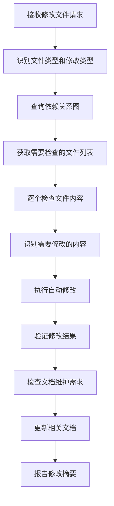

# 自动化修改规则

## 规则执行流程



## 文件类型识别

### 类型层文件修改

```yaml
file_pattern: 'types/**/*.ts'
check_rules:
  - 检查exports变更影响
  - 检查interface/type变更影响
  - 检查enum变更影响
auto_sync_targets:
  - 对应Store文件的import语句
  - 相关utils文件的类型注解
  - 相关组件的props/emits类型定义
  - 相关工厂函数的类型参数
```

### Store层文件修改

```yaml
file_pattern: 'stores/**/*.ts'
check_rules:
  - 检查state结构变更
  - 检查actions函数签名变更
  - 检查computed属性变更
auto_sync_targets:
  - 相关Composable中的storeToRefs使用
  - 相关组件中的store调用
  - 相关页面中的store集成
```

### Composable层文件修改

```yaml
file_pattern: 'composables/**/*.ts'
check_rules:
  - 检查返回值结构变更
  - 检查参数签名变更
  - 检查依赖Store变更
auto_sync_targets:
  - 使用该Composable的组件
  - 使用该Composable的页面
```

### 组件层文件修改

```yaml
file_pattern: 'components/**/*.vue'
check_rules:
  - 检查props定义变更
  - 检查emits事件变更
  - 检查slot变更
auto_sync_targets:
  - 使用该组件的父组件
  - 使用该组件的页面
```

## 具体修改规则

### 类型接口变更规则

```javascript
// 规则：types/frames/basic.ts中FieldType枚举变更时
modification_type: "enum_change"
detection_pattern: "export.*FieldType.*="
impact_analysis: {
  immediate_check: [
    "stores/frames/frameFieldsStore.ts",
    "utils/frames/frameUtils.ts",
    "components/frames/FrameEdit/FrameFieldEditor.vue"
  ],
  check_content: [
    "switch.*FieldType.*case语句",
    "FieldType.*导入语句",
    "fieldType.*属性使用"
  ],
  auto_fix: [
    "添加缺失的case分支",
    "更新类型导入",
    "添加新的字段类型处理逻辑"
  ]
}
```

### Store状态结构变更规则

```javascript
// 规则：serialStore.ts中state结构变更时
modification_type: "state_structure_change"
detection_pattern: "state.*:\\s*{"
impact_analysis: {
  immediate_check: [
    "pages/SerialConfigPage.vue",
    "components/serial/SerialPortList.vue",
    "composables/serial/useSerialConfig.ts"
  ],
  check_content: [
    "storeToRefs.*serialStore",
    "serialStore\\.[a-zA-Z]+",
    "\\.value访问模式"
  ],
  auto_fix: [
    "更新storeToRefs解构",
    "修复状态访问路径",
    "添加缺失的响应式引用"
  ]
}
```

### Composable返回值变更规则

```javascript
// 规则：useFrameEditor.ts返回值结构变更时
modification_type: "composable_return_change"
detection_pattern: "return\\s*{[^}]+}"
impact_analysis: {
  immediate_check: [
    "pages/frames/FrameEditor.vue"
  ],
  check_content: [
    "useFrameEditor\\(\\)",
    "\\{.*\\}.*=.*useFrameEditor",
    "解构赋值模式"
  ],
  auto_fix: [
    "更新解构赋值语句",
    "添加新的返回值使用",
    "移除不存在的属性引用"
  ]
}
```

### 组件Props变更规则

```javascript
// 规则：组件props定义变更时
modification_type: "component_props_change"
detection_pattern: "defineProps<{[^}]+}>"
impact_analysis: {
  immediate_check: [
    "查找所有使用该组件的文件"
  ],
  check_content: [
    "组件标签属性传递",
    "v-bind绑定",
    "props类型匹配"
  ],
  auto_fix: [
    "添加缺失的必需props",
    "移除废弃的props传递",
    "修复props类型不匹配"
  ]
}
```

## 自动修改模式

### 导入语句同步

```typescript
// 模式：类型定义变更时自动更新导入
pattern: "类型文件exports变更"
auto_fix: {
  target_files: "所有导入该类型的文件",
  action: "更新import语句",
  template: "import { ${new_exports} } from '${module_path}'"
}
```

### Store访问模式同步

```typescript
// 模式：Store状态变更时自动更新访问方式
pattern: "Store state结构变更"
auto_fix: {
  target_files: "所有使用该Store的组件和Composable",
  action: "更新storeToRefs和直接访问",
  template: "const { ${state_properties} } = storeToRefs(${store_name})"
}
```

### 组件集成同步

```typescript
// 模式：组件接口变更时自动更新使用方式
pattern: "组件props/emits变更"
auto_fix: {
  target_files: "所有使用该组件的父组件",
  action: "更新组件标签属性和事件处理",
  template: "<${component_name} ${props} @${events} />"
}
```

## 验证规则

### 类型安全验证

- 检查TypeScript编译错误
- 验证类型导入正确性
- 确认接口实现完整性

### 功能完整性验证

- 检查必需的业务逻辑函数
- 验证状态管理完整性
- 确认事件处理正确性

### 依赖关系验证

- 检查循环依赖
- 验证导入路径正确性
- 确认模块导出完整性

## 执行优先级

### 高优先级（立即执行）

1. 类型定义文件修改的传播
2. Store核心状态变更的同步
3. 关键Composable接口变更的更新

### 中优先级（批量执行）

1. 组件Props/Emits变更的同步
2. 工具函数接口变更的更新
3. 配置文件变更的传播

### 低优先级（提醒确认）

1. 样式类名变更的同步
2. 注释和文档的更新
3. 测试文件的同步更新

## 错误恢复机制

### 修改失败时

1. 回滚已执行的修改
2. 记录失败原因和位置
3. 提供手动修改建议

### 依赖冲突时

1. 标识冲突的依赖关系
2. 提供多种解决方案
3. 等待用户确认选择

### 类型不兼容时

1. 保留原有兼容版本
2. 创建适配器函数
3. 逐步迁移策略

## 文档维护检查机制

### 文档更新触发条件

```yaml
# 当代码结构发生以下变更时，需要检查和更新文档
structure_changes:
  new_file_created:
    - 触发：创建新的 .ts/.vue 文件
    - 检查：文件依赖关系图.md
    - 动作：添加新文件的依赖关系映射

  file_deleted:
    - 触发：删除 .ts/.vue 文件
    - 检查：文件依赖关系图.md、文件功能接口索引.md
    - 动作：移除相关文件的所有引用记录

  export_interface_change:
    - 触发：文件的 export 接口发生变更
    - 检查：文件功能接口索引.md
    - 动作：更新对应文件的接口描述

  dependency_relationship_change:
    - 触发：import/export 关系发生变更
    - 检查：文件依赖关系图.md
    - 动作：更新依赖关系映射和影响级别

  new_modification_pattern:
    - 触发：发现新的修改模式或规则
    - 检查：自动化修改规则.md
    - 动作：添加新的自动化规则定义
```

### 文档检查规则

#### 文件依赖关系图维护

```javascript
// 规则：检查依赖关系图的完整性和准确性
document_check: "文件依赖关系图.md"
triggers: [
  "新增文件创建",
  "文件删除",
  "import语句变更",
  "export语句变更",
  "组件使用关系变更"
]
check_actions: {
  verify_completeness: [
    "检查是否所有实际文件都在依赖图中",
    "验证依赖关系的准确性",
    "确认影响级别设置的合理性"
  ],
  update_requirements: [
    "添加新文件的依赖映射",
    "更新变更文件的依赖关系",
    "调整受影响文件的影响级别",
    "移除已删除文件的所有引用"
  ]
}
```

#### 功能接口索引维护

```javascript
// 规则：检查功能接口索引的同步性
document_check: "文件功能接口索引.md"
triggers: [
  "类型定义变更（types/ 目录）",
  "Store接口变更（stores/ 目录）",
  "Composable接口变更（composables/ 目录）",
  "组件Props/Emits变更（components/ 目录）",
  "工具函数签名变更（utils/ 目录）"
]
check_actions: {
  interface_sync: [
    "更新类型定义描述",
    "同步函数签名变更",
    "更新组件接口描述",
    "修正功能描述不一致问题"
  ],
  documentation_quality: [
    "检查接口描述的完整性",
    "验证示例代码的有效性",
    "确保依赖说明的准确性"
  ]
}
```

#### 自动化规则维护

```javascript
// 规则：检查自动化规则的适用性和有效性
document_check: "自动化修改规则.md"
triggers: [
  "发现新的修改模式",
  "现有规则执行失败",
  "项目结构调整",
  "新增文件类型或组织方式"
]
check_actions: {
  rule_validation: [
    "验证现有规则的有效性",
    "检查规则覆盖的完整性",
    "测试自动修改模板的正确性"
  ],
  rule_enhancement: [
    "添加新发现的修改模式",
    "优化失效的自动化规则",
    "补充遗漏的检查项目",
    "更新文件类型识别规则"
  ]
}
```

### 文档同步执行模式

#### 实时同步模式

```typescript
// 模式：代码修改时立即检查文档同步需求
pattern: "代码文件保存时触发"
execution: {
  immediate_check: [
    "检查修改类型是否触发文档更新",
    "确定需要更新的文档类型",
    "执行对应的文档检查规则"
  ],
  sync_actions: [
    "更新文件依赖关系映射",
    "同步接口变更到功能索引",
    "记录新的修改模式规则"
  ],
  validation: [
    "验证文档更新的正确性",
    "确保文档间的一致性",
    "检查是否有遗漏的更新项"
  ]
}
```

#### 批量同步模式

```typescript
// 模式：多个文件修改完成后统一检查文档同步
pattern: "批量修改完成后触发"
execution: {
  comprehensive_check: [
    "全面检查所有文档的准确性",
    "验证依赖关系图的完整性",
    "确认功能接口索引的同步性"
  ],
  batch_update: [
    "批量更新依赖关系变更",
    "统一同步接口描述变更",
    "整理并添加新的自动化规则"
  ],
  final_validation: [
    "交叉验证各文档间的一致性",
    "确保没有孤立或错误的引用",
    "生成文档同步报告"
  ]
}
```

### 文档维护检查清单

#### 修改前检查

```markdown
## 文档维护前置检查

- [ ] 确认当前修改涉及的文件类型和范围
- [ ] 识别可能影响的文档类型
- [ ] 备份当前文档状态（如有必要）
- [ ] 确定文档更新的优先级和顺序
```

#### 修改后验证

```markdown
## 文档维护后置验证

- [ ] 验证文件依赖关系图的完整性和准确性
- [ ] 确认功能接口索引与实际代码的一致性
- [ ] 检查自动化规则是否涵盖新的修改模式
- [ ] 测试基于更新文档的自动化修改是否正常工作
- [ ] 确保文档间交叉引用的正确性
- [ ] 生成文档维护报告，记录更新内容和验证结果
```

### 文档维护报告模板

```markdown
## 文档维护报告

### 触发原因

- 修改文件：[文件路径]
- 修改类型：[修改类型说明]
- 触发时间：[时间戳]

### 文档更新内容

#### 文件依赖关系图.md

- [ ] 新增依赖关系：[具体内容]
- [ ] 更新依赖关系：[具体内容]
- [ ] 移除依赖关系：[具体内容]
- [ ] 调整影响级别：[具体内容]

#### 文件功能接口索引.md

- [ ] 更新接口描述：[具体内容]
- [ ] 同步函数签名：[具体内容]
- [ ] 修正功能说明：[具体内容]

#### 自动化修改规则.md

- [ ] 新增规则模式：[具体内容]
- [ ] 优化现有规则：[具体内容]
- [ ] 修正失效规则：[具体内容]

### 验证结果

- [ ] 文档完整性：通过/失败 [说明]
- [ ] 文档一致性：通过/失败 [说明]
- [ ] 自动化测试：通过/失败 [说明]

### 后续建议

- [如有需要，提供后续优化建议]
```

### 文档维护错误处理

#### 常见问题处理

```yaml
# 文档同步失败的常见原因和处理方式
sync_errors:
  incomplete_dependency_mapping:
    problem: '依赖关系图不完整'
    solution: '执行全量扫描，重建依赖关系映射'

  interface_description_outdated:
    problem: '接口描述与实际代码不符'
    solution: '基于当前代码重新生成接口描述'

  rule_pattern_invalid:
    problem: '自动化规则模式失效'
    solution: '分析失效原因，更新或移除失效规则'

  cross_reference_broken:
    problem: '文档间交叉引用错误'
    solution: '验证所有引用的有效性，修正错误引用'
```

#### 恢复机制

```typescript
// 文档维护失败时的恢复策略
recovery_strategy: {
  backup_restore: "从备份恢复文档到最近的稳定状态",
  incremental_rebuild: "基于当前代码状态逐步重建文档",
  manual_intervention: "标记需要人工确认的部分，等待手动处理",
  rollback_option: "提供代码和文档的一致性回滚选项"
}
```
